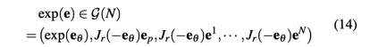

# Invariat\_EKF\_for\_3D\_SLAM

[toc]

---
## 一些结论
* 如果是无 bias 的理想 IMU ，propagate 环节可以使用 IEKF ，且
   * 如果是 RIEKF， 状态误差演化不依赖输入的$\omega, a$；
   * LIEKF 依赖输入的$\omega, a$。
* 如果是有 bias 的 IMU（把 bias 加入状态量），propagate 环节的状态误差演化将依赖状态估计值 $\hat X$
   * 如果是 RIEKF，状态误差演化依赖 $\hat R,\hat p,\hat v$，不依赖 IMU 的去 bias 测量值  $\omega_m-\hat b_\omega,a_m-\hat b_a$;
   * 如果是 LIEKF，正好相反；
* 6DoF  landmark 可以构造出左不变观测（右不变还不确定是否可以，暂时没构造成功）： 只有协方差矩阵依赖状态轨迹，观测误差的 Jacobian 恒定。且可以支持相机外参，可以适配多camera、滑窗。
   * 但 feature 点观测（3D 位置信息），以及更贴近实际的 bearing vector 观测，目前都没有构造出不变观测误差。
* 综合上两点，LIEKF 可能更好用一点：存在 6DoF landmark 不变观测，且能适配外参和滑窗，且状态误差演化不依赖 $\hat R,\hat p,\hat v$（转而依赖相对更确定的  $\omega_m-\hat b_\omega,a_m-\hat b_a$）；
* 目前能想到的 IEKF 应用最理想的情况： 状态转移靠（不怎么打滑的）轮速 odometry 或无 bias 的 IMU，配以 6DoF  landmark 。

---

## 无 bias 的 IMU
理想情况下（bias=0），可以构造符合 IEKF 要求的过程；

状态定义为 $(R,p,v)$，状态空间为 $\mathbb {RPV}=\mathbb {SO}(3) \rtimes \mathbb {PV}$, 其中$\mathbb {PV} = \mathbb R^3\times  \mathbb R^3$为 $(p,v)$ 所在的空间，配备平凡李群结构；

群乘法定义为:

$(R_1,p_1,v_1)\cdot (R_2,p_2,v_2) = (R_1R_2,  \quad p_1+R_1p_2, \quad v_1+R_1v_2)$

控制量$(\omega,a)$代表载体系下的角速度和加速度

过程演化的微分方程：

$\dot X=f_{(\omega,a)}(X)=f_{(\omega,a)}(R,p,v) =(\dot R,\dot p,\dot v) =(R\omega^\wedge, v, Ra-G)$

$f_{(\omega,a)}(Id) = f_{(\omega,a)}(I,0,0) = (\omega^\wedge, 0, a-G)$

这个过程方程并非左不变的：$Xf_{(\omega,a)}(Id) = (R\omega^\wedge, 0, R(a-G)) \ne f_{(\omega,a)}(X)$

也非右不变的： $f_{(\omega,a)}(Id)X = (\omega^\wedge R, \omega^\wedge p, a-G+\omega^\wedge v) \ne f_{(\omega,a)}(X)$

但：

$X_{12}=X_1X_2=(R_1R_2, \quad p_1+R_1p_2, \quad v_1+R_1v_2)$

$X_1f_{(\omega,a)}(X_2)=(R_1 R_2\omega^\wedge,\quad R_1v_2, \quad R_1R_2a-R_1G)$

$f_{(\omega,a)} (X_1)X_2=(R_1\omega^\wedge R_2, \quad  v_1+R_1\omega^\wedge p_2, \quad R_1a-G+R_1\omega^\wedge v_2)$

$X_1f_{(\omega,a)}(Id)X_2=(R_1\omega^\wedge, 0, R_1(a-G))\cdot X_2=(R_1\omega^\wedge R_2,\quad R_1\omega^\wedge p_2,\quad R_1(a-G)+R_1\omega^\wedge v_2)$

$f_{(\omega,a)} (X_1X_2) = (R_1R_2\omega^\wedge, \quad v_1+R_1v_2,\quad R_1R_2a-G)$

满足 $f_{(\omega,a)} (X_1X_2) = f_{(\omega,a)} (X_1)X_2 + X_1f_{(\omega,a)}(X_2) - X_1f_{(\omega,a)}(Id)X_2$

以右不变状态误差为例：$\eta = X\hat X^{-1}=(R,p,v)(\hat R^{-1},-\hat R^{-1}\hat p,-\hat R^{-1}\hat v)=(\eta_R, p-\eta_R\hat p, v-\eta_R\hat v)$

> 使用右不变状态误差 相当于 使用左微扰的 robocentric ? 是否有区别？需要时间思考确认一下，状态转移这块可能是没区别的？

$\eta_R=R\hat R^{-1}$

$\eta_p = p-\eta_R\hat p$

$\eta_v = v-\eta_R\hat v$

$\dot \eta_R = \dot {\overbrace{R\hat R^{-1}}} = \dot R\hat R^{-1}-R(\hat R^{-1}\dot {\hat R}\hat R^{-1})=R\omega^\wedge \hat R^{-1} - R\hat R^{-1}\hat R\omega^\wedge\hat R^{-1}=0$

$\dot \eta_p = \dot p - (\underbrace{\dot \eta_R}_{0} \hat p + \eta_R \dot{\hat p})=v-\eta_R\hat v = \eta_v$

$\dot \eta_v=\dot v - (\dot \eta_R \hat v + \eta_R \dot{\hat v})=(Ra-G)-\eta_R(\hat R a-G)=Ra-Ra+(\eta_R-I)G=(\eta_R-I)G$

右不变状态误差的演化很简洁：$\dot \eta=(0,\eta_v,(\eta_R-I)G)$。

对应的李代数演化方程为： 

$\exp(\xi_R)=\eta_R$

$J_l(\xi_R)\xi_p=\eta_p$

$J_l(\xi_R)\xi_v=\eta_v$

$\dot \eta\eta^{-1}=(0,\eta_v,(\eta_R-I)G)(\eta_R^{-1},\hat p-\eta_R^{-1}p, \hat v-\eta_R^{-1}v)=(0, \eta_v, (\eta_R-I)G)=(0, J_l(\xi_R)\xi_v, (\exp(\xi_R)-I)G)$

$\dot \xi=\mathcal J_l^{-1}(\xi).(\dot \eta\eta^{-1})=  \mathcal J_l^{-1}(\xi).(0, J_l(\xi_R)\xi_v, (\exp(\xi_R)-I)G)$

线性化并略去 $\xi$ 的高阶小量，得

 $\dot\xi\approx (0,\xi_v,\xi_RG)$

既不依赖 $\hat X$，也不依赖输入的控制量  $\omega,a$，只依赖一个重力常量 $G$。

> 没有bias和惯性测量误差时，使用普通的线性状态误差也会得到不依赖 $\hat X$的误差演化方程：

> $\dot {\tilde R} = \tilde R\omega^\wedge,\quad \dot {\tilde p} = \tilde v,\quad \dot {\tilde v}=\tilde Ra$

> 而且该误差演化还不依赖重力常量 $G$，只不过会依赖输入的控制量  $\omega,a$。

> 不管用什么误差，相同边界值情况下状态量本身的积分是一样的，变化的只是误差的定义（参数化方式）和概率分布。误差演化方程的线性化程度越好（线性化程度怎么评估）、越能保持误差的高斯性，就越利于系统的收敛。

> 观测函数h在真值附近的观测输出波动与状态误差间的线性程度也是重要因素。

> (状态误差自身演化的线性程度+与观测波动的线性程度)

> 如果依赖状态轨迹，但实际应用场景的状态轨迹常见模式已知，则可以具体分析？

## 加入 bias： 右不变误差

依然以 右不变误差为例，看看加入 bias 会怎样：如果引入 bias，$\hat X$将被依赖。使用右不变误差时，误差的演化主要受 $\hat R$ \* (bias 误差) 影响。

如果引入 bias $b_{\omega},b_a$和它们的估计值 $\hat b_{\omega},\hat b_a$，以及对应的测量噪声 $\nu_\omega,\nu_a$，那么

状态空间扩充为 $(\mathbb {SO}(3) \rtimes\mathbb {PV}) \times \mathbb{B}$；其中 $\mathbb B=\mathbb R^3\times \mathbb R^3$，配备平凡李群结构。

$a=a_m-b_a-\nu_a, \quad  \hat a = a_m-\hat b_a$

$\omega=\omega_m-b_\omega-\nu_\omega, \quad \hat \omega=\omega_m - \hat b_\omega$

$\dot R=\omega^\wedge, \quad \dot {\hat R} =\hat \omega ^\wedge$

$\dot v=Ra, \quad \dot{\hat v} = \hat R\hat a$

$\dot \eta_R = R\omega^\wedge \hat R^{-1} - R\hat R^{-1}\hat R\hat \omega^\wedge\hat R^{-1}=R(\omega-\hat \omega)^\wedge\hat R^{-1}=\eta_R\hat R(-\eta_{b_\omega}-\nu_\omega)^\wedge\hat R^{-1}=-\eta_R(\hat R(\eta_{b_\omega}+\nu_\omega))^\wedge$

进一步 

$\dot \eta_R = -\eta_R(\hat R(\eta_{b_\omega}+\nu_\omega))^\wedge \eta_R^{-1}\eta_R = -(\underbrace {\eta_R\hat R}_R(\eta_{b_\omega}+\nu_\omega))^\wedge \eta_R$

>  注意 $\dot\eta_R$ 不是个旋转向量（$\not \in \mathfrak {so}(3)$），他不是 $\omega,\hat \omega$ 的旋转差！这种常规定义不变误差的方式，似乎也变得不完美了？如何定义 $\eta_R$ 可以使其物理意义合理且 $\dot\eta_R$ 能定义为角速度向量之差 $R\omega-\hat R\hat \omega =$ ？

$\dot \eta_p = \dot p - (\dot \eta_R \hat p + \eta_R \dot{\hat p})=v-\eta_R\hat v - \dot \eta_R\hat p= \eta_v - \dot \eta_R\hat p$

$\dot \eta_v=\dot v - (\dot \eta_R \hat v + \eta_R \dot{\hat v}) =(Ra-G)-\eta_R(\hat R \hat a-G) - \dot \eta_R\hat v=(\eta_R-I)G-\underbrace{\eta_R\hat R}_R(\eta_{b_a}+\nu_a)-\dot \eta_R\hat v$

转化为李代数，线性化并略去 $\xi$ 的高阶小量，得

($\eta_{b_\omega}=\xi_{b_\omega}$, $\eta_{b_a}=\xi_{b_a}$, $\eta_R=\exp(\xi_R)\approx I+\xi_R$,  $\eta_p=J_l(\xi_R)(\xi_p)\approx \xi_p,  \eta_v\approx \xi_v$, )

$\dot \xi_R\approx \dot \eta_R \approx - (\hat R(\xi_{b_\omega}+\nu_\omega))^\wedge$

$\dot \xi_p \approx \dot \eta_p \approx \xi_v - \dot \xi_R\hat p$

$\dot\xi_v\approx \dot \eta_v \approx \xi_R G-\hat R(\xi_{b_a}+\nu_a)-\dot \xi_R\hat v$

再整理：

$\dot \xi_R^\vee\approx - \hat R(\xi_{b_\omega}+\nu_\omega)$

$\dot \xi_p \approx \xi_v + (\hat R(\xi_{b_\omega}+\nu_\omega))\times \hat p$

$\dot\xi_v\approx  \xi_R G-\hat R(\xi_{b_a}+\nu_a)+(\hat R(\xi_{b_\omega}+\nu_\omega))\times\hat v$

（$b_\omega,b_a$ 的演化是简单的随机游走，不再写出）

可见，由于 $\omega$ 的 bias 和测量噪声 $b_\omega+\nu_\omega$，旋转部分的 jacobian 对 $\hat R$ 产生了依赖 $\hat R(\xi_{b_\omega}+\nu_\omega)$；

平移和速度部分的误差，因为旋转误差 jacobian $\dot \xi_R$ 的存在，又各自对  $\hat p$ 和  $\hat v$ 产生了依赖；

由于 $a$ 的 bias 和测量噪声  $\xi_{b_a}+\nu_a$，速度的 jacobian 又对 $\hat R$ 产生了额外依赖 $\hat R(\xi_{b_a}+\nu_a)$；

如果 bias 估计得比较准，且 IMU 测量噪声较小，那么 jacobian 受 $\hat R,\hat p,\hat v$ 的影响就会较小。

如果陀螺仪的 bias 估得准（静止初始化），那 $\hat R(\xi_{b_\omega}+\nu_\omega)$就可以控制住，这时可以认为 $\dot \xi_R^\vee,\dot \xi_p$ 受估计值$\hat X$的影响较小；

对于 $\dot\xi_v$，它额外受加速计的 bias 影响，而要估准 加速计的 bias 可能需要有足够的 IMU 激励；随着时间积累 $\dot\xi_v$的积分 $\xi$ 又会影响到 $\dot \xi_p$.

---

## 加入 bias： 左不变误差

左不变状态误差定义为

$\eta = \hat X^{-1}X=(\hat R^{-1},-\hat R^{-1} \hat p, -\hat R^{-1}v,-\hat b).(R,p,v,b)=(\hat R^{-1}R, \hat R^{-1}(p-\hat p), \hat R^{-1}(v-\hat v), b-\hat b)$

$\eta_R=\hat R^{-1}R$

$\eta_p = \hat R^{-1}(p-\hat p)$

$\eta_v = \hat R^{-1}(v-\hat v)$

$\eta_b=b-\hat b =\xi_b$

$a=a_m-b_a-\nu_a, \quad  \hat a = a_m-\hat b_a,\quad a-\hat a=-(\eta_{b_a}+\nu_a)=-(\xi_{b_a}+\nu_a)$

$\omega=\omega_m-b_\omega-\nu_\omega, \quad \hat \omega=\omega_m - \hat b_\omega,\quad \omega - \hat \omega = -(\eta_{b_\omega}+\nu_\omega)= -(\xi_{b_\omega}+\nu_\omega)$

$\dot R=\omega^\wedge, \quad \dot {\hat R} =\hat \omega ^\wedge$

$\dot v=Ra, \quad \dot{\hat v} = \hat R\hat a$

$\dot {\hat R^{-1}}=-\hat R^{-1}\dot{\hat R}\hat R^{-1}=-\hat R^{-1}\hat R\hat \omega^\wedge\hat R^{-1}=-\hat \omega^\wedge\hat R^{-1}$

$\dot \eta_R = \dot {\hat R^{-1}}R+\hat R^{-1}\dot R  = -\hat \omega^\wedge\hat R^{-1}R + \hat R^{-1}R\omega^\wedge = -\hat \omega^\wedge\eta_R + \eta_R(\hat \omega - (\eta_{b_\omega}+\nu_\omega) )^\wedge$

$\dot \eta_p = \hat R^{-1}(\dot p-\dot {\hat p}) + \dot{\hat R^{-1}}(p-\hat p) =  \hat R^{-1}(v-\hat v) - \hat \omega^\wedge\hat R^{-1}(p-\hat p) = \eta_v - \hat \omega^\wedge \eta_p$

$\dot \eta_v =  \hat R^{-1}(\dot v-\dot {\hat v}) + \dot{\hat R^{-1}}(v-\hat v) = \hat R^{-1}(Ra-\hat R\hat a) - \hat \omega^\wedge\hat R^{-1}(v-\hat v)  = \eta_R(\hat a - (\eta_{b_a}+\nu_a))-\hat a-\hat \omega^\wedge \eta_v$

最终 

$\dot \eta_R = [\eta_R,\hat \omega] - \eta_R(\eta_{b_\omega}+\nu_\omega)^\wedge$

$\dot \eta_p = \eta_v - \hat \omega^\wedge \eta_p$

$\dot\eta_v = (\eta_R-I)\hat a  - \eta_R(\eta_{b_a}+\nu_a)-\hat \omega^\wedge \eta_v$

可见左不变的误差演化主要依赖 $\hat \omega$ 和 $\hat a$ 这两个去掉 bias 的测量值；

由于 bias 使用了估计值 $\hat b$，所以左不变的误差演化相当于只依赖了 $\hat X$ 中 $\hat b$；

> 与右不变的情况正好相反，右不变情况下不依赖 $\hat b$ ，但依赖 $\hat R,\hat p,\hat v$;

对应的李代数误差演化为：

$\eta_R = \exp(\xi_R)\approx I + \xi_R$, 所以

$\dot \xi_R^\vee\approx  \xi_R^\vee \times \hat \omega -(\xi_{b_\omega}+\nu_\omega)$

$\dot \xi_p\approx \dot \eta_p \approx \xi_v - \hat \omega \times \xi_p$

$\dot \xi_v \approx \dot \eta_v \approx  \xi_R^\vee\times \hat a -(\xi_{b_a}+\nu_a)   - \hat \omega \times \xi_v$

---

## 一种关于 6DoF  landmark 的（左）不变观测

设状态量为 $X=((R_I, p_I, f), \quad (R_f, T_{CI}))$

状态空间建模为  $G = (SO(3)\rtimes (\mathbb R^3\times \mathbb R^3)) \quad \times \quad (SO(3) \times SE(3)))$

定义两个群同态：

 $\phi: X\mapsto (R_f^{-1},0)\cdot (R_I,(p_I-f))\quad  G\to SE(3)$

$\psi: X\mapsto T_{CI}\quad  G\to SE(3)$

设观测空间为 $SE(3)$，观测函数为

 $Y=h(X)=\psi(X)\phi(X^{-1})=T_{CI}.(R_I^{-1}, -R_I^{-1}(p_I-f)).(R_f,0)=T_{CI}.(R_I^{-1}, -R_I^{-1}p_I).(R_f,f)$

即 $Y=T_{CI}.T_{GI}^{-1}.T_{GF}=T_{CF}$

$Y$ 正好代表观测到的 tag 相对于相机的 6DoF pose，这是一个有现实观测意义的量。

> 更有现实意义的当然是 点 feature 的 bearing vector.

状态 $X\in G$ 对观测 $Y\in SE(3)$ 的作用 $\rho$ 定义为：

$\rho(X,Y)=\psi(X)Y\phi(X^{-1})$

观测函数$h$在 $\rho$ 作用下是左不变的：

$\rho(X_1,h(X_2))=\psi(X_1)h(X_2)\phi(X_1^{-1})=\psi(X_1)\psi(X_2)\phi(X_2^{-1})\phi(X_1^{-1})=\psi(X_1X_2)\phi(X_2^{-1}X_1^{-1})=h(X_1X_2)$

> 由于可以把外参 $T_{CI}$包含在状态量里，所以适合多 camera 系统或者滑窗。

> 思考：能否定义出使  $h(X)=\psi(X)\phi(X^{-1})$ 等变的右作用 $\rho$?

SE3上的不变观测误差定义为：

 $\tilde Y=\rho(\hat X^{-1}, Y)=\psi(\hat X^{-1})Y\phi(\hat X)=\psi(\hat X^{-1})\psi(X)\phi(X^{-1})\phi(\hat X)=\psi(\eta)\phi(\eta^{-1})$

$\tilde Y=\rho(\hat X^{-1}, Y)=\eta_{T_{CI}} . (\eta_{R_I}^{-1}, \eta_{R_I}^{-1}(\eta_{p_I}-\eta_f)) . (\eta_{R_f},0)$

$\begin{aligned} \tilde Y=\rho(\hat X^{-1}, Y)&=(\eta_{R_{CI}}, \eta_{t_{CI}}) . (\eta_{R_I}^{-1}, \eta_{R_I}^{-1}(\eta_{p_I}-\eta_f)) . (\eta_{R_f},0)\\
&=(\eta_{R_{CI}}\eta_{R_I}^{-1}\eta_{R_f}, \quad \eta_{t_{CI}}+\eta_{R_{CI}}\eta_{R_I}^{-1}(\eta_{p_I}-\eta_f))
\end{aligned}$

可见上述误差是不依赖状态估计值 $\hat X$的。

把 $\eta$ 转化为 李代数上的状态误差 $\xi$ 并线性化近似后，可以得到 观测误差的 jacobian  $H=\frac{\partial \tilde Y}{\partial \xi}$，$H$也不依赖 $\hat X$.

> 如果只有 landmark 点位置观测，没有姿态观测，怎么办？

> $\rho(\hat X^{-1}, Y)$ 是否等价于  $\hat T_{CF}^{-1}.T_{CF}=(\hat R_{CF}^{-1}R_{CF}, \hat R_{CF}^{-1}(t_{CF}-\hat t_{CF}) )$ ? 如果等价就好了，我们就可以把点的位置观测转化为位置的不变误差。但好像二者不等价，无法迁移到点观测的case.

> 设 $\rho(\hat X^{-1}, Y)=(\exp(\theta), B)$ ，将 $\theta$ 和 $B$ 作为最终的误差形态 $\tilde Y$。但 $\theta$ 并不代表 $\hat R_{CF}^{-1}R_{CF}$， $B$ 也不代表 $\hat R_{CF}^{-1}(t_{CF}-\hat t_{CF})$。

如果实际的 landmark 观测不是 6DoF 的 $Y$，而只是它的函数 $z=\zeta(Y)$，比如只有 3D 点坐标、或者更实用的 bearing vector。该怎么处理？

一个直接的思路是，先把实际的观测，转化为上述具有不变性的 6DoF  观测 $Y$：转化过程中，缺失的观测维度用预测值 $\hat X$ 补上，这样"观测噪声"将与状态误差 $\xi$ 产生相关性，再利用 0 空间投影去掉这种相关性以及多出的观测维度。为了方便用 QR 分解来做0空间投影，根据情况可能还需要把 6DoF  观测$Y$进行重参数化，把缺失观测的自由度排在前面。这样是否就把普通观测得 Jacobian 也转化为不依赖 $\hat X$ 的观测了呢？

实际好像是不行的，因为重新参数化后新旧参数间的 jacobian 评估、或者0空间投影的过程，本身就会依赖 $\hat X$。

假如实际观测为 $z=\zeta(Y)$，则最终的观测 Jacobian 则计算为 $H_z = \frac{\partial z}{\partial Y} \cdot \frac{\partial Y}{\partial \tilde Y}\cdot H = \frac{\partial z}{\partial Y} \cdot (\frac{\partial \tilde Y}{\partial  Y})^{-1}\cdot H$。

其中 $\frac{\partial \tilde Y}{\partial  Y}= \frac{\partial (\psi(\hat X^{-1})Y\phi(\hat X))}{\partial  Y}$， 且 $\frac{\partial \tilde Y}{\partial  Y}$ 和 $\frac{\partial z}{\partial Y}$ 的评估点都为 $Y_{z\hat X}$(通过实际的低维度观测 $z$ 和状态估计值 $\hat X$ 补全缺失维度得到的 $Y$)，因此这两个矩阵的评估都是依赖 $\hat X$ 的；

所以，6DoF landmark 这一不变观测的特例难以推广。

---

## 内容回收站（暂未整理或已重写）

---
### 思考问题1

> 以下两种case，哪种更有利？

> 1. 状态误差演化是线性的，但是依赖状态轨迹（理论上存在吗？）; jacobian 只能靠估计
> 2. 状态误差演化是非线性的，但不依赖状态轨迹；jacobian 已知，但有非线性。
> 从短时间积分角度（给定相同的初值，初始误差相等），应该是2更有利，因为可以保证初始时的 jacobian 都是相对准确的，所以初始时对积分曲线的偏离量级在误差的二阶小量；而1中，如果不能保证初始 jacobian 正确，那么初始时对积分曲线就再会有额外的偏离，尤其在初始估计较差、 jacobian 误差较大时；
> 更常见的情况当然是又非线性、又依赖轨迹。
> 
> 对于观测误差方程而言，不需要做积分，所以误差的线性程度可能更重要些？（线性化 jacobian 的信赖域要大？）即便 jacobian 依赖 $\hat X$ ，但是只要差不多就 ok？如果非线性厉害，就算是准确的 jacobian，其信赖域也受限？

> 一些不成熟的思考：

> 不依赖控制量的 不变误差，除了方便计算误差的积分外（比如计算离散时间的状态转移矩阵），理论上还有什么优势？

> 如果 $\dot a=Ab$，$b$ 是随机过程，$A$是固定的矩阵（对应不变误差下的演化 jacobian）；如果 $b$ 在任意时刻的期望是0（但协方差可能随时间变化），那么 $\dot a$ 在任意时间段内的积分的期望也是0？如果$b=a$，即 $b$ 就是 $a$ 的积分呢？（积分的期望能否转化成期望的积分？这需要随机微积分的知识来确认）

> 如果 $A$ 是变化、但不依赖ab的连续信号呢？（对应线性观测误差下的演化 jacobian）

---
### 思考问题2
* 是否能构造 bias 的不变性？（难）
* 点 feature 的位置、bearing vector ，能否构造出不变观测？
* 群在自身的作用不必是自己的左乘或右乘？变换群只要与状态空间同维数即可？或者状态群和它作为变换群时可以有不同的群乘法？$\gamma(x)$ 可以不等于 $x^{-1}$ ? 
* 既然有 bias 后，惯性系统的误差演化已经对$\hat X$ 有了9个维度的依赖，那能否尝试下以 SE3 为变换群（是否就等价于 robocentric）？这样还方便处理 3D 点 feature 的观测。
* 运动状态描述群： 当前位置、姿态、速度（惯性系）、载体内加速度（加速系）、载体内角速度（转动系）；

状态群：

$R,p,v,a,w$

$R_1R_2, \quad p_1+R_1p_2, \quad v_1 + R_1v_2,  \quad R_2^{-1}a_1+a_2, \quad R_2^{-1}\omega_1+\omega_2$

* SE(3) 做变换群构造 symmetry preserving SLAM，可能对 point feature 也有不错效果 (是否完全等同于 robocentric)?
   * 对于 propagate 环节，引入 bias 后，误差的演化要依赖9个维度的$\hat X$; SE(3) 也将依赖9个自由度，没有变差？
   * feature 观测环节等同于 robocentric ?

---

### RIEKF 3D SLAM 论文中提到的几种模型

状态转移方程：

$\exp$

retraction:

$\hat X\oplus \mathbf e = (\exp(\mathbf e_\theta)\hat R, \exp(\mathbf e_\theta)\hat p + J_l(\mathbf e_\theta)\mathbf e_p, ...,\exp(\mathbf e_\theta)\hat f^N + J_l(\mathbf e_\theta)\mathbf e^N)$

$SO(3)$-SLAM:  状态空间被建模为 $SO(3)\times \mathbb R^{3+3N}$; 利用 $SO(3)$ 的乘法，无法将状态转移方程写成 $X_{n+1}=X_n.\Gamma_{(u,\epsilon)}$ 的形式；$F_n$ 将是依赖 $\hat X$ 的；

$SE(3)$-SLAM:   对于任意的 $\Gamma_{u,\epsilon}$，利用 $SE(3)\times \mathbb R^{3N}$ 的乘法，与利用 $G$ 的乘法，得到相同的状态转移方程  $X_{n+1}=X_n.\Gamma_{(u,\epsilon)}$  。因此$SE(3)$-SLAM 与 RIEKF-SLAM 有相同的 $F_n,G_n$；但是作者的实验中 $SE(3)$-SLAM   总是发散，为什么？是因为   $H_n$ 不同？$SE(3)$-SLAM 的观测误差非线性更高？

Pseudo-RIEKF:  retraction 定义如下：

 Pseudo-RIEKF 没有给状态空间以合适的李群结构（群乘法，以及由乘法衍生的 $\exp$）：如果状态空间有李群结构，那么 $\hat X\oplus \mathbf e = \exp(\mathbf e).\hat X$；而由指数映射的特点，$\exp(2\mathbf e)=\exp(\mathbf e).\exp(\mathbf e)$，所以应该有  $(\hat X\oplus \mathbf e)\oplus \mathbf e = \hat X\oplus 2\mathbf e$，但按照上图中定义的 retraction 这显然并不成立。

但对于无穷小的 $\mathbf e$ ，由于 $J_l(\mathbf e_\theta)=I$ ，所以 Pseudo-RIEKF 与 RIEKF 的 retraction 有相同的 Jacobian $\frac{\partial (X\oplus \mathbf e)}{\partial \mathbf e}|_{\mathbf e=0}$；

虽然有相同的 jacobian, 但Pseudo-RIEKF的更新环节无法定义为 左乘一个微扰（没有群结构）：当更新的 $\mathbf e_\theta$ 较大时，Pseudo-RIEKF 与 RIEKF的 更新结果会差得较多

---

###  "伪" 不变观测 (已重写)
（本节已重写。但有些推导还可留着以后参考）

原始观测量为相机下的 feature 坐标: $y=R^{-1}(f-p)$

> 如果上式的 $R,p$ 代表 IMU 的位姿，那么 $R^{-1}(f-p)$  是 feature 在IMU系下的坐标；如果有 IMU系 到  Camera 系的外参 $T$，那么 $y=T.R^{-1}(f-p)$

为了构造不变性，将观测量扩充为 SE(3)  中的元素

扩充后的观测函数为

$h(R,p,f)=(R^{-1}, R^{-1}(f-p))$

> 对应的现实观测模型：比如，观测的 feature 实际上是一个 tag，观测它可以得到它相对 相机（并用外参转化为相对 IMU） 的 6DoF pose。若已知它在全局系下的姿态为 identity，但位置未知（待估计），表示为 $f$，那么得到的观测值就是 $(R^{-1}, R^{-1}(f-p))$.

或者可以理解为： 

$(R,p,f)\mapsto M=(R, p-f) \mapsto M^{-1}=(R^{-1}, R^{-1}(f-p)) \quad (SE3)$

第一个箭头是群同态$\phi:(R,p,f)\mapsto (R, p-f)$；第二个箭头是取逆；

或先取逆，再同态，二者是等价的：$h(X) = d_Y.\phi(X)^{-1}=d_Y.\phi(X^{-1})$

> $d_Y=T$ 是  IMU系 到  Camera 系的外参

$h(X_1X_2)=d_Y.\phi(X_2^{-1}X_1^{-1})$

如果定义作用 $\rho$ 为：$\rho (X,Y) := Y.X^{-1} := Y.\phi(X^{-1})$，那么 $h$ 在此作用下是左不变的：

$h(X)=d_Y.X^{-1}$

左不变状态误差为：

$\eta_R=\hat R^{-1}R$

$\eta =(\hat R^{-1},-\hat R^{-1}\hat p, -\hat R^{-1}\hat f)  (R,p,f) = (\eta_R, \hat R^{-1}(p-\hat p), \hat R^{-1}(f-\hat f))$

$\exp(\xi_R) = \eta_R$

$J_l(\xi_R)\xi_p = \eta_p = \hat R^{-1}(p-\hat p)$

$J_l(\xi_R)\xi_f = \eta_f = \hat R^{-1}(f-\hat f)$

$\phi(\eta) = (\eta_R, \hat R^{-1}((p-f)-(\hat p-\hat f)))$

$\phi(\eta^{-1}) = (\eta_R^{-1}, R^{-1}((f-p)-(\hat f-\hat p)))$

左不变观测误差为 :

$\rho(\hat X^{-1}, Y)=Y.\phi(\hat X)=d_Y.\phi(X^{-1})\phi(\hat X) = d_Y.\phi(\eta^{-1})$

$\tilde Y=\rho(\hat X^{-1}, \hat Y)^{-1}.\rho(\hat X^{-1}, Y)=d_Y^{-1}.(d_Y.\phi(\eta^{-1})) = \phi(\eta^{-1}) = (\eta_R^{-1}, R^{-1}(f-p)-R^{-1}(\hat f-\hat p))$

记平移部分的误差为 $\tilde y=R^{-1}(f-p)-R^{-1}(\hat f-\hat p)$;

把上述误差转移到 SE3 的李代数上，以便线性化。

对于旋转部分的李代数，令 $\exp(\theta)=\eta_R^{-1}$，得 $\theta = -\xi_R$；

平移部分的李代数 $\mu$ 为

$\tilde y=J_l(\theta)\mu=J_l(-\xi_R)\mu=R^{-1}(f-p)-R^{-1}(\hat f-\hat p)=\eta_R^{-1}(\eta_f-\eta_p) = \exp(-\xi_R)J_l(\xi_R)(\xi_f-\xi_p)$

$\mu = J_l(-\xi_R)^{-1}\tilde y=J_l(-\xi_R)^{-1} \exp(-\xi_R)J_l(\xi_R)(\xi_f-\xi_p)$

把上式线性化并略去状态误差 $\xi$ 的二阶小量可得 $\mu\approx \xi_f-\xi_p$，因此不变观测误差 $\mu$ 相对于 $\xi$ 的 jacobian $H$ 显而易见了。

但注意，实际观测可以得到的值只有 $R^{-1}(f-p)$，而 $R^{-1}$ 只是为了不变性而构造出的虚拟观测，实际是拿不到的。因此  $\tilde Y$ 和 $\tilde y=R^{-1}(f-p)-R^{-1}(\hat f-\hat p)$ 、$\theta$ 都是不可知的，$\mu$ 也就是不可获得的。

我们可以强行令 $R^{-1}$ 的观测值为 $\hat R^{-1}$来计算上述观测误差，这样 $R^{-1}$ 的观测噪声与状态误差就有了3个自由度的相关性，需要对协方差矩阵再做些处理。如果实际的观测过程不是直接得到 feature 的坐标 $y$ ，而只是 feature 坐标的函数 $z=\zeta(y)$，比如 bearing vector，那将是更复杂的情况。

通用思路是，把实际的观测，转化为对 $(R^{-1},R^{-1}(f-p))$ 的观测，这样如前述推导，观测  jacobian $H$ 不依赖 $\hat X$；转化过程中，缺失的观测维度用预测值 $\hat X$ 补上，这样"观测噪声"将与状态误差 $\xi$ 产生相关性，再利用 0 空间投影去掉这种相关性以及多出的观测维度。为了方便用QR分解来做0空间投影，可能会需要把 $(R^{-1},R^{-1}(f-p))$ 进行重参数化， 把缺失的自由度排在前面。这样的操作使得只有"观测噪声"的协方差矩阵依赖 $\hat X$, 但这对系统的收敛性影响较小。

> 0 空间投影这一步可能需要对  $(R^{-1},R^{-1}(f-p))$重新参数化，新旧参数之间的 jacobian 的评估是否必须依赖 $\hat X$ ？（好像是的）或者对 0 空间的估计本身就依赖 $\hat X$ ？ 从而导致剩余 jacobian 对$\hat X$ 的依赖？需要用具体的例子计算验证，比如上述的 feature 位置测量、 bearing vector测量等，希望不是竹篮打水。

> 由于  $h(X)=d_Y.\phi(X^{-1})$ ，

> 如果定义作用 $\rho$ 为：

> $\rho(X,Y):=d_Y.\phi(X^{-1}).d_Y^{-1}.Y=Ad_{d_Y}(\phi (X^{-1})). Y$;  那么  $h$ 在此作用下是右不变的：

> $h(X_1X_2)=d_Y.\phi(X_2^{-1})\phi(X_1^{-1})=d_Y.\phi(X_2^{-1})d_Y^{-1}h(X_1)=\rho(X_2, h(X_1))$

> 右不变状态误差为：

> $\eta_R=R\hat R^{-1}$

> $\eta = (R,p,f)(\hat R^{-1},-\hat R^{-1}\hat p, -\hat R^{-1}\hat f) = (\eta_R, p-\eta_R\hat p, f-\eta_R\hat f)$

> $\exp(\xi_R)=\eta_R$

> $J_l(\xi_R)\xi_p = \eta_p=p-\eta_R\hat p$

> $J_l(\xi_R)\xi_f =\eta_f = f-\eta_R\hat f$

> $\phi(\eta)=(\eta_R, (p-f)-\eta_R(\hat p-\hat f))$

> $\phi(\eta^{-1})=(\eta_R^{-1}, \eta_R^{-1}(f-p)-(\hat f-\hat p))$

> 右不变观测误差为 :

> $\rho(\hat X^{-1}, Y)=d_Y.\phi(\hat X).d_Y^{-1}.Y=d_Y.\phi(\hat X).\phi(X^{-1})=d_Y.\phi(\eta^{-1})$

> $\tilde Y=\rho(\hat X^{-1}, \hat Y)^{-1}.\rho(\hat X^{-1}, Y)=d_Y^{-1}.(d_Y.\phi(\eta^{-1})) = \phi(\eta^{-1})=(\eta_R^{-1}, \eta_R^{-1}(f-p)-(\hat f-\hat p))$

> 右不变的情况下，$\rho(\hat X^{-1}, Y)$ 相当于把基于载体系的观测 $R^{-1}(f-p)$ 转为基于世界系的观测 $(f-p)$;

> 把 $\tilde Y$ 变换到 SE3 的李代数上，

> 旋转部分 $\theta$： $\exp(\theta)=\eta_R^{-1}$，即 $\theta=-\xi_R$;

> 平移部分 $\mu$： 

> $J_l(\theta)\mu = J_l(-\xi_R)\mu = \eta_R^{-1}(f-p)-(\hat f-\hat p) = \eta_R^{-1}(\eta_f-\eta_p) = \exp(-\xi_R).J_l(\xi_R)(\xi_f-\xi_p)$

> $\mu=J_l(-\xi_R)^{-1}.\exp(-\xi_R).J_l(\xi_R)(\xi_f-\xi_p)$

> 线性化并略去 $\xi$ 的二阶小量，得 $\mu\approx \xi_f-\xi_p$

> 不变观测误差 $\theta$,$\mu$ 相对于 $\xi$ 的 jacobian $H$ 都显而易见。

---

### RIEKF 消除 状态误差演化对 $\hat X$ 依赖的一些失败尝试

需要把  $R(b-\hat b)$ 建模为一项误差，才能消除对 $\hat R$ 的依赖。（但无论如何也消除不了对 $\hat p,\hat v$ 的依赖，因为 gyro  bias 的估计误差不能保证为0，所以一下尝试可能也是没有太大意义的，留作记录）

如果定义状态空间为 $(\mathbb {SO}(3) \rtimes(\mathbb {PV} \times \mathbb{B})$，群乘法涉及到 bias 的部分定义为

$X=X_1X_2$: $b_\omega = b_{\omega 1} + R_1b_{\omega2}, \quad b_a = b_{a 1} + R_1b_{a2}$

能否消除对 bias 估计值的依赖？

对于右不变误差 $\eta=X\hat X^{-1}$ ，

 $\eta_{b_\omega} = b_\omega-R(\hat R^{-1}\hat b_\omega) = b_\omega-\eta_R\hat b_\omega$

这样构造不出 $R(b_\omega-\hat b_\omega)$;

如果群乘法涉及到 bias 的部分定义为

$X=X_1X_2$: $b = R_2^{-1}b_{1} + b_{2}$

$X^{-1}$:  $(R,b)\mapsto (R^{-1},-R^{-1}b)$

对于右不变误差 $\eta=X\hat X^{-1}$ ，

 $\eta_{b} = \hat R^{-1}b-\hat R^{-1}\hat b = \hat R^{-1}(b-\hat b)=R^{-1}\eta_R(b-\hat b)$

这样构造不出 $R(b-\hat b)$;

如果群乘法涉及到 bias 的部分定义为

$X=X_1X_2$: $b = R_2^{-1}b_{1} + R_1b_{2}$

$X^{-1}$:  $(R,b)\mapsto (R^{-1},-b)$

对于右不变误差 $\eta=X\hat X^{-1}$ ，

 $\eta_{b} = \hat R b - R\hat b$

也构造不出 $R(b-\hat b)$;

如果群乘法涉及到 bias 的部分定义为

$X=X_1X_2$: $b = b_{1} + R_1R_2^{-1}b_{2}$

$X^{-1}$:  $(R,b)\mapsto (R^{-1},-R^{-2}b)$

太奇怪了。

对于右不变误差 $\eta=X\hat X^{-1}$ ，

 $\eta_{b} = b - R\hat R^{-1}\hat b$

也构造不出 $R(b-\hat b)$;

暂时想不到巧妙的群构造能消除掉误差演化方程中出现的 bias 项

---
