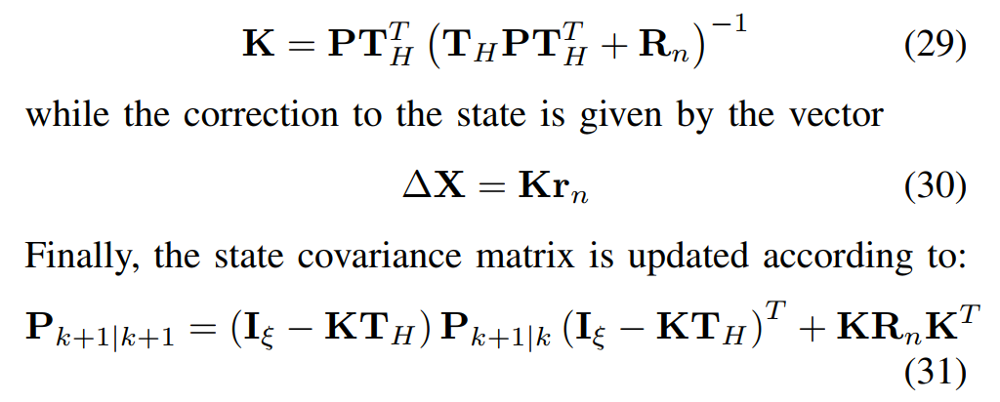

# VI-SLAM / VIO 算法简介 & OpenVINS 的原理与实现

[toc]

OpenVINS 官方文档链接

[https://docs.openvins.com/](https://docs.openvins.com/)

---
# I.  VI-SLAM / VIO 算法简介
---
## **什么是 VI-SLAM / VIO ？**
**VI-SLAM / VIO 算法 **是利用视觉、惯性两类传感器，来对机器人或其他载体进行自定位的算法。

这里 "定位" 是指对载体的 6DoF Pose 的估计，包括"位置" 和 "姿态"，而不仅仅是 "位置" 。

SLAM 除了定位机器人自身外，还需要对机器人所处环境进行建图 (Mapping)；VO/VIO 则更注重定位本身，且更侧重 "累计运动量"，随着时间的增长，在绝对精度上存在累积误差。

---
## **视觉、惯性传感器**
视觉和惯性传感器有很多互补的特性，将它们组合来解决定位问题是很有潜力的方案。

**视觉、惯性传感器对比**

| |**IMU**|**Camera**|
| ----- | ----- | ----- |
|输出频率|高|中等|
|信息量|少|丰富（可用于检测回环）|
|累积误差|增长快（加速度需要做两次积分才能得到位置）|增长慢|
|受环境影响|只受自身运动影响|需要假设环境是静止的，易受环境中运动物体的影响，易受光线和视觉特征丰富度的影响|
|其他问题|存在bias、温漂等问题； 加速度需要有充分激励，否则 IMU 只能对姿态估计提供帮助；|数据量大，处理慢； 存在特征误匹配问题；|

---
## 视觉数据使用方法：间接法和直接法
根据对图像数据使用方式的不同，视觉 SLAM 算法可分为两类：间接法和直接法。

DSO[4\] 的 Introduction 部分对这两类方法做了很好的综述。可概括如下：

* 间接法：feature-based approaches  （ORB-SLAM, VINS-Mono, OKVIS, MSCKF）
   * 这类方法会先对图像做些预处理，提取出一些特征（主流方法为点特征，也有一些研究采用线特征等），然后将几何误差(geometric error)作为观测误差。
   * 对于基于点特征的方法，几何误差一般指特征点的重投影误差
* 直接法：featureless approaches （LSD, DSO）
   * 这类方法不需要对图像做预处理，直接使用光度误差(photometric error)作为观测误差。
   * SVO / ROVIO 算是半直接法，需要提取特征，但使用光度误差而不是几何误差。

本文主要关注基于 **特征点** 的 SLAM 算法。

---

# II. SLAM 状态估计：基础理论回顾

内容较多，转移至：

[SLAM 状态估计基础理论回顾](https://newthinker-jeffrey.github.io/SLAM/SLAM%E7%8A%B6%E6%80%81%E4%BC%B0%E8%AE%A1%E5%9F%BA%E7%A1%80%E7%90%86%E8%AE%BA%E5%9B%9E%E9%A1%BE.html)

---

# III.  OpenVINS 原理与实现
OpenVINS 基于 MSCKF 改进而来，所以下面先介绍 MSCKF。

---
## MSCKF
MSCKF 算法中两个关键环节是 nullspace projection 和 measurement compression。

### Standard EKF-SLAM: landmark 较多时的维数灾难
我们先来看下标准的 EKF-SLAM，这里我们参考 [7\] 中的 Formulation。

标准 EKF-SLAM 中，我们把机器人当刻的 pose $\mathbf x_{R_k}$ 和 landmark 的位置 $\mathbf p_L$ 都放在状态量里：

标准 EKF-SLAM 的优点是可以维护和利用 camera pose 与 landmark position 之间的相关性（协方差信息），并对二者同时进行估计；

但这也会带来一个问题：如果场景里的 landmark 数量很多，状态向量里将有很多份 $p_L$，我们状态量的维数将变得非常高，Covariance的内存占用和相关的矩阵计算量将变得巨大。

---
### 从状态向量里去掉 landmark
MSCKF 提供了一种 optimal (up to linearization) 的方法，使得状态向量里不必再保留 landmark，从而解决了 landmark 过多时带来的维数问题。

**landmark 的多帧观测产生的几何约束的表达**

多帧图像对同一个 landmark 的观测，可以在这些图像的 camera pose 间产生一个几何约束。

在 Standard EKF SLAM 的 Formulation 中，我们通过把 landmark 放在状态量里，借助这个额外的变量和 camera 对 landmark 的观测模型，来表达多帧 camera pose 间的几何约束。

MSCKF 则提出了另一种 Formulation：用一种间接的视觉观测模型，使得不把 landmark position 放在状态量中也可以表达这种几何约束 。借助这一新的观测模型，MSCKF 得以实现 "从状态向量里去掉 landmark"。但与此同时，我们需要在状态向量里保存近期若干个时刻的 camera pose：

#### 基本观测模型
**单 feature、单相机**：

以下是 camera 对 landmark 的基本观测模型，这是标准 EKF-SLAM 中用到的观测模型。MSCKF 的观测模型也是以此为基础建立。

式18是简单的相机投影成像模型：以 landmark 在 camera 系$C_i$下的坐标为输入

式19是 feature 坐标变换模型：以 feature 在世界系下的坐标 $^G \mathbf p_{f_j}$ 和 camera 在世界系下的pose $( ^{C_i}_G\overline q, ^G \mathbf p_{C_i})$为输入，把 feature 坐标变换到 camera 系下。

对应的预测和error为：

误差线性化后为：

其中 $H_{X_i}^{(j)}$为观测误差对 Camera pose 估计误差的 Jacobian，$H_{f_i}^{(j)}$为观测误差对 feature position 估计误差的 Jacobian。

#### MSCKF 的观测模型，nullspace projection
**单 feature、多相机**：

下面我们介绍 MSCKF 用到的观测模型。这个模型要求 feature 必须有多帧观测。

如果把多个相机（其实是多个时刻）对同一 feature 的观测误差和观测矩阵按行叠放在一起，就得到：（注意式22与式21的区别：式22中少了下标 $_i$，表示这是多行像 21 这样的公式的组合）

我们希望得到一个不依赖 feature 的观测模型，从而允许我们从状态向量中去掉它。

从形式上看，我们似乎只要把式22中的后两项（见下图框起来的部分）合在一起当做观测噪声即可。

但这是行不通的：卡尔曼滤波器 要求状态量 (这里指各时刻相机 pose) 的 预测误差 $\widetilde X$与观测噪声必须是独立的，而上图中框起来的部分与  $\widetilde X$ 却是相关的。它们的相关性来自于在三角化计算 $\mathbf p_{f_j}$的预测值时用到了相机 pose $X$的预测值，所以二者的预测误差 $^G \widetilde {\mathbf p}_{f_j}, \widetilde X$ 之间存在相关性。

为了消除这种相关性，可以把式22的两端都投影到 $H_f^{(j)}$ 的 nullspace 上，这样就可以消除等式右侧的  $^G \widetilde {\mathbf p}_{f_j}$ 。假设 $\mathbf A$ 的列向量构成 $H_f^{(j)}$ 的 nullspace 的一组基（所以 $A^TH_f^{(j)}=0$），式 22 两边左乘$A^T$就可以实现这种投影（nullspace projection）：

这样我们就得到了一个只依赖 相机 pose $X$的观测模型。

**Remark on the model**:

1. MSCFK 观测模型中单个feature对应的观测量的维数：
   * MSCFK 观测模型中的"合成"观测量$r_o^{(j)}$ 比原始观测量   $r^{(j)}$ 少了3维，这三维对应  于观测误差对 feature 的 jacobian  $H_f^{(j)}$ 的列数：合成观测量$r_o^{(j)}$ 的维数等于  $H_f^{(j)}$ nullspace 的维数。
   * 具体来说，feature 的每次观测可提供两个维度的观测量（图像坐标），所以如果一个 feature 有 $M_j$ 帧观测，那它对应的观测量的维数为 $2M_j-3$，所以**至少要有2帧观测**才能保证 合成观测量$r_o^{(j)}$ 有意义（维数>0）
2. MSCKF 的观测模型，其实等价于 **先把 landmark 加入状态量，再把它边缘化掉**。在 II 中已经对 nullspace projection 和 边缘化 这两个操作的等价性做了理论上的解释。
   * 把 landmark 边缘化掉后，会使得因子图中观测到该 landmark 的各个 camera pose 之间产生稠密的连接。

---
### Kalman 更新环节
#### Measurement Compression
从上面的观测模型中，我们可以看到，每个 feature 将产生一个  $2M_j-3$ 维的观测量。设所有feature 产生的总观测量维数为 $d=\sum_j 2M_j-3$.

当 feature 数量、feature 连续观测帧数较多时，观测量的总维数$d$可以很高，对应的总观测矩阵 $H_X$—— 由每个 feature 的 $H_o^{(j)}$ (见上面图中式24) 按行拼接在一起组成——也将很大。这将在卡尔曼更新环节带来很高的计算量。

MSCKF 也针对这一问题做了处理：通过对 $H_X$ 的QR分解，把观测误差投影到观测矩阵 $H_X$ 的 range 上！因为只有这部分观测误差会受我们对 $X$ 的估计误差影响。这样投影之后，观测误差就只从 $d$维降到了$r$维（$r$是$H_X$的列秩，一般$H_X$是列满秩的且 $H_X$的列数 为 $6N$，其中$N$ 为滑窗中缓存的图像帧数）。这一操作我们称之为 Measurement Compression，之前在 II 中也对此做了介绍。

上面式28就是我们最终在EKF更新计算中使用的观测方程。

#### 更新环节的计算复杂度
更新方程为

MSCKF论文中分析了是做与不做 Measurement Compression 分别对应的计算复杂度。计算复杂度主要由两个环节贡献：

1. 卡尔曼增益矩阵的计算（式29）
2. 后验协方差矩阵的更新（式31）

令 $\xi=6N+15$为 MSCKF 状态量的总维数，我们现在分析下相关环节的计算复杂度

| |先 Measurement Compression 再 Update|不做Measurement Compression|
| ----- | ----- | ----- |
|最终计算用的观测误差维数|$r=rank(H_X) \le 6N\lt \xi$ ($N$为滑窗中缓存的图像帧数)|$d=\sum_{j=1}^L 2M_j-3$ ($L$为3D feature数量)|
|$H_X$的QR分解|$r^2d$|\-|
|式29中的求逆|$r^3$|$d^3$|
|式31中的矩阵乘法|$\xi^3$|max($\xi^2d$, $\xi d^2$)|

一般，$d \gg \xi \gt r$，所以可以认为更新环节的总复杂度如下表，可见做了 Measurement Compression 后计算复杂度方面能显著降低。

| |先 Measurement Compression 再 Update|不做 Measurement Compression|
| ----- | ----- | ----- |
|总复杂度| max($r^2d, \xi^3$)|$d^3$|

---
### 问题：长周期 Feature
以上基本介绍完了 MSCKF 的核心算法。现在我们来关注一个细节：何时该触发一个 feature 的 update ？有两种情况会触发更新。

1. 第一种比较简单：如果一个 feature 在最新的一帧图像中跟丢了，说明我们已经集齐了该 feature 的所有观测，这时我们应该该 feature 的更新。
2. 还有一种情况，这种情况怎么更好地处理，值得我们思考。如果一个 feature 仍然在 tracking 中，且它的 track 已经贯穿了整个滑窗，无法再添加新的观测了，这时会强制触发该 feature 的 update。

第一种情况对应 "短周期" feature： 这些  feature 只被 tracking 了少数几帧 (帧数小于滑窗长度) 就跟丢了；

第二种情况则对应  "长周期" feature，这些  feature 长时间出现在图像之中，可以被 tracking很多帧。实际上这种 "长周期" feature 对于减轻 drift 能起到很好的作用：它能在当前帧和很久之前的帧间建立起直接的几何约束，能有效抑制 drift 随时间的积累。

但 MSCKF 的处理机制，不能很好地利用这种长周期的 feature：当一个 feature 的 tracking 帧数超过滑窗长度时，它会触发一次强制更新。对这个 feature 而言，它的一部分观测在这次更新中被使用了，还有一部分观测在之后的更新中被使用，使得该 feature 实质上被"分割"成了两个独立的 feature，从而损失了一些约束信息。

这个问题在后来的 OpenVINS 中得到了更好的处理。 

---
## OpenVINS 原理
---
### 状态向量组成
再开始介绍 OpenVINS 的相关算法前，我们先看下 OpenVINS 中状态向量的组成，如下

* 首先必不可少的是用于 propagate 的惯性状态量 $\mathbf x_I$，此外，
* 既有 MSCKF 中滑窗 $\mathbf x_C$（唯一的一点小区别是，MSCKF 滑窗中 Clone 的是 Camera pose， OpenVINS 的滑窗中则是 IMU pose），
* 又有 landmark : $\mathbf x_M$，
* 还包含了相机的内外参 $\mathbf x_W$ 以支持内外参的在线修正，以及 camera-imu 时钟差 $^C t_I$ 以支持 time-offset 的在线修正。

---
### OpenVINS 的 EKF 更新
前面提到，MSCKF 的 EKF 更新中不能很好地利用长周期 feature。

OpenVINS 则对此做了很好的改进。

OpenVINS 的 EKF 更新分为两个环节：msckf\_update 和 slam\_update。

* msckf\_update ： 这个环节会用 msckf 的方法来处理短周期 feature。这些短周期 feature 不会被添加到状态量中，或者说，添加之后马上又被边缘化；
* slam\_update： 这个环节会用类似传统的 EKF-SLAM 的方法来处理长周期 feature 。这些 feature 会添加到状态量中（见下节状态向量组成），随着 IMU pose 一起被更新；

两个环节结合两种方法，既能高效利用短周期 feature 提供的观测信息，又能保留长周期 feature 的约束信息，有效减轻 drift 的发生。

---
### OpenVINS 中 feature 的初始化
一个 feature 在什么时候被初始化？

这里有两种处理思想：

1. 一种是希望在 feature 刚被 tracking 时就把它加到系统里进行估计，这样能及时用上它的观测信息（ROVIO、SVO 等算法中采用了这种方式）；
2. 第二种就是像 MSCKF 和 OpenVINS 中这样，使用 delayed initialization (延迟初始化) 的方法：当一个 feature 收集了足够多的观测后，才初始化它（通过三角化）。延迟初始化的好处是，由于观测信息丰富，feature 的初始化精度更高。这对于需要使用 FEJ 的情况有很大意义：feature 的初始估计将持续被作为它后续的线性化点，所以初始化精度应该尽可能地高。

 OpenVINS 中初始化一个 feature 的时机与 MSCKF 中类似，分两种情况：

1. 该 feature 在最新帧中跟丢了
2. 该 feature 的 tracking 已经贯穿了整个滑窗

这两种情况下，我们认为已经为 该 feature 收集了足够多的观测。但这两种情况下我们的处理方式有所不同。

首先看下观测误差方程：

我们下面用 19.1 代表式 19 中矩阵方程的第一行，用 19.2 表示第 2 行

* 对于情况 1，我们把它当做短周期 feature 使用：初始化后，马上用 19.2 做 msckf update 
   * feature 三角化获得初始估计（即线性化点）和观测 Jacobian $\mathbf H_x,\mathbf H_f$ 后，不再对 feature 做最优估计（它马上被边缘化掉了）
* 对于情况 2，我们是在初始化一个 长周期 feature：
   * 不同于情况 1，在 feature 三角化获得初始估计（即线性化点）后，会再将 feature 加入状态量（添加到协方差矩阵中）并对 feature 做最优估计：
      * 先根据旧状态量 $\mathbf x_k$ 的先验估计以及上述误差方程式 19.1 (式19矩阵方程第1行)，对新状态量 $^G \mathbf p_f$ 的先验估计值做一次 refine (高斯牛顿)，并根据式 19.1 中 $\widetilde {\mathbf x}_k$与 $^G\widetilde {\mathbf p}_f$ 之间的线性相关性，得到 新状态量 $^G \mathbf p_f$  的与旧状态量 $\mathbf x_k$ 的协方差，从而可以把 新状态量 $^G \mathbf p_f$  正式加入我们的状态向量中：

      * 利用 19.2 提供的观测信息，再做一次卡尔曼更新（这一步实质上就是 MSCKF\_update），得到所有状态量（包括新加入的状态量 $^G \mathbf p_f$） 的后验估计。
      * 注意在这个过程中， $^G \mathbf p_f$的估计值会有两次更新：第一次是对先验的 refine, 第二次是 msckf\_update 过程中发生的后验更新；
      * 更详细的推导过程 见  [https://docs.openvins.com/update-delay.html](https://docs.openvins.com/update-delay.html)

---
###  IMU 与 Camera 之间的 time offset 
#### time offset  的 定义
通常， IMU 与 Camera 系统间存在时钟差 (time offset)。我们以 Camera 系统的时钟为基准，那么在 $t$ 时刻：

* Camera 时钟读数为 $t$
* IMU 时钟读数为 $t+t_d$
其中 $t_d$ 就是时钟差（对应上面状态向量组成图中的$^C t_I$）。

#### time offset 的在线估计
OpenVINS 支持对 $t_d$ 做在线的估计，原理如下 [17\]。
假设我们当前 对 $t_d$ 的估计值 为 $\hat t_d$，估计误差为 $\tilde t_d = t_d - \hat t_d$；

$t$ 时刻的相机 pose 记为$X_t = X^C_t=X^I_{t+t_d}$，其中 $X^C_t$ 指Camera时钟达到 $t$ 时的Camera pose，  $X^I_{t+t_d}$ 指 IMU 时钟达到 $t+t_d$ 时的 Camera pose；

通过把 IMU 数据 propagate 到 IMU 时刻 $t+\hat t_d$ ，可以得到估计值 $\hat X_t =  \hat X^I_{t+\hat t_d}$，估计误差为

 $\begin{aligned} \tilde X_t =X^I_{t+t_d} - \hat X^I_{t+\hat t_d} & = (X^I_{t+t_d} -  X^I_{t+\hat t_d}) + ( X^I_{t+\hat t_d}-\hat X^I_{t+\hat t_d})  \\
& \approx \left[\begin{matrix}v \\ \omega \end{matrix}\right](t_d-\hat t_d) + ( X^I_{t+\hat t_d}-\hat X^I_{t+\hat t_d})\\
&=\left[\begin{matrix}v \\ \omega \end{matrix}\right]\tilde t_d + \tilde X^I_{t+\hat t_d}
\end{aligned}$  
其中  $v,\omega$指 $t$ 时刻（对应 IMU 时钟 $t+t_d$）的速度和角速度，可以通过 惯性状态量 和 IMU 读数得到近似值。
然后回顾下前面提到的基本观测模型

如果 1 个 feature 在 $t$ 时刻的图像中被观测到了，那么此刻的观测误差 $r_i^{(j)}$ 受我们对 $t$ 时刻的相机 pose $X_t=X^I_{t+t_d}$ 的估计误差 $\tilde X_t$ 影响（对应的 Jacobian 参考式 21 中的 $H_{X_i}^{(j)}$）；

而前面已经看到  $\tilde X_t$  又会受 $\tilde t_d$ 影响，对应的 Jacobian 就是 $\left[\begin{matrix}v \\ \omega \end{matrix}\right]$；

于是根据链式法则，我们就可以得到 观测误差 $r_i^{(j)}$ 与 $\tilde t_d$ 之间的 Jacobian，从而我们可以通过视觉观测对 $t_d$ 进行估计。

为了实现 $t_d$ 的在线校正，我们需要把它放到状态量中。此外，状态量中还将包含至少一个相机 pose $X_i$ 。随着我们对 $X_i$ 物理意义的不同诠释，我们有两种不同的具体实现：

1. 如果我们认为状态量 $X_i$ 是 IMU 时钟 $t+ t_d$ 的 Camera pose，那么我们的观测矩阵将只包含视觉观测误差对  $X_i$   jacobian （因为观测误差只依赖  $t+ t_d$ 时刻的 Camera pose）；但同时，状态量的协方差矩阵中要反映出 $X_i$ 与 $t_d$ 的相关性；
2. 如果我们认为状态量 $X_i$ 是 IMU 时钟  $t+ \hat t_d$ 时刻的 Camera pose，那么 $X_i$  与 $t_d$ 没有相关性，但我们的观测矩阵将同时包含视觉观测误差对  $X_i$  和 $t_d$ 的 jacobian （因为观测误差受 $t+ \hat t_d$ 时刻的 Camera pose 影响，而这个 pose 又受 $X_i$ 和 $t_d$ 的影响）；

OpenVINS的实现中，采取的是第 1 种解释，所以在 Propation 的 augment clone 环节就做了 time offset 校正的处理。

---
### 状态向量的增长： augment clone 
假如 $t$ 时刻有一帧新图像到来，我们需要将此时的 IMU pose 添加到滑窗 $\mathbf x_C$ 中，我们的状态向量会发生"增长"。

为此，我们需要首先通过 propagate 把惯性状态量 $\mathbf x_{I}$ 更新到最新图像对应的时刻得到 $\mathbf x_{I_{t+\hat t_d}}$ ，然后把 $\mathbf x_{I_{t+\hat t_d}}$中的 pose 部分 clone 一份  $\mathbf x_{C_t}$  放入滑窗 $\mathbf x_C$ 中；

> 惯性状态量 $\mathbf x_{I}$ 被诠释为 IMU 时钟读数为 $t+\hat t_d$ 时的pose；而 clone 出的 $x_{C_t}$则被诠释为 Camera 时钟读数 $t$、即 IMU 时钟读数为 $t+t_d$ 时的pose； 二者时刻上差了 $\tilde t_d$，所以 clone 出的 $x_{C_t}$的误差与  $\tilde t_d$ 存在相关性，需要再协方差矩阵中体现。

状态向量发生"增长"时，系统的协方差矩阵也要"增长"：由于被 Clone 出来的变量   $\mathbf x_{C_t}$  是已有变量  $\mathbf x_{I}$ 和 $t_d$(即 $^C t_I$）的函数，所以新变量     $\mathbf x_{C_t}$   的误差与它涉及的这些旧变量误差之间有相关性（ $\mathbf x_{C_t}$ 对旧变量的 Jacobian），利用此关系以及旧变量间的协方差就可以为新变量   $\mathbf x_{C_t}$  计算协方差。

$\mathbf x_{C_t}$ 对旧变量的 Jacobian 的计算参见

[https://docs.openvins.com/classov\_\_msckf\_1\_1StateHelper.html#ade3a86a89f15cc6e03a6430fd1dee694](https://docs.openvins.com/classov__msckf_1_1StateHelper.html#ade3a86a89f15cc6e03a6430fd1dee694)

---
### Propagation
[https://docs.openvins.com/propagation.html](https://docs.openvins.com/propagation.html)

#### 系统演化方程
IMU 测量方程（Continuous-time）

系统演化的微分方程：

注意，我们4个连续时间噪声项: 

$\mathbf n_g,\mathbf n_a$： gyro  和 acc 的观测噪声项，每个轴上功率谱密度为 $\sigma_{gc}, \sigma_{ac}$;

$\mathbf n_{wg},\mathbf n_{wa}$： gyro  和 acc 的随机游走（布朗运动）噪声项，每个轴上功率谱密度为 $\sigma_{wgc}, \sigma_{wac}$;

#### $t_k$ 到 $t_{k+1}$ 之间的 propagation 
姿态四元数（看做单列4行的矩阵）从 $t_k$ 到 $t_{k+1}$ 之间的 propagation (假设真实角速度在此期间维持不变)：

其他量的 propagation:

#### 数值积分方法
以上积分，可以用不同的数值方法求解，可以在 配置文件中通过 `use_rk4int` 和 `use_imuavg` 的组合来选择：

|`use_rk4int`|`use_imuavg`|对应的数值积分方法|
| ----- | ----- | ----- |
|true|\-|[rk4](https://en.wikipedia.org/wiki/Runge%E2%80%93Kutta_methods)|
|false|true|[Midpoint](https://en.wikipedia.org/wiki/Midpoint_method)|
|false|false|[Euler](https://en.wikipedia.org/wiki/Euler_method) (the simplest)|

#### 噪声的离散化

>  $\mathbf n_{gc}$ 和 $\mathbf n_{bgc}$都是连续时间高斯白噪声，它们的积分是布朗运动。但为什么离散化时他们的标准差分别是 乘以 $\frac{1}{\sqrt {\Delta t}}$ 和 $\sqrt {\Delta t}$ ？

> 对于游走噪声 $\mathbf n_{bgc}$，$E\left[\int_0^{\Delta t} \mathbf n_{bgc}^2(t)dt\right] = \Delta t \cdot \sigma_{bgc}^2$，离散采样时我们是对积分值采样，所以$\mathbf n_g$的标准差取 $\sigma_{bg}=\sqrt {\Delta t} \cdot \sigma_{bgc}$;

> 

> 而对于测量噪声 $\mathbf n_{gc}$，虽然    $E\left[\int_0^{\Delta t} \mathbf n_{gc}^2(t)dt\right] = \Delta t \cdot \sigma_{gc}^2$，但我们是对某时刻的瞬时值采样，这时离散化就比较难解释，这里只大概介绍其原理。事实上白噪声的功率是无限的（白噪声功率谱密度是非0常量，对所有频率的积分是无穷），我们无法用幅值有限的离散样本来模拟。离散化时，只能先对白噪声做个低通滤波使其带宽和功率变得有限，再对滤波后得到的有限带宽$W=f/2$（采样频率对应我们的采样周期$\Delta t=1/f$）的噪声进行采样。最终就是取离散化标准差  $\sigma_{g}=\frac{\sqrt {\Delta t} \cdot \sigma_{gc}}{\Delta t}$ 。具体可参考([https://moys.gov.iq/attachments/Probability\_and\_Random\_Processe\_-\_Scott\_Miller.pdf](https://moys.gov.iq/attachments/Probability_and_Random_Processe_-_Scott_Miller.pdf)   12.2.3节)

#### error  的传递，Jacobian 和 协方差的计算

---
### 完整观测模型
之前已经提到过单个相机对单个 feature 的基本观测模型，比较简单，方便做理论陈述。

但实际使用时，我们还要考虑相机畸变、IMU 和 Cemera 外参、landmark 的参数化方式等因素。本节介绍完整的观测模型。

[https://docs.openvins.com/update-feat.html](https://docs.openvins.com/update-feat.html)

我们先来看下观测方程。能拿到最直接的观测量是 feature 的图像坐标 $\mathbf z_{m,k}$ ，观测函数 $\mathbf h$的输入则是我们状态向量中的相关变量。

把观测函数层层拆开，有以下几级函数：

然后用链式法则求 Jacobian：

需要注意 $\mathbf h_t$函数，当 landmark 选择 global 的参数化方式时，它的第一个参数 $^G \mathbf p_f$ 本身是状态量的一部分，所以上式中的第二项不存在；但如果使用的 anchor 的参数化方式，则  $^G \mathbf p_f$ 就只是个中间变量，我们还要求出第二项。

#### Landmark's Representations
Landmark 可以有不同类型的 representation，相应地，Landmark 变量的自由度可以是 1 (depth\_single) 或者 3 (full representation)。

* `GLOBAL_3D,  ANCHORED_3D`： 全局系或ANCHOR系下的笛卡尔坐标 $(x,y,z)$ 表示法;
* `GLOBAL_FULL_INVERSE_DEPTH, ANCHORED_FULL_INVERSE_DEPTH`: 全局系或ANCHOR系下的 "逆径" 球坐标 $(\frac{1}{r}, \theta, \varphi)$ 表示法;
* `ANCHORED_MSCKF_INVERSE_DEPTH`：逆深度表示法 $(u_{\mathbf {n}},v_{\mathbf{n}},\frac{1}{z})=(\frac{x}{z},\frac{y}{z},\frac{1}{z})$，这是当前主要使用的表示法；
* `ANCHORED_INVERSE_DEPTH_SINGLE`:  类似于逆深度表示法 ，但只有 $(\frac{1}{z})$ 一个自由度，$(u_{\mathbf{n}},v_{\mathbf{n}})$则固定为某一帧的观测值；
* `UNKNOWN` : 未定义值

landmark 本身有 3 个自由度，除了 `ANCHORED_INVERSE_DEPTH_SINGLE` 外，其他参数化方法都有 3 个参数； 

`ANCHORED_INVERSE_DEPTH_SINGLE` 这种表示法则只有 1 个逆深度参数，它的 bearing 信息（2个自由度）在做更新计算时会被 边缘化掉。由于一个 landmark 的每帧观测能产生一个 2 维的约束，为了边缘化掉2维的 bearing 信息，至少需要3维的观测（边缘化后仍然能有 >0 维的观测），因此 landmark 至少要有 2 帧（对应4维的）观测，才能执行边缘化。这也是这种表示法为什么会要求每个 feature 至少还留有2帧观测的原因。

---
### 初始化
初始化阶段的输出：

* 选择某一时刻$t_0$作为初始时刻
* 给出$t_0$时刻 IMU 的初速度 $v_0$、bias $b_a,b_g$、IMU系中的重力加速度方向 $^{I_0} g$。

#### 静态初始化
为了完成静止初始化、且保证初始化后系统能正常工作，我们需要

* 能采集一段时间的静止 IMU 数据
* 保证初始化完成后系统处于运动状态（有 ZUPT 时例外）

> IMU 初始化后，系统不能处于静止状态（在不开启 ZUPT 的情况系下）。否则，初始化后由于没有 feature 能够被三角化，会导致视觉信息完全不能用于 update，我们纯粹靠 IMU 在 propagate，这会导致 VIO 很快飞掉。

> 且当没有充分的加速度激励时，acc 的初始 bias 误差可能与 sensor 的实际加速度在相同量级、甚至比实际加速度更显著，这导致通过积分得到的路径长度可能很大比例是 bias 误差贡献的，这会导致我们对尺度的估计也基本不可用。

为此，我们采集一段时间的 IMU 和 图像数据 （常用 2s 的时间窗口），并将窗口平分为两部分：我们希望窗口的前半部分中 IMU 在静止状态，后半部分中 IMU 开始运动。

IMU 是否处于静止，我们同时根据图像中特征点的视差和 IMU acc 的读数变化来判断。

如果找到了这样一个时间窗口，那我们就可以利用窗口前半部分的静止数据来做初始化了。

1. 去初始时刻 $t_0$ 为窗口中间时刻，此刻之后 IMU 才开始运动，所以可以认为 $v_0=0$;
2. 利用静止期间 gyro 的数据，取平均得到 gyro 的 bias $b_g$；
3. 利用静止期间  acc 的数据，取平均得到 acc 的平均读数 $\overline a=b_a+^{I_0}g$。
   1. $^{I_0} g$ 在半径为 9.81 的圆上；圆上的任意一点都对应 $^{I_0} g$ 和 $b_a$ 的一组解：

   2. 我们假设 $9.81=|^{I_0} g| \gg  |b_a|$，因此 $\overline a$ 与  $^{I_0} g$ 近似平行。我们取二者平行 (最小化 $|b_a|$ )，得到的解如下：

如此便完成了静止初始化。可见初始化过程中，实际上我们并不能通过 $\overline a$ 唯一地确定    $^{I_0} g$ 和 $b_a$：我们是按照最小化 $|b_a|$ 的原则选取的一组  $^{I_0} g$ 和 $b_a$ ，但这个原则并一定符合实际。由于 $b_a$ 的模长较小，其相对误差可能较大。
#### 动态初始化 (可跳过)
动态初始化，是利用一个时间窗口中的动态数据，结合视觉观测和 IMU 数据来联合估计这段时间内 Camera/IMU 在各时刻的 pose、速度、bias、以及 feature 位置。

虽然动态初始化可以估计出这么多量，但其输出给 VIO 的量依然只有本节最开始提到的那几项，跟静止初始化一样。

动态初始化分三个步骤进行：

1. 第 1 步是在假设 bias = 0 的前提下，粗略估计初始帧的速度、姿态（重力指向$-Z$）以及各 feature 的位置；
2. 第 2 步是根据初始帧的速度，利用 IMU 积分 (依然假设 bias = 0 ) 初步估计每一帧对应的位置、姿态和速度；
3. 第 3 步则是利用前两步得出的初值，做 Inertial - Visual BA，优化各时刻的 pose、速度、bias、以及 feature 位置；
   1. 第3步BA优化问题中的因子包括 惯性因子、视觉因子和先验因子 。

   2. 计算惯性因子 $\mathbb C_I$时需要用到 IMU 预积分：当 bias 变动较小时能快速在相邻帧间repropagate（近似）。预积分的推导见 [16\]，其中介绍了两种 CPI (Continuous Preintegration)，CPI1 假设两次 IMU 数据之间"加速计读数"保持恒定，CPI2假设 IMU local 系下的真实加速度保持恒定。代码中两种CPI都做了实现，但目被调用的是CPI1;
   3. 先验因子子 $\mathbb C_P$ 主要用于约束一些不可观的状态量：比如全局的位置和yaw，以及当时间窗口很短、且旋转有限时，gyro 尤其是 acc 的 bias 也近乎不可观。

以上，只有第 1 步还需要多做些解释；第2步就是简单的积分；第3步也是常规的 BA 操作。

第 1，2 步骤中获取各状态量初值的时候，都十分依赖 IMU 的积分结果，所以如果 IMU 数据不好（比如 bias 较大、或者积分累积误差较大），都可能对初始化效果有很大影响。

##### 初始帧速度、重力方向和所有 feature 位置的粗略估计
第1步主要的作用是，对初始帧速度、重力方向和所有 feature 位置做粗略估计。[11\] [12\]

基本原理是，用初始帧速度、重力方向（可用于定义初始姿态）和 IMU 数据（已知），表示出所有时刻的 Camera pose；再利用所有 feature 观测提供的约束，对 初始帧的速度、重力方向和所有 feature 位置求解析解。

假设

* 第 0 帧图像对应时刻 $t_0$ 的 IMU 系为 $I_0$，
* 此刻 IMU 相对于 $I_0$ 的速度为 $^{I_0}\mathbf v_{I_0}$，
* 重力加速度在 $I_0$ 系中为 $^{I_0}g$，
* 某个 feature $f$在 $I_0$ 系中的位置为 $^{I_0}\mathbf p_f$，$\left[ \begin{matrix} u_n \\ v_n  \end{matrix} \right]$为其在第 $k$ 图像中的归一化观测坐标（normalized bearing）

那么有以下约束

其中 $^0\alpha_k$ 和 $^{I_k}_{I_0}\Delta R$ 都是通过 IMU 在第 0 帧到 第$k$帧图像间的积分得到，$^C_I R$为 camera 和 IMU 间的外参。

从 29 可以看出，我们得到一个关于 $^{I_0}\mathbf p_f,^{I_0}\mathbf v_{I_0},^{I_0}g$ 的方程；如果这个 feature 有多帧观测，把这些观测各自对应的 29 式放在一起，就能得到一个方程组：

由于每个如 式29 的方程能提供2个约束，而 $^{I_0}\mathbf p_f,^{I_0}\mathbf v_{I_0},^{I_0}g$ 三个向量共有9个参数，所以只要有5帧观测就可以对上述方程组 式30 进行求解。如果考虑 $|^{I_0}g|=9.81$ 模长恒定的约束，这9个参数只有8个自由度，因此只要有4帧观测即可求解。

这样就得到一个带二次约束的最小二乘问题：

为了后续符号上的方便，令 $\mathbf x_2 = ^{I_0} \mathbf g$ ；

那么格朗日乘子式为：

上述拉格朗日乘子式对应的 KKT 条件为：

利用 (44) 的 第一个等式，我们可以用 $\mathbf x_2$ 表示 $\mathbf x_1$ ：

令 $B=A_1(A_1^TA_1)^{-1}A_1^T$，$C=I-B$，可以验证 $B^2=B$ 且 $C^2=C$，

那么利用(45)得 $A_1\mathbf x_1=-B(A_2\mathbf x_2 - b)$，带入到 (31) 中，

$$\begin{aligned} \Vert A_1\mathbf x_1 + A_2\mathbf x_2 - b \Vert_2 = \\
\Vert -B(A_2\mathbf x_2 - b) + (A_2\mathbf x_2 - b) \Vert_2 = \\
\Vert C(A_2\mathbf x_2 - b) \Vert_2 = \\
\mathbf x_2^T A_2^T C^2 A_2\mathbf x_2 - 2b^T C^2 A_2\mathbf x_2 + b^TC^2b=\\
\mathbf x_2^T A_2^T C A_2\mathbf x_2 - 2b^T C A_2\mathbf x_2 + b^TCb=\\
\mathbf x_2^T D\mathbf x_2 - 2d^T\mathbf x_2 + b^TCb
\end{aligned}$$

其中， $D=A_2^TCA_2$, $d=A_2^TCb$。

由此可见，为最小化 (31)，我们需要从满足KKT条件的候选解中选出能使得 $\mathbf x_2^T D\mathbf x_2 - 2d^T\mathbf x_2$ 最小的。

> 此外，$C$ 是半正定的：

> 若 $\mathbf x \in ColRange(A_1)$，那么存在 $\mathbf y$ 使得 $\mathbf x=A_1\mathbf y$，于是 $\mathbf x^T B \mathbf x = \mathbf y^T A_1^T B A_1\mathbf y = \mathbf y^T A_1^T  A_1\mathbf y = \mathbf x^T  \mathbf x$，因此 $\mathbf x^T C \mathbf x =0$;

> 若 $\mathbf x \in ColNullSpace(A_1)$，那么 $\mathbf x^T A_1=0$，从而 $\mathbf x^T B \mathbf x = 0$，因此 $\mathbf x^T C \mathbf x =\mathbf x^T  \mathbf x \ge 0$

另外，(45) 代回 (44) 的第二个等式消掉其中的$\mathbf x_1$，可以得到原问题 KKT 条件只包含 $\mathbf x_2$ 的部分如下：(46)

因此原问题等价于：（ (49)的 KKT条件即 (46) ，且是最小化目标函数)

而这又等价于找满足 KKT 条件 (46) 的所有解中，$\lambda$ 最小的那组（证明见 [14\] Theorem 1 + 2），因此 (49) 转化为

而 KKT 条件 (46) 的 $\lambda$ 的解等价于下面的 quadratic eigenvalue problem 的解：存在某个向量 $\mathbf e$ 使得下式成立。（ 这两个问题的等价性证明见 [13\] Theorem 5.1+5.2）

而 (51) 成立则说明 $\left((D-\lambda I_3)^2 - \frac{1}{g^2}dd^T\right)$ 的行向量存在 null space:  （51) 中的$\mathbf e$就在其null space上。存在 null space 意味着秩亏，行列式为0，于是等价于(52):

把这个行列式展开，是一个关于 $\lambda$ 的一元六次方程。这个方程可能存在多个解，但前面已经提到，我们应该选最小的$\lambda$：它能使得(49) 最小化。

> 求解一元高次方程可以用伴随矩阵 : [https://en.wikipedia.org/wiki/Companion\_matrix](https://en.wikipedia.org/wiki/Companion_matrix)

> 对伴随矩阵做特征值分解即可得到 $\lambda$ 所有的解。OpenVINS 的代码实现中用的就是此方法。

> 

> SLAM 经典论文 五点法求 Essential 矩阵 [18\] 中，提到过另一种利用 Sturm-sequences 来求解的方法：A highly efficient way is to use *Sturm-sequences* to **bracket the roots**, followed by a **root-polishing** scheme.

求得 $\lambda$ 后，我们即可得到原问题的解如下：

###### 代码中的一个问题？（可跳过）
在 OpenVINS 的代码实现中，并非如论文中所说选了最小的 $\lambda$，而是选取了使得 $\mathbf x_2=(D-\lambda I)^{-1}d$ 的模长最接近 $g$ 的那个 $\lambda$。

感觉这种实现可能会有问题：关于 $\lambda$ 的高次方程(52) 是等价于前面的 KKT条件 (46) 的，(52) 的解应该都能满足 (46) 中$\mathbf x_2$的模长约束，因此通过判断 $\mathbf x_2=(D-\lambda I)^{-1}d$ 的模长并不一定能选到最小的 $\lambda$。

相关代码如下图

### ZUPT （零速更新）
系统处于静止状态时，可能会带来些问题：

* 当系统处于静止状态时，新的 feature 无法获得足够的视差来初始化，如果此时视野内也没有长期 feature，那么位姿的输出将只靠 IMU 积分，所以很快会飞掉；
* 如果视野中有较大的运动物体并且被 tracking 上了，那么系统会认为自己在运动，导致错误的更新

因此，如果能判断出系统是否处于静止，并在静止情况下做特殊处理，将对算法在静止状态下的鲁棒性有很大改进。

#### 零速判断
我们有两种方式来判断系统是否处于静止：

1. Inertial-based Detection：如果估计出的加速度和角速度都接近0，我们认为系统可能处于静止（但注意，理论上加速度为0并不代表速度也为0，我们额外还需要对速度也做个阈值判断）
   1. 我们利用 IMU 的读数 $\mathbf a_m, \mathbf \omega _m$ 以及对当前姿态和 bias 的估计 $^{I_k}_G\mathbf R, \mathbf b_a, \mathbf b_g$ 可以预测出当前的加速度 $\mathbf a$ 和角速度 $\mathbf \omega$；做零速判断时，我们的 Hypothesis 是实际的加速度和角速度为 0，即$\mathbf a = \mathbf \omega = 0$，所以误差项 $\tilde {\mathbf z}$的定义（可见$\tilde {\mathbf z}$同时受状态量的误差和IMU测量噪声影响）、以及其相对于状态量 $^{I_k}_G\mathbf R, \mathbf b_a, \mathbf b_g$ 的 jacobian 如下:  

   2. 然后判断马氏距离，来看我们的 Hypothesis （即系统处于静止）是否成立。最近两帧图像间的每次 IMU 测量都各产生一个6维观测和一个上图中的 Jacobian ，所有这些观测合在一起组成一个维数很高的观测和下图中的观测矩阵$\mathbf H$（多个 Jacobian 合成）。注意 IMU 观测噪声的协方差被乘了个放大系数 $\alpha$ ，以应对我们对测量值的 overconfident 和其他未被考虑的噪声项（比如震动）

   3. ZUPT "零速虚拟观测" 的 $R$ 阵设置代码如下，乘了系数 `_zupt_noise_multiplier`，对应上图中的 $\alpha$  。注意，下图代码中的误差项 `res` 是做过 measurement compression 之后的，且其协方差矩阵为$I$：在measurement compression 之前，代码中已经将各个噪声项预处理为 单位协方差的，之所以这样预处理是我们因为要把 $\omega$和 $a$这两种不同类型的观测量整合到一起，而它们的方差系数又不一样，为保证噪声整体的 isotropy 就提前做了预处理，各自都转为单位方差的。

2. Disparity-based Detection：静止时feature在前后帧的视差接近0。但对于场景中有运动物体的情况，基于图像判断静止就不可靠了。
   1. 计算所有被 tracking 的 feature （假设共 $N$ 个）在最近的相邻两帧间的平均视差，再做阈值判断：

OpenVINS 中可以支持组合两种判断方式：

#### 更新环节
ZUPT 功能如果开启，OpenVINS 在 Feature tracking 之后、常规  Propagation 和 Update 之前，回显尝试做 ZUPT；如果 ZUPT 更新成功（判断为0速并做了更新），则不再进行后面的常规  Propagation 和 Update；

ZUPT 更新时，有两种方式。两种方式都会保持状态向量 `state` 中的滑窗时间不变，但 `state->_timestamp` 推进到最新时刻

>  `state->_timestamp`  是每次 IMU propagate 时的起始时间，见 `Propagator::propagate_and_clone() `  

第一种（`explicitly_enforce_zero_motion = false` ），只对 bias 进行 Propagate（bias 协方差变大），不对 pose、速度等变量 propagate，且不再对状态向量再做新的 clone；再用上面构建的虚拟观测值 $\mathbf a=\mathbf \omega=0$ 来做 Kalman 更新；

第二种（ `explicitly_enforce_zero_motion = true`  ），依然 `propagate_and_clone()` ，从代码看起来，是构造了一个最新两帧间的相对运动观测 $\mathbf y$，并给它以 0 观测值，从而试图在更新环节抵消掉 propagate 产生的运动；最后会再 marginalize 掉新 clone 出来的变量，使得滑窗的范围保持不变。

> 构造出观测量 $\mathbf y$的观测方程如下 (最新clone出的一帧用下标1，之前的旧帧用下标0)

> $\mathbf y = \left[\begin{matrix}  -\log_{SO3}(^{I_0}_G \mathbf R \cdot ^{I_1}_G \mathbf R^T)  \\ ^G \mathbf p_1 - ^G \mathbf p_0\\
^G\mathbf v_0
 \end{matrix}\right] + \mathbf n_y$

> 我们给$\mathbf y$一个0观测值，然后观测误差 residual 为 $\mathbf y - \hat {\mathbf y} =0  - \hat {\mathbf y}$ ，其中 $\hat {\mathbf y}$ 为用 propagation 后的状态估计值计算得到的相对运动量：可见我们的 residual 直接设置为 $-\hat {\mathbf y}$即可）。然再为观测噪声 $\mathbf n_y$设置一个比较小的协方差矩阵，这样更新时就会试图使两帧间的相对运动接近0.

`explicitly_enforce_zero_motion` 目前代码中强制 false，所以只有第一种更新方式在被使用。

---
REFERENCES

1. [OpenVINS\] Patrick Geneva, Kevin Eckenhoff, Woosik Lee, Yulin Yang, and Guoquan Huang,  "OpenVINS: A Research Platform for Visual-Inertial Estimation"
2. [MSCKF\] A.I.MourikisandS.I.Roumeliotis, "A multi-state constraint Kalman filter for vision-aided inertial navigation," in Proceedings of the IEEE International Conference on Robotics and Automation, Rome, Italy, Apr. 10–14, 2007, pp. 3565–3572.
3. Frank Dellaert, Michael Kaess, "Factor Graphs for Robot Perception"
4. [DSO\] J. Engel, V. Koltun, and D. Cremers, "Direct sparse odometry," IEEE Transactions on Pattern Analysis and Machine Intelligence, 2017.
5. [VINS-Mono\] T. Qin, P. Li, and S. Shen, “VINS-Mono: A robust and versa- tile monocular visual-inertial state estimator,” IEEE Transactions on Robotics, vol. 34, no. 4, pp. 1004–1020, 2018.
6. [OKVIS\] S. Leutenegger, S. Lynen, M. Bosse, R. Siegwart, and P. Furgale, "Keyframe-based visual-inertial odometry using nonlinear optimization," Int. J. Robot. Research, vol. 34, no. 3, pp. 314–334, Mar. 2014.
7. [FEJ\] Huang, G. P., Mourikis, A. I. and Roumeliotis, S. I. (2009), "A first-estimates jacobian ekf for improving slam consistency," in Experimental Robotics, Springer, pp. 373–382.
8. J.A. Castellanos, J. Neira, and J. Tardos, "Limits to the consistency of EKF- based SLAM," In 5th IFAC Symposium on Intelligent Autonomous Vehicles, pages 1244–1249, Lisbon, Portugal, July 2004.
9. S. Huang and G. Dissanayake, "Convergence and consistency analysis for extended Kalman filter based SLAM," IEEE Transactions on Robotics, 23(5):1036– 1049, Oct. 2007.
10.  Yanhao Zhang, Teng Zhang, Shoudong Huang, "Comparison of EKF based SLAM and Optimization based SLAM Algorithms"
11.  [RPNG-2022-INIT\] Patrick Geneva, Guoquan Huang, "OpenVINS State Initialization: Details and Derivations", RPNG. [https://pgeneva.com/downloads/reports/tr\_init.pdf](https://pgeneva.com/downloads/reports/tr_init.pdf)
12.  Tue-Cuong Dong-Si and Anastasios I Mourikis, "Closed-form Solutions for Vision-aided Inertial Navigation," Tech. rep. Dept. of Electrical Engineering, University of California, Riverside, 2011. url: [https://tdongsi.github.io/download/pubs/2011\_VIO\_Init\_TR.pdf](https://tdongsi.github.io/download/pubs/2011_VIO_Init_TR.pdf)
13.  Walter Gander, Gene H Golub, and Urs Von Matt, "A constrained eigenvalue problem," In: Linear Algebra and its applications 114 (1989), pp. 815–839.
14.  Emil Spjøtvoll, "A Note on a Theorem of Forsythe and Golub," In: SIAM Journal on Applied Mathematics 23.3 (1972), pp. 307–311.
15.  Forsythe and Golub, "On the stationary values of a second-degree polynomial on the unit sphere," In: SIAM Journal on Applied Mathematics, 13 (1965), pp. 1050-1068.
16.  Kevin Eckenhoff, Patrick Geneva, Guoquan Huang, "Continuous Preintegration Theory for Graph-based Visual-Inertial Navigation," *RPNG* [https://udel.edu/\~ghuang/papers/tr\_cpi.pdf](https://udel.edu/~ghuang/papers/tr_cpi.pdf)
17.  Li M, Mourikis AI, "Online temporal calibration for camera–IMU systems: Theory and algorithms," *The International Journal of Robotics Research*. 2014;33(7):947-964. doi:[10.1177/0278364913515286](https://doi.org/10.1177/0278364913515286)
18.  D. Nister, "An efficient solution to the five-point relative pose problem," in *IEEE Transactions on Pattern Ana*Nister*lysis and Machine Intelligence*, vol. 26, no. 6, pp. 756-770, June 2004, doi: 10.1109/TPAMI.2004.17.

