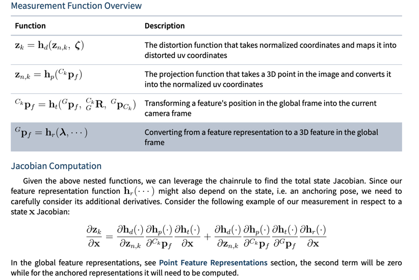
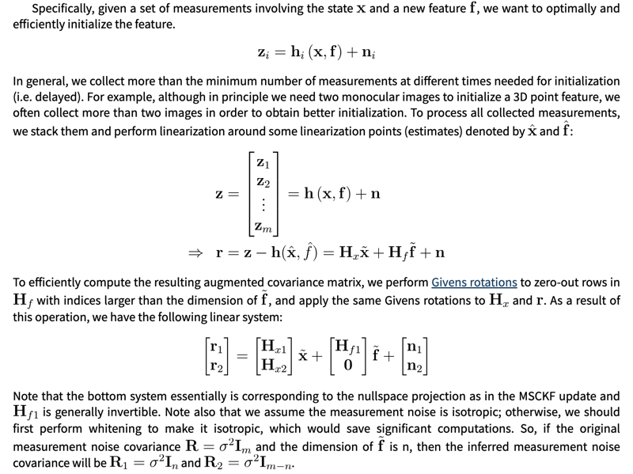
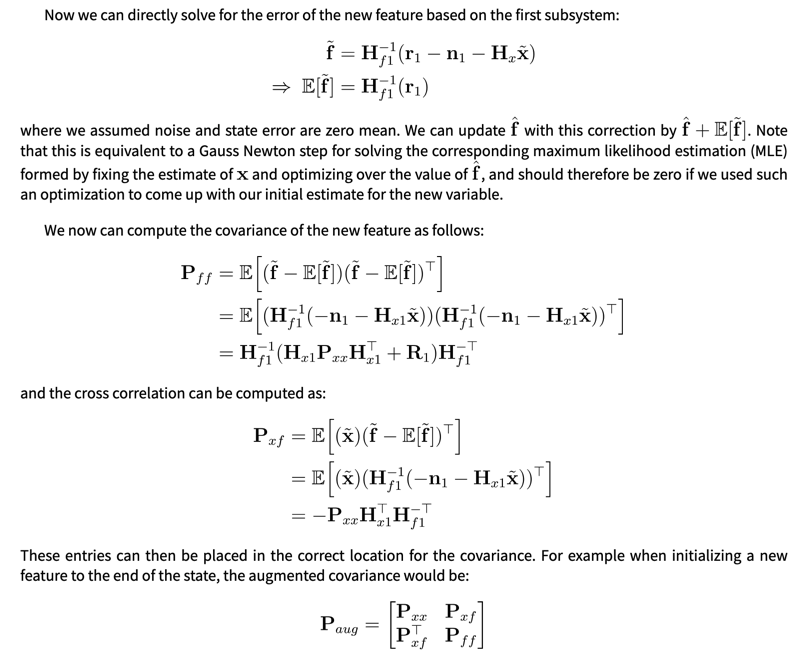

# RIEKF用于OpenVINS的实现思路draft

---
状态量：

为方便扩展多目，clone 部分记录 I 系的相关pose，再结合外参表示出 C 系的 pose

有两种方式，一种是记录  $T_{I_{t_{k-i}}I_{t_k}}$，一种是直接记录 $T_{GI_{t_{k-i}}}$;

状态量：

（坐标表示规范：  [https://github.com/ethz-asl/maplab/wiki/Expressing-frame-transformations-in-code](https://github.com/ethz-asl/maplab/wiki/Expressing-frame-transformations-in-code)）

Inertial part:  $X_I$

$R_{GI_{\hat t_k}}$

$p_{I_{\hat t_k}}:=^Gp_{GI_{\hat t_k}}$

$v_{I_{\hat t_k}}:=^Gv_{GI_{\hat t_k}}$

$b_\omega, b_a$

Landmarks:  $X_M$

$f_j$

> 后来对状态误差定义做了改进： 与原来的状态误差定义相比： landmark error 的参考 pose  不再是 IMU 子状态 $T_{GI_{\hat t_{k}}}$ ，而是 clone 的 $T_{GI_{t_k}}$; 这样就可以用更好的 Propagation 了。

Cloned part:  $X_C$

方案1：$R_{GI_{{t_{k-i}}}}$,     $T_{t_{k-i}}:=p_{I_{t_{k-i}}} :=^G p_{GI_{t_{k-i}}}$

或者  

方案2：$R_{I_{t_{k-i}}I_{\hat t_k}}$  ,    $T_{t_{k-i}}:=^{I_{t_{k-i}}} p_{I_{t_{k-i}}I_{\hat t_k}}$

外参部分： $X_E$ （$l$ 是相机的编号）

$R_{C_lI}$,   $T_l:=t_{C_lI}=^{C_l} t_{C_lI}$

内参部分 $X_\zeta$ :

 $\zeta_l$

Cam-IMU 时间延迟： $t_d$  (为了简化问题先不考虑延迟)

---

RI-EKF 用于 VIO 时 Propagate 环节的计算量有所增加（相较于普通EKF）：

* 普通 EKF 方法中，Propagate 时只有 Inertial 部分的 State 协方差会发生变化；
* In-EKF 方法中，Propagate 时 landmark 甚至 clone state 的协方差也会发生变化；

---
惯性状态的 propagate

如果引入 bias $b_{\omega},b_a$和它们的估计值 $\hat b_{\omega},\hat b_a$，以及对应的测量噪声 $\nu_\omega,\nu_a$，那么

状态空间扩充为 $(\mathbb {SO}(3) \rtimes\mathbb {PV}) \times \mathbb{B}$；其中 $\mathbb B=\mathbb R^3\times \mathbb R^3$，配备平凡李群结构。

$a=a_m-b_a-\nu_a, \quad  \hat a = a_m-\hat b_a$

$\omega=\omega_m-b_\omega-\nu_\omega, \quad \hat \omega=\omega_m - \hat b_\omega$

$\dot R=\omega^\wedge, \quad \dot {\hat R} =\hat \omega ^\wedge$

$\dot v=Ra-G, \quad \dot{\hat v} = \hat R\hat a-G$

$\dot \eta_R = R\omega^\wedge \hat R^{-1} - R\hat R^{-1}\hat R\hat \omega^\wedge\hat R^{-1}=R(\omega-\hat \omega)^\wedge\hat R^{-1}=\eta_R\hat R(-\eta_{b_\omega}-\nu_\omega)^\wedge\hat R^{-1}=-\eta_R(\hat R(\eta_{b_\omega}+\nu_\omega))^\wedge$

进一步 

$\dot \eta_R = -\eta_R(\hat R(\eta_{b_\omega}+\nu_\omega))^\wedge \eta_R^{-1}\eta_R = -(\underbrace {\eta_R\hat R}_R(\eta_{b_\omega}+\nu_\omega))^\wedge \eta_R$

$\dot \eta_p = \dot p - (\dot \eta_R \hat p + \eta_R \dot{\hat p})=v-\eta_R\hat v - \dot \eta_R\hat p= \eta_v - \dot \eta_R\hat p$

$\dot \eta_v=\dot v - (\dot \eta_R \hat v + \eta_R \dot{\hat v}) =(Ra-G)-\eta_R(\hat R \hat a-G) - \dot \eta_R\hat v=(\eta_R-I)G-\underbrace{\eta_R\hat R}_R(\eta_{b_a}+\nu_a)-\dot \eta_R\hat v$

转化为李代数，线性化并略去 $\xi$ 的高阶小量，得

($\eta_{b_\omega}=\xi_{b_\omega}$, $\eta_{b_a}=\xi_{b_a}$, $\eta_R=\exp(\xi_R)\approx I+\xi_R$,  $\eta_p=J_l(\xi_R)(\xi_p)\approx \xi_p,  \eta_v\approx \xi_v$, )

$\dot \xi_R\approx \dot \eta_R \approx - (\hat R(\xi_{b_\omega}+\nu_\omega))^\wedge$

$\dot \xi_p \approx \dot \eta_p \approx \xi_v - \dot \xi_R\hat p$

$\dot\xi_v\approx \dot \eta_v \approx \xi_R G-\hat R(\xi_{b_a}+\nu_a)-\dot \xi_R\hat v$

再整理：

$\dot \xi_R^\vee\approx - \hat R(\xi_{b_\omega}+\nu_\omega)$

$\dot \xi_p \approx \xi_v - \hat p^\wedge (\hat R(\xi_{b_\omega}+\nu_\omega))$

$\dot\xi_v\approx  -G^\wedge \xi_R^\vee -\hat R(\xi_{b_a}+\nu_a)-\hat v^\wedge (\hat R(\xi_{b_\omega}+\nu_\omega))$

（$b_\omega,b_a$ 的演化是简单的随机游走，不再写出）

可见，由于 $\omega$ 的 bias 和测量噪声 $b_\omega+\nu_\omega$，旋转部分的 jacobian 对 $\hat R$ 产生了依赖 $\hat R(\xi_{b_\omega}+\nu_\omega)$；

平移和速度部分的误差，因为旋转误差 jacobian $\dot \xi_R$ 的存在，又各自对  $\hat p$ 和  $\hat v$ 产生了依赖；

由于 $a$ 的 bias 和测量噪声  $\xi_{b_a}+\nu_a$，速度的 jacobian 又对 $\hat R$ 产生了额外依赖 $\hat R(\xi_{b_a}+\nu_a)$；

如果 bias 估计得比较准，且 IMU 测量噪声较小，那么 jacobian 受 $\hat R,\hat p,\hat v$ 的影响就会较小。

如果陀螺仪的 bias 估得准（静止初始化），那 $\hat R(\xi_{b_\omega}+\nu_\omega)$就可以控制住，这时可以认为 $\dot \xi_R^\vee,\dot \xi_p$ 受估计值$\hat X$的影响较小；

对于 $\dot\xi_v$，它额外受加速计的 bias 影响，而要估准 加速计的 bias 可能需要有足够的 IMU 激励；随着时间积累 $\dot\xi_v$的积分 $\xi$ 又会影响到 $\dot \xi_p$.

---
整体的 Propagate 流程（老版，弃用，但部分推导还有参考价值）:

两种思路：

每帧 IMU 数据 propagate 一次：

propagate 时每个 landmark 的 cov 也会发生变化（此外使用第一种 clone 方案时 $X_C$ 也会受 propagate 影响），所以 cov 的 propagate 变得复杂了；

> 后来对状态误差定义做了改进： 与原来的状态误差定义相比： landmark error 的参考 pose  不再是 IMU 子状态 $T_{GI_{\hat t_{k}}}$ ，而是 clone 的 $T_{GI_{t_k}}$; 这样就可以用更好的 Propagation 了。

如果每帧 IMU 都 propagate 一次，计算开销将变大；

简化（但有瑕疵的）方法是，类似于预积分，计算出相邻两帧图像间的相对变化量，再整体一次性 propagate；

IMU state 的 Propagate：

预积分：

记两帧图像间的 Inertial State 总变化为 $\Delta$，

以 $S_0:=(I,0,0,b_g,b_a)$  为初始状态 (初始协方差为0) 对两帧图像间的所有 IMU 数据进行积分，得到 $S_0\cdot \Delta = (\Delta R, \Delta p, \Delta v, b_g, b_a)$  ，

$\Delta = S_0^{-1} \cdot (S_0\cdot \Delta) = (I,0,0,-b_g,-b_a)\cdot (\Delta R, \Delta p, \Delta v, b_g, b_a)=(\Delta R, \Delta p, \Delta v, 0, 0)$

并计其间的累积噪声  $\xi_\Delta$  的协方差为 $Cov_\Delta$；

我们可以直接以 $\Delta$ 为控制量， $\xi_\Delta$ 为过程噪声（协方差为 $Cov_\Delta$）来进行 Propagate；

然而，由于 $b_g,b_a$ 不可知，所以无法准确计算 $\Delta$ 和 $Cov_\Delta$，只能以 $\hat b_g,\hat b_a$ 来近似计算出 $\hat \Delta$ 和 $Cov_{\hat \Delta}$ 来作为控制量和过程协方差。

> 实际中，可以把 $Cov_{\hat \Delta}$ 放大一定系数或加上一个固定噪声来防止 overconfident；

> 或者不将初始协方差设为0，而是考虑 $b_g,b_a$ 的初始误差协方差，但这样一来，由于 $b_g,b_a$ 是状态量的一部分，虚拟的过程噪声 $\xi_\Delta$ 将对状态误差产生依赖，严格意义上这不符合 Kalman Filter 的要求。

预积分后，我们把 $\Delta$补成一个完整状态（补 0 ，在第1种clone方案 $X_C$ 部分补 $\Delta R,\Delta p$），（$Cov_\Delta$ 则对应的补 0 或 $\Delta R,\Delta p$ 部分）右乘到状态量上，就完成了状态量的 Propagate;

协方差的 Propagate 可通过观察两个带协方差的群元素相乘公式得到：

$X_{12}:=X_1X_2=\exp(\xi_1)\hat X_1\exp(\xi_2)\hat X_2$

$\hat X_{12}:=\hat X_1\hat X_2$,     

$\exp(\xi_{12})\hat X_{12}=X_{12}$,   

$\begin{aligned} \exp(\xi_{12}) &=X_{12}\hat X_{12}^{-1}\\
&=\exp(\xi_1)\hat X_1\exp(\xi_2)\hat X_2(\hat X_2^{-1}\hat X_1^{-1})\\
&=\exp(\xi_1)\hat X_1\exp(\xi_2)\hat X_1^{-1}
\end{aligned}$

$\begin{aligned} \underbrace{\exp(-\xi_1)\exp(\xi_{12})}_{\approx \quad\exp(\xi_{12}-\xi_1)} &=\hat X_1\exp(\xi_2)\hat X_1^{-1}
\end{aligned}$

$\xi_{12}-\xi_1\approx Ad_{\hat X_1}\xi_2$

$\xi_{12} \approx \xi_1 + Ad_{\hat X_1}\xi_2$

$G_{1} = \left[\begin{matrix} I & 0\\ 0 & I \end{matrix}\right]$ ， $G_{2} = Ad_{\hat X_1} = \left[\begin{matrix} \hat R_{1} & 0\\ \hat t_{1}^\times \hat R_{1} & \hat R_{1} \end{matrix}\right]$

$X$ 可分离成独立的几部分分别计算：

* $X_E$ 和 $X_C$ 部分都是独立的 SE(3)
* $(R_{GI_{\hat t_k}}, p_{I_{\hat t_k}}, v_{I_{\hat t_k}}, f_j)$ ，这一部分像扩展的 SE(3);
* $b$ , $t_d$，$X_\xi$ 都是普通加法群

拼接得到完整的 $G_1,G_2$;

然后 $Cov$ 计算为：  $Q_{12} = G_1 Q_1 G_1^T + G_2 Q_2 G_2^T$

---
整体的 Propagate 流程:

landmark 的 err 基于 $t_k$ 时刻的 clone pose 表达；且即便采用 clone 方案2，  $t_k$ 时刻的 clone 也用  $R_{GI_{t_k}}, p_{GI_{t_k}}$，更早时刻的 clone 再用 $R_{I_{t_{k-i}}I_{t_k}}, p_{I_{t_{k-i}}I_{t_k}}$;

分三或四步 Propagate：

第一步： IMU propagate，除 $X_I$ 外其他量不变；

第二步： clone $R_{GI_{t_k}}, p_{GI_{t_k}}$，这一步可以处理时间差 （此时， $R_{GI_{t_{k-1}}}, p_{GI_{t_{k-1}}}$ 也都还在 state vector 中）

第三步：切换 landmark error 的参考 pose： 从  $R_{GI_{k-1}}, p_{GI_{k-1}}$ 切换为  $R_{GI_k}, p_{GI_k}$

由$f\approx \rho_{f_{old}} + \exp(\theta_{GI_{t_{k-1}}})\hat f \approx \rho_{f_{old}} - \hat f^\times \theta_{GI_{t_{k-1}}} + \hat f$，得

$f-\hat f\approx \rho_{f_{old}} - \hat f^\times \theta_{GI_{t_{k-1}}}$

同理

$f-\hat f\approx \rho_{f_{new}} - \hat f^\times \theta_{GI_{t_{k}}}$

于是：

$\rho_{f_{new}} = \rho_{f_{old}}  + \hat f^\times (\theta_{GI_{t_{k}}} - \theta_{GI_{t_{k-1}}})$

由此可得这一步 Propagate 的 Jacobian;

第四步： 对于 clone 方案 2，还需切换 clone 变量的参考 pose：

对于 $i>1$，  $t_{k-i}$ 时刻的 clone 从 $T_{I_{t_{k-i}}I_{t_{k-1}}}$ 变为 $T_{I_{t_{k-i}}I_{t_{k}}}$ ，

 $T_{I_{t_{k-i}}I_{t_{k}}} = T_{I_{t_{k-i}}I_{t_{k-1}}} T_{GI_{t_{k-1}}}^{-1} T_{GI_{t_{k}}}$ 

 $\begin{aligned} \exp(\xi_{I_{t_{k-i}}I_{t_{k}}})\hat T_{I_{t_{k-i}}I_{t_{k}}} &= \exp(\xi_{I_{t_{k-i}}I_{t_{k-1}}})\hat T_{I_{t_{k-i}}I_{t_{k-1}}} \hat T_{GI_{t_{k-1}}}^{-1} \exp(-\xi_{GI_{t_{k-1}}})\exp(\xi_{GI_{t_{k}}})\hat T_{GI_{t_{k}}}\\
\end{aligned}$ 

 $\begin{aligned} \underbrace{\exp(-\xi_{I_{t_{k-i}}I_{t_{k-1}}})\exp(\xi_{I_{t_{k-i}}I_{t_{k}}})}_{\approx \quad \exp(\xi_{I_{t_{k-i}}I_{t_{k}}} -\xi_{I_{t_{k-i}}I_{t_{k-1}}})} &= \hat T_{I_{t_{k-i}}I_{t_{k-1}}} \hat T_{GI_{t_{k-1}}}^{-1} \exp(-\xi_{GI_{t_{k-1}}})\exp(\xi_{GI_{t_{k}}})\hat T_{GI_{t_{k}}}\hat T_{I_{t_{k-i}}I_{t_{k}}}^{-1}\\
&=\hat T_{GI_{t_{k-i}}}^{-1} \underbrace{\exp(-\xi_{GI_{t_{k-1}}})\exp(\xi_{GI_{t_{k}}})}_{\approx \quad \exp(\xi_{GI_{t_{k}}}-\xi_{GI_{t_{k-1}}})} \hat T_{GI_{t_{k-i}}}
\end{aligned}$ 

$\xi_{I_{t_{k-i}}I_{t_{k}}} -\xi_{I_{t_{k-i}}I_{t_{k-1}}} \approx Ad_{\hat T_{GI_{t_{k-i}}}^{-1}}(\xi_{GI_{t_{k}}}-\xi_{GI_{t_{k-1}}}) = Ad_{\hat T_{GI_{t_{k-i}}}}^{-1}(\xi_{GI_{t_{k}}}-\xi_{GI_{t_{k-1}}})$

因此 

$\xi_{I_{t_{k-i}}I_{t_{k}}} \approx \xi_{I_{t_{k-i}}I_{t_{k-1}}} + Ad_{\hat T_{GI_{t_{k-i}}}}^{-1}(\xi_{GI_{t_{k}}}-\xi_{GI_{t_{k-1}}})$

$Ad_{\hat T_{GI_{t_{k-i}}}} = \left[\begin{matrix} \hat R_{GI_{t_{k-i}}} & 0\\ \hat p_{GI_{t_{k-i}}}^\times \hat R_{GI_{t_{k-i}}} & \hat R_{GI_{t_{k-i}}} \end{matrix}\right]$,  $Ad_{\hat T_{GI_{t_{k-i}}}^{-1}} = Ad_{\hat T_{GI_{t_{k-i}}}}^{-1} = \left[\begin{matrix} \hat R_{GI_{t_{k-i}}}^{-1} & 0\\  -\hat R_{GI_{t_{k-i}}}^{-1}\hat p_{GI_{t_{k-i}}}^\times & \hat R_{GI_{t_{k-i}}}^{-1} \end{matrix}\right]$

对于 $i=1$， $t_{k-1}$ 时刻的 clone 从 $T_{GI_{t_{k-1}}}$ 变为 $T_{I_{t_{k-1}}I_{t_{k}}}$ ，

$T_{I_{t_{k-1}}I_{t_{k}}} = T_{GI_{t_{k-1}}}^{-1} T_{GI_{t_{k}}}$ 

$\begin{aligned} \exp(\xi_{I_{t_{k-1}}I_{t_{k}}})\hat T_{I_{t_{k-1}}I_{t_{k}}} &= \hat T_{GI_{t_{k-1}}}^{-1} \exp(-\xi_{GI_{t_{k-1}}})\exp(\xi_{GI_{t_{k}}})\hat T_{GI_{t_{k}}}\\
\end{aligned}$ 

$\begin{aligned} \exp(\xi_{I_{t_{k-1}}I_{t_{k}}}) &= \hat T_{GI_{t_{k-1}}}^{-1} \exp(-\xi_{GI_{t_{k-1}}})\exp(\xi_{GI_{t_{k}}})\hat T_{GI_{t_{k}}}\hat T_{I_{t_{k-1}}I_{t_{k}}}^{-1}\\
&=\hat T_{GI_{t_{k-1}}}^{-1} \exp(-\xi_{GI_{t_{k-1}}})\exp(\xi_{GI_{t_{k}}})\hat T_{GI_{t_{k-1}}}
\end{aligned}$ 

因此 

$\xi_{I_{t_{k-i}}I_{t_{k}}} \approx Ad_{\hat T_{GI_{t_{k-1}}}^{-1}}(\xi_{GI_{t_{k}}}-\xi_{GI_{t_{k-1}}}) = Ad_{\hat T_{GI_{t_{k-1}}}}^{-1}(\xi_{GI_{t_{k}}}-\xi_{GI_{t_{k-1}}})$

---
State Augment 与 时间差修正:

补 $R_{GI_{I_{t_{k}}}}$ ,     $T_{t_{k}}:=p_{I_{t_{k}}} :=^G p_{GI_{t_{k}}}$

$R_{GI_{I_{t_{k}}}}\approx R_{GI_{\hat t_k}}\cdot \exp(\omega_{\hat t_k}  \tilde t_d)$

$\hat R_{GI_{I_{t_{k}}}}:= \hat R_{GI_{\hat t_k}}$

$\exp(\theta_{GI_{t_k}})=R_{GI_{I_{t_{k}}}}\hat R_{GI_{I_{t_{k}}}}^{-1} \approx R_{GI_{\hat t_k}}\cdot \exp(\omega_{\hat t_k}  \tilde t_d)\cdot \hat R_{GI_{\hat t_k}}^{-1}$

$\theta_{GI_{t_k}} \approx Ad_{R_{GI_{\hat t_k}}} (\omega_{\hat t_k}  \tilde t_d)=R_{GI_{\hat t_k}}\omega_{\hat t_k} \tilde t_d\approx \hat R_{GI_{\hat t_k}}\hat \omega_{\hat t_k} \tilde t_d$

$p_{I_{t_{k}}} \approx p_{I_{\hat t_{k}}} + v_{I_{\hat t_{k}}} \tilde t_d$

$\rho_{GI_{t_k}} + \exp(\theta_{GI_{t_k}}) \hat p_{I_{t_{k}}} \approx p_{I_{\hat t_{k}}} + v_{I_{\hat t_{k}}} \tilde t_d$

$\rho_{GI_{t_k}} -  \hat p_{I_{t_{k}}}^\times \theta_{GI_{t_k}}\approx  v_{I_{\hat t_{k}}} \tilde t_d$

$\rho_{GI_{t_k}} \approx  (v_{I_{\hat t_{k}}}  + \hat p_{I_{t_{k}}}^\times R_{GI_{\hat t_k}}\omega_{\hat t_k}) \tilde t_d \approx  (\hat v_{I_{\hat t_{k}}}  + \hat p_{I_{t_{k}}}^\times \hat R_{GI_{\hat t_k}}\hat \omega_{\hat t_k}) \tilde t_d$

$\frac{\partial \theta_{GI_{t_k}} }{\partial \tilde t_d}\approx \hat R_{GI_{\hat t_k}}\hat \omega_{\hat t_k}$

$\frac{\partial \rho_{GI_{t_k}} }{\partial \tilde t_d}\approx \hat v_{I_{\hat t_{k}}}  + \hat p_{I_{t_{k}}}^\times \hat R_{GI_{\hat t_k}}\hat \omega_{\hat t_k}$

---
SLAM Update:

链式法则参考：[https://docs.openvins.com/update-feat.html](https://docs.openvins.com/update-feat.html)

我们使用链式法则如下：

$\frac{\partial z}{\partial x} = \frac{\partial z}{\partial z_{n}}\cdot\frac{\partial z_{n}}{\partial p_{C_{k-i}f}}\cdot \frac{\partial p_{C_{k-i}f}}{\partial x}$ （'$n$' for 'normalizd'）

$z_{n}=[u_n, v_n, 1]^T$

$\frac{\partial z}{\partial z_{n}}\cdot\frac{\partial z_{n}}{\partial p_{C_{k-i}f}}$ 依然采用常规线性误差方法计算；$\frac{\partial p_{C_{k-i}f}}{\partial x}$ 则按照新的方法计算。

EKF-SLAM  方案（不需要 clone），忽略时间差：

$\begin{aligned} p_{Cf} &= R_{CI} \cdot p_{If} + t_{CI} \\
&=  R_{CI} \cdot (R_{GI}^{-1}(f-p_{GI})) + t_{CI}\\
&=  R_{CI}R_{GI}^{-1}(f-p_{GI}) + t_{CI}
\end{aligned}$

$\begin{aligned} \hat p_{Cf} &=\hat R_{CI} \hat R_{GI}^{-1}(\hat f-\hat p_{GI}) + \hat t_{CI}
\end{aligned}$

把

$R_{CI}=\exp(\theta_{CI})\hat R_{CI}\approx (I+\theta_{CI}^\times)\hat R_{CI}$

$R_{GI}^{-1} = \hat R_{GI}^{-1} \exp(-\theta_{GI})\approx \hat R_{GI}^{-1} (I-\theta_{GI}^\times)$

$R_{CI}R_{GI}^{-1} \approx  \hat R_{CI} \hat R_{GI}^{-1} + \theta_{CI}^\times \hat R_{CI} \hat R_{GI}^{-1} - \hat R_{CI} \hat R_{GI}^{-1}\theta_{GI}^\times$

$f\approx \rho_f + \exp(\theta_{GI})\hat f\approx \rho_f + \hat f+\theta_{GI}^\times \hat f = \rho_f + \hat f- \hat f^\times\theta_{GI}$     

$p_{GI}\approx \rho_{GI} + \exp(\theta_{GI})\hat p_{GI}\approx \rho_{GI}  +\hat p_{GI} - \hat p_{GI}^\times \theta_{GI}$

$f-p_{GI}\approx (\rho_f-\rho_{GI}) + (\hat f-\hat p_{GI}) - (\hat f - \hat p_{GI})^\times \theta_{GI}$

$t_{CI} \approx \rho_{CI} + \exp(\theta_{CI})\hat t_{CI} \approx  \rho_{CI} + \hat t_{CI} -  \hat t_{CI}^\times \theta_{CI}$

代入得

$\begin{aligned} p_{Cf} - \hat p_{Cf}  &\approx &  \hat R_{CI} \hat R_{GI}^{-1}((\rho_f-\rho_I) - (\hat f - \hat p_{GI})^\times \theta_{GI}) \\
&&-  [\hat R_{CI} \hat R_{GI}^{-1}(\hat f-\hat p_{GI})]^\times \theta_{CI} \\
&&+  \hat R_{CI} \hat R_{GI}^{-1}(\hat f-\hat p_{GI})^\times \theta_{GI} \\
&&+ \rho_{CI} -  \hat t_{CI}^\times \theta_{CI}\\
\\
&\approx &  \hat R_{CI} \hat R_{GI}^{-1}(\rho_f-\rho_I) \\
&&-  [\hat R_{CI} \hat R_{GI}^{-1}(\hat f-\hat p_{GI}) + \hat t_{CI}]^\times \theta_{CI} \\
&&+ \rho_{CI}\\
\end{aligned}$

所以

$\frac{\partial p_{Cf}}{\partial \theta_{CI}} = -  [\hat R_{CI} \hat R_{GI}^{-1}(\hat f-\hat p_{GI}) + \hat t_{CI}]^\times =- \hat p_{Cf}^\times$

$\frac{\partial p_{Cf}}{\partial \rho_{GI}} = -\hat R_{CI} \hat R_{GI}^{-1}$

$\frac{\partial p_{Cf}}{\partial \rho_f} = \hat R_{CI} \hat R_{GI}^{-1}$

$\frac{\partial p_{Cf}}{\partial \rho_{CI}} = I$

> 与论文里公式一致。注意 ，论文里公式变量为 $T_{GC}$，此处的变量为 $T_{GI}$，但二者的 Jacobian 正好相等，即 $\frac{\partial \xi_{GC}}{\partial \xi_{GI}}=I$：

> $T_{GC}=T_{GI}T_{CI}^{-1}$

> $\exp(\xi_{GC})\hat T_{GC} =\exp(\xi_{GI})T_{GI}T_{CI}^{-1}\exp(-\xi_{CI})$

> $\exp(-\xi_{GI})\exp(\xi_{GC}) =T_{GI}T_{CI}^{-1}\exp(-\xi_{CI})\hat T_{GC}^{-1}=T_{GC}\exp(-\xi_{CI})\hat T_{GC}^{-1}$

> $\xi_{GC}-\xi_{GI}\approx Ad_{T_{GC}}(-\xi_{CI})$

> $\xi_{GC}\approx \xi_{GI} + Ad_{T_{GC}}(-\xi_{CI})$

clone 方案1：

$\begin{aligned} p_{C_{k-i}f} &= R_{CI} \cdot p_{I_{k-i}f} + t_{CI} \\
&=  R_{CI} \cdot (R_{GI_{I_{t_{k-i}}}}^{-1}(f-p_{GI_{I_{t_{k-i}}}})) + t_{CI}\\
&=  R_{CI}R_{GI_{I_{t_{k-i}}}}^{-1}(f-p_{GI_{I_{t_{k-i}}}}) + t_{CI}
\end{aligned}$

$\begin{aligned} \hat p_{C_{k-i}f} &= \hat R_{CI}\hat R_{GI_{I_{t_{k-i}}}}^{-1}(\hat f-\hat p_{GI_{I_{t_{k-i}}}}) +\hat t_{CI}
\end{aligned}$

把

$R_{CI}=\exp(\theta_{CI})\hat R_{CI}\approx (I+\theta_{CI}^\times)\hat R_{CI}$

$R_{GI_{I_{t_{k-i}}}}^{-1} = \hat R_{GI_{I_{t_{k-i}}}}^{-1} \exp(-\theta_{GI_{I_{t_{k-i}}}})\approx \hat R_{GI_{I_{t_{k-i}}}}^{-1} (I-\theta_{GI_{I_{t_{k-i}}}}^\times)$

$R_{CI}R_{GI_{I_{t_{k-i}}}}^{-1} \approx  \hat R_{CI} \hat R_{GI_{I_{t_{k-i}}}}^{-1} + \theta_{CI}^\times \hat R_{CI} \hat R_{GI_{I_{t_{k-i}}}}^{-1} - \hat R_{CI} \hat R_{GI_{I_{t_{k-i}}}}^{-1}\theta_{GI_{I_{t_{k-i}}}}^\times$

$f\approx \rho_f + \exp(\theta_I)\hat f\approx \rho_f + \hat f+\theta_I^\times \hat f = \rho_f + \hat f- \hat f^\times\theta_I$     其中下标 $_I:=_{GI_{t_k}}$;

$p_{GI_{I_{t_{k-i}}}}\approx \rho_{GI_{I_{t_{k-i}}}} + \exp(\theta_{GI_{I_{t_{k-i}}}})\hat p_{GI_{I_{t_{k-i}}}}\approx \rho_{GI_{I_{t_{k-i}}}} + \hat p_{GI_{I_{t_{k-i}}}} - \hat p_{GI_{I_{t_{k-i}}}}^\times \theta_{GI_{I_{t_{k-i}}}}$

$f-p_{GI_{I_{t_{k-i}}}}\approx (\rho_f-\rho_{GI_{I_{t_{k-i}}}}) + (\hat f-\hat p_{GI_{I_{t_{k-i}}}}) - (\hat f^\times\theta_I-\hat p_{GI_{I_{t_{k-i}}}}^\times \theta_{GI_{I_{t_{k-i}}}})$

$t_{CI} \approx \rho_{CI} + \exp(\theta_{CI})\hat t_{CI} \approx  \rho_{CI} + \hat t_{CI} -  \hat t_{CI}^\times \theta_{CI}$

代入得

$\begin{aligned} p_{C_{k-i}f} - \hat p_{C_{k-i}f}  &\approx & \hat R_{CI} \hat R_{GI_{I_{t_{k-i}}}}^{-1}( (\rho_f-\rho_{GI_{I_{t_{k-i}}}})  - (\hat f^\times\theta_I-\hat p_{GI_{I_{t_{k-i}}}}^\times \theta_{GI_{I_{t_{k-i}}}})) \\
&&-  [\hat R_{CI} \hat R_{GI_{I_{t_{k-i}}}}^{-1}(\hat f-\hat p_{GI_{I_{t_{k-i}}}})]^\times \theta_{CI} \\
&&+  \hat R_{CI} \hat R_{GI_{I_{t_{k-i}}}}^{-1}(\hat f-\hat p_{GI_{I_{t_{k-i}}}})^\times \theta_{GI_{I_{t_{k-i}}}} \\
&&+ \rho_{CI} -  \hat t_{CI}^\times \theta_{CI}\\
\end{aligned}$

所以

$\frac{\partial p_{C_{k-i}f}}{\partial \theta_{GI_{I_{t_{k-i}}}}} = \hat R_{CI} \hat R_{GI_{I_{t_{k-i}}}}^{-1}\hat p_{GI_{I_{t_{k-i}}}}^\times  + \hat R_{CI} \hat R_{GI_{I_{t_{k-i}}}}^{-1}(\hat f-\hat p_{GI_{I_{t_{k-i}}}})^\times = \hat R_{CI} \hat R_{GI_{I_{t_{k-i}}}}^{-1} \hat f^\times$

$\frac{\partial p_{C_{k-i}f}}{\partial \theta_I} = -\hat R_{CI} \hat R_{GI_{I_{t_{k-i}}}}^{-1} \hat f^\times$

> 注意，当 $i=0$ 时，$\theta_{GI_{t_{k-i}}}$ 与 $\theta_I$ 是同一个量，因此

>  $\frac{\partial p_{C_{k}f}}{\partial \theta_{GI_{t_k}}} = \hat R_{CI} \hat R_{GI_{I_{t_{k}}}}^{-1} \hat f^\times-\hat R_{CI} \hat R_{GI_{I_{t_{k}}}}^{-1} \hat f^\times = 0$

$\frac{\partial p_{C_{k-i}f}}{\partial \theta_{CI}} = -  [\hat R_{CI} \hat R_{GI_{I_{t_{k-i}}}}^{-1}(\hat f-\hat p_{GI_{I_{t_{k-i}}}}) + \hat t_{CI}]^\times =- \hat p_{C_{k-i}f}^\times$

$\frac{\partial p_{C_{k-i}f}}{\partial \rho_{GI_{I_{t_{k-i}}}}} = -\hat R_{CI} \hat R_{GI_{I_{t_{k-i}}}}^{-1}$

$\frac{\partial p_{C_{k-i}f}}{\partial \rho_f} = \hat R_{CI} \hat R_{GI_{I_{t_{k-i}}}}^{-1}$

$\frac{\partial p_{C_{k-i}f}}{\partial \rho_{CI}} = I$

> 可见，如果不启用 msckf，只使用 $t_k$ 时刻的 观测（slam feature），且不在线更新 外参时，上述 Jacobian 只依赖于旋转  $R_{C_kG}$ （但考虑投影函数后的完整观测 Jacobian 仍然依赖于 $\hat p_{C_{k-i}f}$ ），而在段时间的 Propagation 过程中，这个旋转通过陀螺仪可以估计得很准 ($\hat R_{C_kG}$)，因此我们可以用很准的观测 Jacobian。

clone 方案2：

（增量式推导。将下述推导中在下标里出现的 $\hat t_k$ 全部换成 $t_k$）

clone 的变量为 $R_{I_{t_{k-i}}I_{\hat t_k}}$  ,    $T_{t_{k-i}}:=p_{I_{t_{k-i}}I_{\hat t_k}}:=^{I_{t_{k-i}}} p_{I_{t_{k-i}}I_{\hat t_k}}$

考虑到

$R_{GI_{{t_{k-i}}}} = R_I \cdot R_{I_{t_{k-i}}I_{\hat t_k}}^{-1}$,      $\hat R_{GI_{{t_{k-i}}}} = \hat R_I \cdot \hat R_{I_{t_{k-i}}I_{\hat t_k}}^{-1}$

$\begin{aligned} \exp(\theta_{GI_{{t_{k-i}}}}) &= R_{GI_{{t_{k-i}}}} \hat R_{GI_{{t_{k-i}}}}^{-1} = R_I \cdot R_{I_{t_{k-i}}I_{\hat t_k}}^{-1} \hat R_{I_{t_{k-i}}I_{\hat t_k}} \cdot \hat R_I^{-1} \\
&=\exp(\theta_I) \hat R_I \cdot \hat R_{I_{t_{k-i}}I_{\hat t_k}}^{-1}\exp(-\theta_{I_{t_{k-i}}I_{\hat t_k}})\hat R_{I_{t_{k-i}}I_{\hat t_k}} \cdot \hat R_I^{-1}
\end{aligned}$

$\begin{aligned} \underbrace{\exp(-\theta_I)\exp(\theta_{GI_{{t_{k-i}}}})}_{\approx \exp(\theta_{GI_{{t_{k-i}}}} - \theta_I)} &= \hat R_I \cdot \hat R_{I_{t_{k-i}}I_{\hat t_k}}^{-1}\exp(-\theta_{I_{t_{k-i}}I_{\hat t_k}})\hat R_{I_{t_{k-i}}I_{\hat t_k}} \cdot \hat R_I^{-1}
\end{aligned}$

$\theta_{GI_{{t_{k-i}}}} - \theta_I \approx Ad_{\hat R_I \cdot \hat R_{I_{t_{k-i}}I_{\hat t_k}}^{-1}}(-\theta_{I_{t_{k-i}}I_{\hat t_k}}) = -\hat R_I \hat R_{I_{t_{k-i}}I_{\hat t_k}}^{-1} \theta_{I_{t_{k-i}}I_{\hat t_k}}$

$\theta_{GI_{{t_{k-i}}}} \approx  \theta_I -\hat R_I \hat R_{I_{t_{k-i}}I_{\hat t_k}}^{-1} \theta_{I_{t_{k-i}}I_{\hat t_k}} = \theta_I - \hat R_{GI_{{t_{k-i}}}} \theta_{I_{t_{k-i}}I_{\hat t_k}}$

$p_{GI_{t_{k-i}}} = p_I - R_{GI_{{t_{k-i}}}} \cdot p_{I_{t_{k-i}}I_{\hat t_k}}$,     $\hat p_{GI_{t_{k-i}}} = \hat  p_I - \hat R_{GI_{{t_{k-i}}}} \cdot \hat p_{I_{t_{k-i}}I_{\hat t_k}}$

$\begin{aligned} p_{GI_{t_{k-i}}} &= p_I - R_{GI_{{t_{k-i}}}} \cdot p_{I_{t_{k-i}}I_{\hat t_k}}\\
&\approx (\rho_I + \exp(\theta_I)\hat p_I) - \exp(\theta_{GI_{{t_{k-i}}}})\hat R_{GI_{{t_{k-i}}}} \cdot (\rho_{I_{t_{k-i}}I_{\hat t_k}} + \exp(\theta_{I_{t_{k-i}}I_{\hat t_k}})\hat p_{I_{t_{k-i}}I_{\hat t_k}})\\
&\approx (\rho_I +\exp(\theta_I)\hat p_I - \exp(\theta_{GI_{{t_{k-i}}}} )\hat p_I)  + \exp(\theta_{GI_{{t_{k-i}}}}) [\hat p_I - \hat R_{GI_{{t_{k-i}}}} \cdot (\rho_{I_{t_{k-i}}I_{\hat t_k}} + \hat p_{I_{t_{k-i}}I_{\hat t_k}} - \hat p_{I_{t_{k-i}}I_{\hat t_k}}^\times \theta_{I_{t_{k-i}}I_{\hat t_k}})]
\end{aligned}$$\begin{aligned} \rho_{GI_{t_{k-i}}} &\approx p_{GI_{t_{k-i}}} - \exp(\theta_{GI_{{t_{k-i}}}} )\hat p_{GI_{t_{k-i}}}\\
&\approx (\rho_I +\exp(\theta_I)\hat p_I - \exp(\theta_{GI_{{t_{k-i}}}} )\hat p_I)  + \exp(\theta_{GI_{{t_{k-i}}}}) [- \hat R_{GI_{{t_{k-i}}}} \cdot (\rho_{I_{t_{k-i}}I_{\hat t_k}}  - \hat p_{I_{t_{k-i}}I_{\hat t_k}}^\times \theta_{I_{t_{k-i}}I_{\hat t_k}})]\\
&\approx (\rho_I + \hat p_I^\times(\theta_{GI_{{t_{k-i}}}} - \theta_I) ) - \hat R_{GI_{{t_{k-i}}}} \cdot (\rho_{I_{t_{k-i}}I_{\hat t_k}}  - \hat p_{I_{t_{k-i}}I_{\hat t_k}}^\times \theta_{I_{t_{k-i}}I_{\hat t_k}})
\end{aligned}$

再利用前面的 $\theta_{GI_{{t_{k-i}}}} \approx   \theta_I - \hat R_{GI_{{t_{k-i}}}} \theta_{I_{t_{k-i}}I_{\hat t_k}}$，得

$\begin{aligned} \rho_{GI_{t_{k-i}}} &\approx (\rho_I - \hat p_I^\times\hat R_{GI_{{t_{k-i}}}} \theta_{I_{t_{k-i}}I_{\hat t_k}}) - \hat R_{GI_{{t_{k-i}}}} \cdot (\rho_{I_{t_{k-i}}I_{\hat t_k}}  - \hat p_{I_{t_{k-i}}I_{\hat t_k}}^\times \theta_{I_{t_{k-i}}I_{\hat t_k}})\\
&=\rho_I -  \hat R_{GI_{{t_{k-i}}}} \rho_{I_{t_{k-i}}I_{\hat t_k}} + ( \hat R_{GI_{{t_{k-i}}}} \hat p_{I_{t_{k-i}}I_{\hat t_k}}^\times - \hat p_I^\times\hat R_{GI_{{t_{k-i}}}}) \theta_{I_{t_{k-i}}I_{\hat t_k}}
\end{aligned}$

$( \hat R_{GI_{{t_{k-i}}}} \hat p_{I_{t_{k-i}}I_{\hat t_k}}^\times - \hat p_I^\times\hat R_{GI_{{t_{k-i}}}}) =  (\hat R_{GI_{{t_{k-i}}}} \hat p_{I_{t_{k-i}}I_{\hat t_k}}^\times\hat R_{GI_{{t_{k-i}}}}^{-1} - \hat p_I^\times) \hat R_{GI_{{t_{k-i}}}} = -\hat p_{GI_{t_{k-i}}}^\times\hat R_{GI_{{t_{k-i}}}}$

综合起来就是

$\theta_{GI_{{t_{k-i}}}} \approx   \theta_I - \hat R_{GI_{{t_{k-i}}}} \theta_{I_{t_{k-i}}I_{\hat t_k}}$

$\rho_{GI_{t_{k-i}}} \approx \rho_I -  \hat R_{GI_{{t_{k-i}}}} \rho_{I_{t_{k-i}}I_{\hat t_k}} -\hat p_{GI_{t_{k-i}}}^\times\hat R_{GI_{{t_{k-i}}}} \theta_{I_{t_{k-i}}I_{\hat t_k}}$

Jacobian 为：

$\begin{aligned} \frac{\partial p_{C_{k-i}f}}{\partial \theta_{I_{t_{k-i}}I_{\hat t_k}}} &= \frac{\partial p_{C_{k-i}f}}{\partial \theta_{GI_{I_{t_{k-i}}}}} \frac{\partial \theta_{GI_{I_{t_{k-i}}}}}{\theta_{I_{t_{k-i}}I_{\hat t_k}}} + \frac{\partial p_{C_{k-i}f}}{\partial \rho_{GI_{I_{t_{k-i}}}}} \frac{\partial \rho_{GI_{I_{t_{k-i}}}}}{\theta_{I_{t_{k-i}}I_{\hat t_k}}} \\
&= -\hat R_{CI} \hat R_{GI_{I_{t_{k-i}}}}^{-1} \hat f^\times\cdot  \hat R_{GI_{{t_{k-i}}}} + \hat R_{CI} \hat R_{GI_{I_{t_{k-i}}}}^{-1}\cdot \hat p_{GI_{t_{k-i}}}^\times\hat R_{GI_{{t_{k-i}}}}\\
&= -\hat R_{CI} \hat R_{GI_{I_{t_{k-i}}}}^{-1} (\hat f-\hat p_{GI_{t_{k-i}}})^\times\cdot  \hat R_{GI_{{t_{k-i}}}}\\
&= -[\hat R_{CI} \hat R_{GI_{I_{t_{k-i}}}}^{-1} (\hat f-\hat p_{GI_{t_{k-i}}})^\times\cdot  \hat R_{GI_{{t_{k-i}}}} \hat R_{CI}^{-1}]\cdot \hat R_{CI}  \\
&=-[\hat R_{CI} \hat R_{GI_{I_{t_{k-i}}}}^{-1}(\hat f-\hat p_{GI_{t_{k-i}}})]^\times \hat R_{CI} \\
&=-(\hat p_{C_{k-i}f} - \hat t_{CI})^\times \hat R_{CI}
\end{aligned}$ （only for $i>0$）

$\begin{aligned} \frac{\partial p_{C_{k-i}f}}{\partial \theta_I} &= \frac{\partial p_{C_{k-i}f}}{\partial_1 \theta_I}  + \frac{\partial p_{C_{k-i}f}}{\partial \theta_{GI_{I_{t_{k-i}}}}} \frac{\partial \theta_{GI_{I_{t_{k-i}}}}}{\theta_I} \\
&= -\hat R_{CI} \hat R_{GI_{I_{t_{k-i}}}}^{-1} \hat f^\times+  \hat R_{CI} \hat R_{GI_{I_{t_{k-i}}}}^{-1} \hat f^\times\cdot I \\
&= 0
\end{aligned}$

$\frac{\partial p_{C_{k-i}f}}{\partial \theta_{CI}} = -\hat p_{C_{k-i}f}^\times$     （同前）

$\frac{\partial p_{C_{k-i}f}}{\partial \rho_{I_{t_{k-i}}I_{\hat t_k}}} = \frac{\partial p_{C_{k-i}f}}{\partial \rho_{GI_{I_{t_{k-i}}}}}  \frac{\partial \rho_{GI_{I_{t_{k-i}}}}} {\partial \rho_{I_{t_{k-i}}I_{\hat t_k}}}  = -\hat R_{CI} \hat R_{GI_{I_{t_{k-i}}}}^{-1}\cdot (- \hat R_{GI_{{t_{k-i}}}} ) = \hat R_{CI}$  （only for $i>0$）

$\frac{\partial p_{C_{k-i}f}}{\partial \rho_I} = \frac{\partial p_{C_{k-i}f}}{\partial \rho_{GI_{I_{t_{k-i}}}}}  \frac{\partial \rho_{GI_{I_{t_{k-i}}}}} {\partial \rho_I}  = -\hat R_{CI} \hat R_{GI_{I_{t_{k-i}}}}^{-1}\cdot I = -\hat R_{CI} \hat R_{GI_{t_{k-i}}}^{-1} = - \hat R_{GC_{t_{k-i}}}^{-1}$

$\frac{\partial p_{C_{k-i}f}}{\partial \rho_f} = \hat R_{CI} \hat R_{GI_{I_{t_{k-i}}}}^{-1}$   （同前）

$\frac{\partial p_{C_{k-i}f}}{\partial \rho_{CI}} = I$   （同前）

clone 方案2：

（从头推导）

clone 的变量为 $R_{I_{t_{k-i}}I_{\hat t_k}}$  ,    $T_{t_{k-i}}:=p_{I_{t_{k-i}}I_{\hat t_k}}:=^{I_{t_{k-i}}} p_{I_{t_{k-i}}I_{\hat t_k}}$

$\begin{aligned} p_{C_{k-i}f} &= R_{CI} \cdot p_{I_{k-i}f} + t_{CI} \\
&=  R_{CI} \cdot (R_{GI_{I_{t_{k-i}}}}^{-1}(f-p_{GI_{I_{t_{k-i}}}})) + t_{CI}\\
&=  R_{CI}  R_{GI_{I_{t_{k-i}}}}^{-1}(f-(p_I - R_{GI_{I_{t_{k-i}}}}p_{I_{t_{k-i}}I_{\hat t_k}})) + t_{CI}\\
&= R_{CI}  R_{GI_{I_{t_{k-i}}}}^{-1}(f-p_I) + R_{CI} p_{I_{t_{k-i}}I_{\hat t_k}} + t_{CI}  \\
&=  R_{CI}R_{I_{t_{k-i}}I_{\hat t_k}}R_I^{-1}(f-p_I) + R_{CI} p_{I_{t_{k-i}}I_{\hat t_k}} + t_{CI}
\end{aligned}$ 

$\begin{aligned} \hat p_{C_{k-i}f} &= \hat R_{CI}\hat R_{I_{t_{k-i}}I_{\hat t_k}}\hat R_I^{-1}(\hat f-\hat p_I) + \hat R_{CI} \hat p_{I_{t_{k-i}}I_{\hat t_k}} + \hat t_{CI}
\end{aligned}$

把

$R_{CI}=\exp(\theta_{CI})\hat R_{CI}\approx (I+\theta_{CI}^\times)\hat R_{CI}$

$R_{I_{t_{k-i}}I_{\hat t_k}}\approx (I+\theta_{I_{t_{k-i}}I_{\hat t_k}}^\times)\hat R_{I_{t_{k-i}}I_{\hat t_k}}$

$R_I^{-1} = \hat R_I^{-1} \exp(-\theta_I)\approx \hat R_I^{-1} (I-\theta_I^\times)$

$R_{CI}R_{I_{t_{k-i}}I_{\hat t_k}}R_I^{-1} \approx  \hat R_{CI}\hat R_{I_{t_{k-i}}I_{\hat t_k}}\hat R_I^{-1} + \theta_{CI}^\times \hat R_{CI} \hat R_{I_{t_{k-i}}I_{\hat t_k}}\hat R_I^{-1} + \hat R_{CI}\theta_{I_{t_{k-i}}I_{\hat t_k}}^\times \hat R_{I_{t_{k-i}}I_{\hat t_k}}\hat R_I^{-1}   -\hat R_{CI}\hat R_{I_{t_{k-i}}I_{\hat t_k}}\hat R_I^{-1}\theta_I^\times$

$f\approx \rho_f + \exp(\theta_I)\hat f\approx \rho_f + \hat f+\theta_I^\times \hat f = \rho_f + \hat f- \hat f^\times\theta_I$     其中下标 $_I:=_{GI_{\hat t_k}}$;

$p_I\approx \rho_I + \exp(\theta_I)\hat p_I\approx \rho_I  +\hat p_I - \hat p_I^\times \theta_I$

$f-p_I\approx (\rho_f-\rho_I) + (\hat f-\hat p_I) - (\hat f - \hat p_I)^\times \theta_I$

$p_{I_{t_{k-i}}I_{\hat t_k}} \approx \rho_{I_{t_{k-i}}I_{\hat t_k}} + \exp(\theta_{I_{t_{k-i}}I_{\hat t_k}})\hat p_{I_{t_{k-i}}I_{\hat t_k}}\approx \rho_{I_{t_{k-i}}I_{\hat t_k}} + \hat p_{I_{t_{k-i}}I_{\hat t_k}} - \hat p_{I_{t_{k-i}}I_{\hat t_k}}^\times \theta_{I_{t_{k-i}}I_{\hat t_k}}$

$\begin{aligned} R_{CI} p_{I_{t_{k-i}}I_{\hat t_k}} &\approx (I+\theta_{CI}^\times)\hat R_{CI}( \rho_{I_{t_{k-i}}I_{\hat t_k}} + \hat p_{I_{t_{k-i}}I_{\hat t_k}} - \hat p_{I_{t_{k-i}}I_{\hat t_k}}^\times \theta_{I_{t_{k-i}}I_{\hat t_k}})\\
&\approx \hat R_{CI}( \rho_{I_{t_{k-i}}I_{\hat t_k}} + \hat p_{I_{t_{k-i}}I_{\hat t_k}} - \hat p_{I_{t_{k-i}}I_{\hat t_k}}^\times \theta_{I_{t_{k-i}}I_{\hat t_k}}) - \hat p_{I_{t_{k-i}}I_{\hat t_k}} ^\times \theta_{CI}
\end{aligned}$

$t_{CI} \approx \rho_{CI} + \exp(\theta_{CI})\hat t_{CI} \approx  \rho_{CI} + \hat t_{CI} -  \hat t_{CI}^\times \theta_{CI}$

代入得

$\begin{aligned} p_{C_{k-i}f} - \hat p_{C_{k-i}f}  &\approx & \hat R_{CI}\hat R_{I_{t_{k-i}}I_{\hat t_k}}\hat R_I^{-1} ((\rho_f-\rho_I) - (\hat f - \hat p_I)^\times \theta_I) \\
&&-  [\hat R_{CI}\hat R_{I_{t_{k-i}}I_{\hat t_k}}\hat R_I^{-1}(\hat f-\hat p_I)]^\times \theta_{CI} \\
&&-  \hat R_{CI} [\hat R_{I_{t_{k-i}}I_{\hat t_k}}\hat R_I^{-1}(\hat f-\hat p_I)]^\times \theta_{I_{t_{k-i}}I_{\hat t_k}} \\
&&+  \hat R_{CI}\hat R_{I_{t_{k-i}}I_{\hat t_k}}\hat R_I^{-1}(\hat f-\hat p_I)^\times \theta_I \\
&& + \hat R_{CI}( \rho_{I_{t_{k-i}}I_{\hat t_k}} - \hat p_{I_{t_{k-i}}I_{\hat t_k}}^\times \theta_{I_{t_{k-i}}I_{\hat t_k}}) - \hat p_{I_{t_{k-i}}I_{\hat t_k}} ^\times \theta_{CI} \\
&&+ \rho_{CI} -  \hat t_{CI}^\times \theta_{CI}\\
\end{aligned}$  

计算 Jacobian:

$\begin{aligned} \frac{\partial p_{C_{k-i}f}}{\partial \theta_{I_{t_{k-i}}I_{\hat t_k}}} &= -  \hat R_{CI} [\hat R_{I_{t_{k-i}}I_{\hat t_k}}\hat R_I^{-1}(\hat f-\hat p_I) +  \hat p_{I_{t_{k-i}}I_{\hat t_k}}]^\times  \\
&= -  \hat R_{CI} [\hat R_{I_{t_{k-i}}I_{\hat t_k}}\hat R_I^{-1}(\hat f-\hat p_I) +  \hat p_{I_{t_{k-i}}I_{\hat t_k}}]^\times \hat R_{CI} ^{-1} \hat R_{CI}   \\
&= -  [\hat R_{CI} \hat R_{I_{t_{k-i}}I_{\hat t_k}}\hat R_I^{-1}(\hat f-\hat p_I) +  \hat R_{CI} \hat p_{I_{t_{k-i}}I_{\hat t_k}}]^\times  \hat R_{CI}   \\
&=-(\hat p_{C_{k-i}f} - \hat t_{CI})^\times \hat R_{CI}
\end{aligned}$  （only for $i>0$）

$\begin{aligned} \frac{\partial p_{C_{k-i}f}}{\partial \theta_I} &= -\hat R_{CI}\hat R_{I_{t_{k-i}}I_{\hat t_k}}\hat R_I^{-1}(\hat f-\hat p_I)^\times + \hat R_{CI}\hat R_{I_{t_{k-i}}I_{\hat t_k}}\hat R_I^{-1}(\hat f-\hat p_I)^\times \\
&= 0
\end{aligned}$

$\begin{aligned} \frac{\partial p_{C_{k-i}f}}{\partial \theta_{CI}} &=  -[\hat R_{CI}\hat R_{I_{t_{k-i}}I_{\hat t_k}}\hat R_I^{-1}(\hat f-\hat p_I) + \hat p_{I_{t_{k-i}}I_{\hat t_k}}  +  \hat t_{CI}]^\times
\\
&=-\hat p_{C_{k-i}f}^\times
\end{aligned}$     

$\frac{\partial p_{C_{k-i}f}}{\partial \rho_{I_{t_{k-i}}I_{\hat t_k}}}  = \hat R_{CI}$  （only for $i>0$）

$\frac{\partial p_{C_{k-i}f}}{\partial \rho_I} = -\hat R_{CI}\hat R_{I_{t_{k-i}}I_{\hat t_k}}\hat R_I^{-1} = - \hat R_{GC_{t_{k-i}}}^{-1}$

$\frac{\partial p_{C_{k-i}f}}{\partial \rho_f} = \hat R_{CI}\hat R_{I_{t_{k-i}}I_{\hat t_k}}\hat R_I^{-1} = \hat R_{GC_{t_{k-i}}}^{-1}$ 

$\frac{\partial p_{C_{k-i}f}}{\partial \rho_{CI}} = I$   

---
MSCKF Update:

---
Delayed Init (新增 Landmark):

用新的状态量计算出 $H_x,H_f$ 后，依然按照下述框架新增 Landmark

[https://docs.openvins.com/update-delay.html](https://docs.openvins.com/update-delay.html)

---

