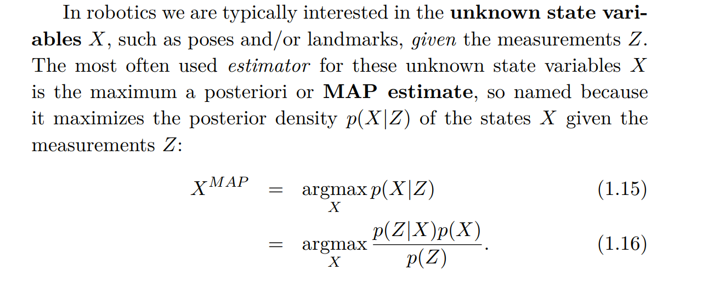
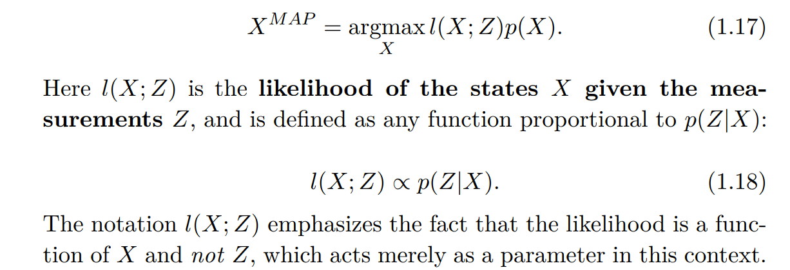
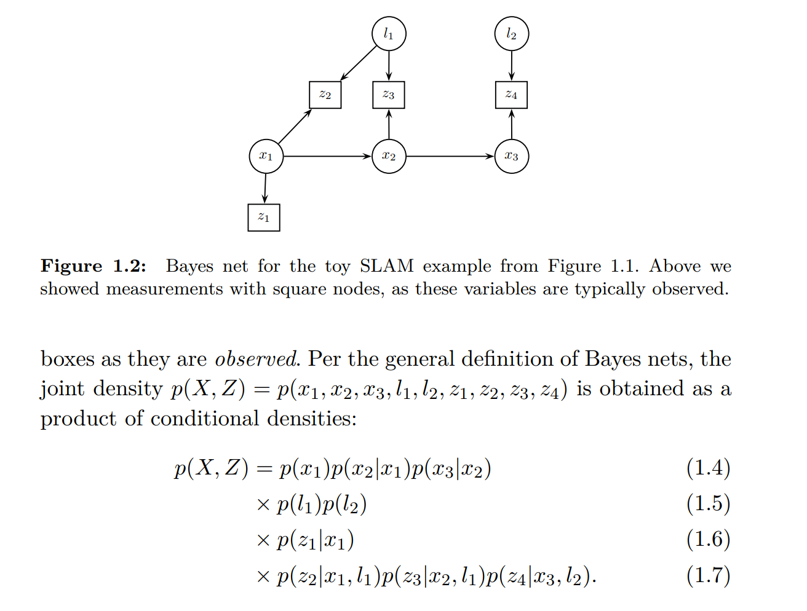
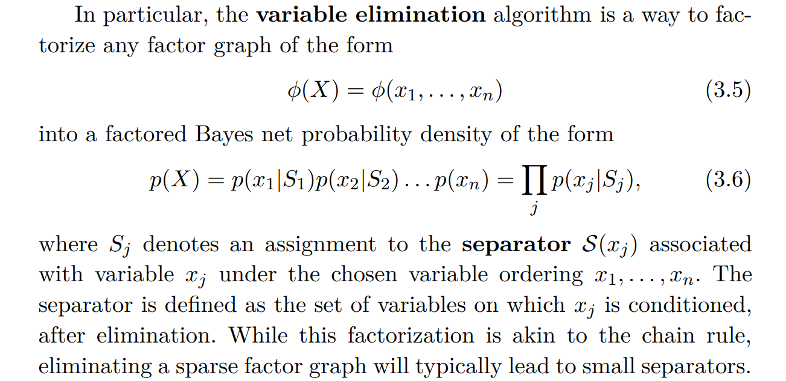
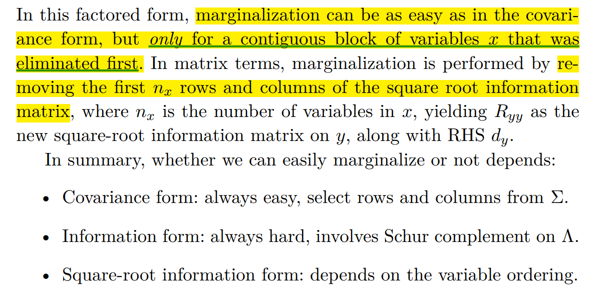
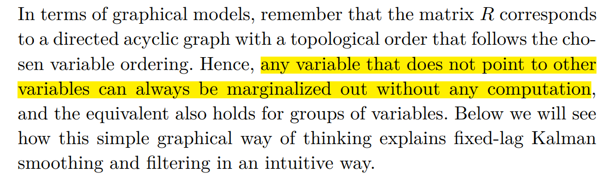
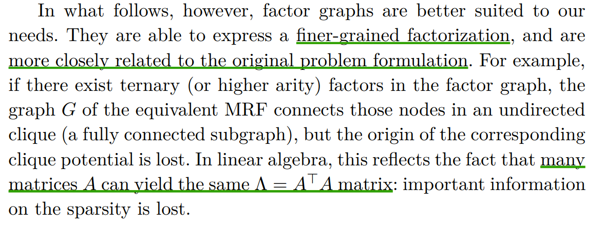
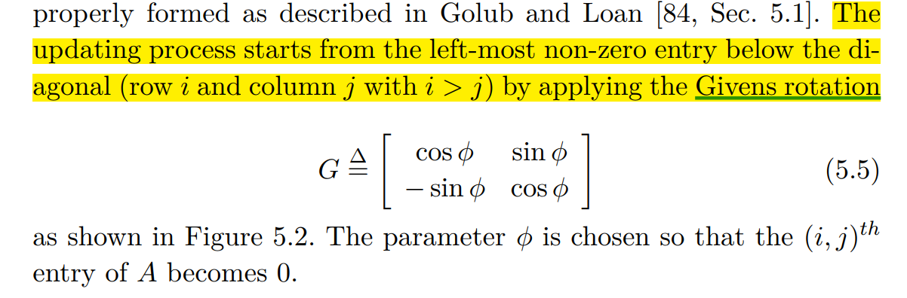
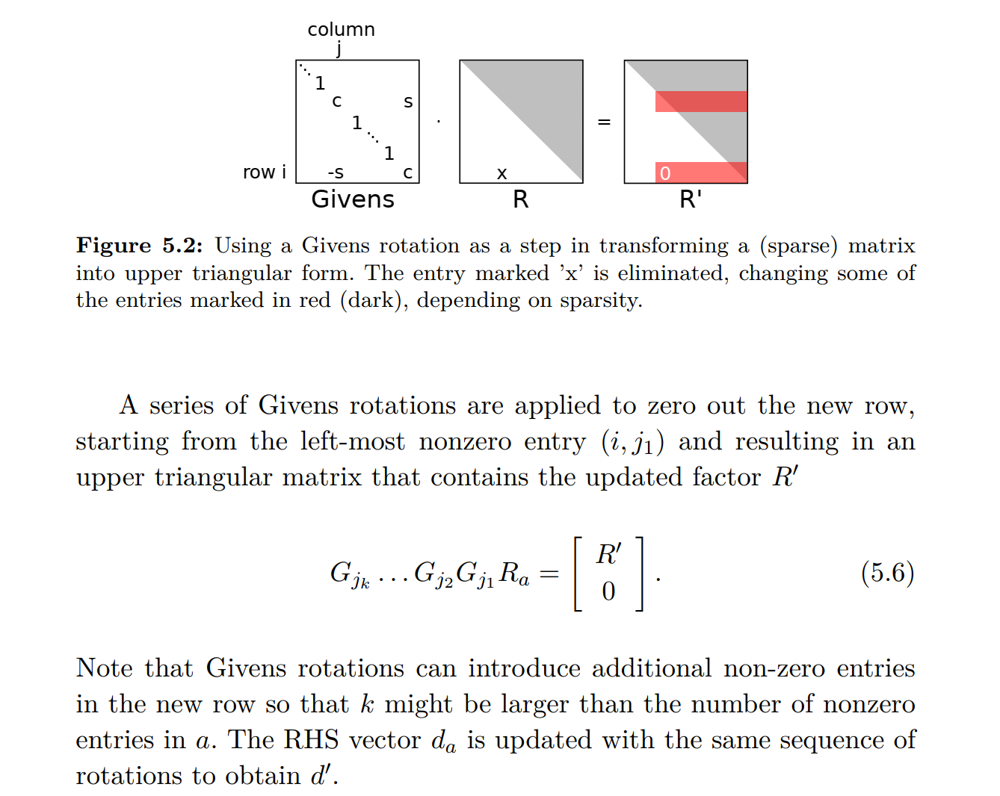
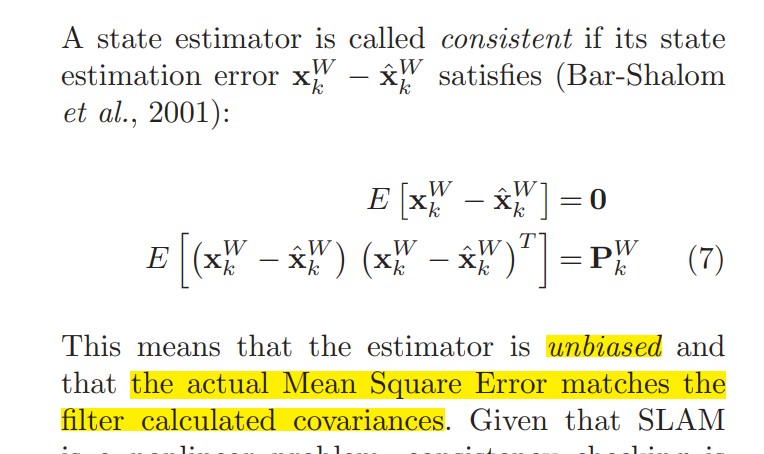

# SLAM 状态估计：基础理论回顾
[toc]

---
# SLAM 状态估计：基础理论回顾
---
状态估计是指通过带有噪声的观测量 $\mathbf{Z}$，对隐藏的状态量 $\mathbf{X}$ 进行估计的过程。其中真实状态量 $\mathbf{X}$ 是未知的，但观测模型是已知的，即：

* 给定  $\mathbf{X}$ 后，我们可以知道 $\mathbf{Z}$的条件概率分布 $P(\mathbf Z|\mathbf X)$ 。
而且通常我们还会有个关于 $\mathbf{X}$ 的先验估计  $P(\mathbf{X})$ 。
有了这些信息，我们就可以用最大后验估计法 (MAP) 对 状态量 $\mathbf{X}$  做出推测。在没有先验知识的情况下，MAP 退化成最大似然估计（MLE）。

VI-SLAM / VIO 本质上是状态估计问题。对基于特征点的 VI-SLAM / VIO 算法来说，状态量 $\mathbf{X}$ 包括

* 各时刻相机的 pose
* 环境中 3D feature 的位置
观测量 $\mathbf{Z}$ 包括
* 各时刻 IMU 的加速度、角速度
* 3D feature 在各帧图像中的检测坐标（特征点的图像坐标）

SLAM 问题涉及到的状态量 $\mathbf{X}$ 和观测量 $\mathbf{Z}$ 通常具有很高的维数，但也具备很好的稀疏性：每个变量或观测量都只跟其他一小部分变量有相互作用。比如，每个时刻的相机pose只跟相邻时刻的相机pose间存在惯性约束、每个时刻相机只能观测到地图中的一小部分3D feature 等。这种具备稀疏性的问题很适合用概率图模型来建模。

下面我们将首先基于概率图模型解析 MAP 问题，再在线性高斯假设下把 MAP 转成最小二乘。然后，我们简单介绍非线性问题和流形状态空间的处理方法，再对基于 EKF 和基于优化的两类估计算法做理论上的对比。

> 可以跳过因子图消元相关的部分。但最好了解下因子图的定义，它提供了一种更方便的对 MAP 问题进行建模的框架：先验和观测可以统称为因子。

---
## 概率图模型与最大后验估计（MAP）
---
### 最大后验估计 (MAP)
如果已知$X$的先验分布 $p(X)$和待观测量 $Z$ 的条件分布 $P(Z|X)$ ，并** 给定了观测值**$Z=b$** 后**， 就可以利用贝叶斯法则定义最大后验估计 (MAP) 如下：

> 要注意在概念上区分 待观测量 $Z$  和 观测值 $b$ ：

> 待观测量 $Z$ 是一个依赖于 $X$ 的随机变量，一般可以建模为 $Z=h(X,n)$，其中 $n$为观测噪声，$h$为观测函数；

> 而实际拿到的观测值 $b$ 则是一个已知常量，它相当于是对随机变量 $Z$ 的一次采样结果。

考虑到在给定观测值$Z$后，$p(Z|X)$ 只是状态量 $X$的一个函数，所以用似然函数 $l(X;Z)$ 来表示这一项更合理（这种表示方法强调了 $l$ 只是 $X$的函数，而$Z$ 只是$l$中的既定参数）：

---
### 用贝叶斯网络表示联合分布 $P(X,Z)$
概率图模型用图（Graph）来描述多个随机变量的联合概率分布。

用 图（Graph） 来表示概率分布的优势在于：可以清晰展现出各变量间的依赖关系、以及这种关系的稀疏性。

贝叶斯网络是最常见的一种概率图模型，它通过一个有向无环图（DAG）描述了一组随机变量的联合概率分布，网络中的每个节点代表一个随机变量，箭头（有向边）则反映了各随机变量间的依赖关系。借助贝叶斯网络，我们可以很方便地根据 **各变量间的条件独立性** 把它们的 **联合概率分布分解成多个条件概率的乘积**（见下面的示例），从而使概率计算得以简化。

在状态估计问题中，我们可以用 贝叶斯网络 来描述 **状态量 **$X$** 和 待观测量 **$Z$** 的联合分布** $P(X,Z)$。

示例：A toy SLAM example

该 toy example 对应的贝叶斯网络如下：利用贝叶斯网络，可以把联合分布 $p(X,Z)$ 分解成式 1.4-1.7 中的各条件概率的乘积。

---
### 用因子图表示后验分布 $P(X|Z)$：MAP=最大化因子乘积
**因子图的引入**：因子图是另一种概率图模型，它的形式化定义如下：

因子图是个二分图，它包含两类节点：*因子节点 * 和 *变量节点*，图中所有的 *边* 只能用于**连接不同类别的节点**，**同类节点之间没有边**；每个因子节点代表一个它所连接的所有变量的函数，因子图本身用于表示了所有这些因子函数的乘积 (结合后面的 toy example 的因子图示例 更容易理解)

因子图比 Bayes nets 更 general：因为因子函数可以很任意，所以它不仅仅可以用来表示概率分布。但在状态估计问题中我们还是主要用概率分布或似然函数作为因子。**因子图比 Bayes nets 更适合做推理。**

**贝叶斯网络转因子图**

每个贝叶斯网络都可以很 trivially 地转化为 因子图：

1. 贝叶斯网络中的每个节点（从根节点开始），都拆分成因子图中的一个 因子节点和一个变量节点，并且将因子节点分别与该变量节点及其所有父变量节点相连（没有父变量的节点都是根节点，在因子图中会产生一个先验因子）；
2. 对于已经有了确定值的变量节点（比如待观测量对应的节点有了观测值），将它从因子图中删去：它变成相关因子中的一个既定参数。

在观测发生之后（观测量$Z$有了确定的观测值$b$），表示联合分布 $p(X,Z)$ 的贝叶斯网络按上述法则（每个观测节点$z$都变成一个因子节点）转化得到的因子图，就代表了后验分布 $p(X|Z)$；

贝叶斯网络 转化为因子图后，**原 MAP 问题就转化为最大化因子图中各因子的乘积**。

toy example 对应的因子图如下 (每个小黑点代表一个因子节点，每个圆圈代表一个变量节点)：

---
## 因子图消元（可折叠）
### 因子图消元的定义

因子图消元，是指把一个包含 $n$ 个变量的因子图分解为一个如上图式 3.6 中的   factored Bayes net 的形式 (factored 代表该 net 可拆分成若干项相乘)。最后 1 个被消元的变量一定是 net 的根节点，对应上图公式3.6中对应$x_n$（最后一个被消元的变量，它的概率分布不依赖其他变量，是无条件分布）。

注意消元后产生的贝叶斯网络与开头给出的原贝叶斯网络的不同，在状态估计问题中：

* 原贝叶斯网络里的节点包括状态量 $X$ 和观测量 $Z$，它表示了状态量 $X$ 和观测量 $Z$的联合分布  $p(X,Z)$；
* 因子图消元后产生的贝叶斯网络只包含未知的状态量 $X$（观测量 $Z$ 通过观测变得已知），同因子图一样，它表示了后验分布 $p(X|Z)$

> 后面还会提到，这种 general 的因子图消元算法，在线性高斯假设下，等价于 QR 分解。QR 分解后，MAP 问题的求解（线性高斯假设下等价于最小二乘问题）就变得很方便。

### 消元过程：逐变量消去

消元示例（消元顺序: $l_1,l_2,x_1,x_2,x_3$）：

### 消元对稀疏性的影响
注意 Algorithm 3.2 中的6，和示例图中每次消元时标出的红色因子：每个变量 $x_j$ 从因子图中被消元时，都会有一个连接了 $S_j$ 中所有变量的新因子  $\tau (S_j)$ 被添加到因子图中，这一步可能会影响因子图的稀疏性。所以之后做MAP求解时，需要谨慎考虑消元顺序，尽可能保持因子图的稀疏性

### 关于求解 MAP 时的可移除变量：（在SLAM问题中可"边缘化"掉的变量）
对于SLAM等常见问题，可以先被消元的变量就可以被"边缘化"掉，因为它们对剩余变量的MAP估计值不会有影响。但这一点对于一般的因子图而言并不一定成立！下面来说明想让这一点成立需要满足什么条件。

如果因子图 $\Phi_{1:n}$ 部分消元后可以变成 $\Phi_{1:n} = p(x_1|S_1)  \Phi_{2:n}$。令 $\lambda(S_1) = \max_{x_1}  p(x_1|S_1)$ ，即$\lambda(S_1)$代表给定$S_1$时 $p(x_1|S_1)$ 的最大值。如果以下条件成立：

$\lambda(S_1)$**的取值不随 **$S_1$** 变化，即**$\lambda(S_1)=\lambda$**是个常数**

那么对于除 $x_1$以外的其他变量而言，最大化原因子图  $\Phi_{1:n}$ 和最大化部分消元后的因子图   $\Phi_{2:n}$ 是一样的。这时求解 MAP 的话 $x_1$就相当于是 可移除的。

对于SLAM问题而言， $p(x_1|S_1)$ 一般是高斯分布的形式，所以无论 $S_1$ 取什么值，总能找到一个 $x_1$ 使得指数项为 0。于是上述条件对于SLAM问题是成立的。

---
## 线性高斯假设
### 线性高斯条件下，MAP = 最小二乘
我们首先说明，线性高斯条件下，所有因子  $\phi_i$ 都具有  $\phi_i(X_i) = \exp\left  \{ -\frac{1}{2}\Vert  A_iX_i-b_i \Vert_2^2 \right\}$ 的形式，这种形式我们称之为"类高斯"的（"类"高斯是因为系数矩阵 $A_i$ 可以不是满秩的）。

状态估计问题中，因子图中的因子可以分为两类，一类是观测因子，一类是先验因子：

* 每个观测因子对应一路线性观测。线性高斯条件下，每路观测 $Z_i$都可以表示为： $Y_i=H_iX_i + n_i$，其中 $H_i$ 为观测矩阵，观测噪声$n_i\propto \mathcal N(0, \Sigma_i)$ 。
* 每个先验因子对应 $X_i$ 的一个高斯先验 $X_i\propto \mathcal N(\overline{X_i}, \Sigma)$。
但不论哪种类型的因子，都可以转化为   $\phi_i(X_i) = \exp\left  \{ -\frac{1}{2}\Vert  A_iX_i-b_i \Vert_2^2 \right\}$ 的形式：
* 对于某路观测 $Y_i=H_iX_i + n_i$，$n_i\propto \mathcal N(0, \Sigma)$ 而言，我们可以先把它转化为一路"标准"观测 $Z_i:=\Sigma^{-T/2}Y_i :=A_i X_i + n_{zi}$ ，其观测矩阵为 $A_{i} = \Sigma^{-T/2}H_i$，观测噪声 $n_{zi}  = \Sigma^{-T/2}n_i \propto \mathcal{N} (0,I)$。"标准" 的含义是指 $Z_i$的观测噪声协方差矩阵为单位阵。令 $b_i$为待观测量 $Z_i$ 的实际观测值，这路观测对应的因子 (likelihood) 正好为 $\phi_i(X_i) \propto p(n_{zi}=A_{i}X_i-b_i)\propto  \exp\left  \{ -\frac{1}{2}\Vert  A_iX_i-b_i \Vert_2^2 \right\}$
* 对于某路高斯先验 $X_i\propto \mathcal N(\overline{X_i}, \Sigma)$，令 $A_{i} = \Sigma^{-T/2},b_i=\overline {X_i}$ ， 则此路先验对应的因子 (先验概率) 正好为 $\phi_i(X_i) \propto \exp\left  \{ -\frac{1}{2}\Vert  A_iX_i-b_i \Vert_2^2 \right\}$

因此，线性高斯条件下，所有因子  $\phi_i$ 都具有  $\phi_i(X_i) = \exp\left  \{ -\frac{1}{2}\Vert  A_iX_i-b_i \Vert_2^2 \right\}$ 的类高斯形式。

---
注意，**多个类高斯因子的乘积依然是类高斯的**，因此**整个因子图** $\Phi(X)=\prod_i\phi_i(X_i)=\exp\left  \{-\frac{1}{2} \sum_i \Vert  A_iX_i-b_i \Vert_2^2 \right\}$ 最终也可以写成 $\Phi(X)=\exp\left  \{ -\frac{1}{2}\Vert  AX-b \Vert_2^2 \right\}$ 的形式，其中 **全局系数矩阵** $A$ 可以通过把各子因子的 $A_i$ 的列数都填充为 $n=\dim_X$ （ 每列都对应 $X$的某一维，被新填充的列中都补0）、再按行堆叠得到， $b$ 也是把各子因子的 $b_i$ 按行堆叠得到。

**整个因子图其实正好对应这个全局观测矩阵 ** $A$ ： $A$ 的每个列(块)对应因子图中的一个变量，每个行(块)对应一个因子 (一路观测或先验)。

此时，MAP 等价于最大化 $\Phi(X) = \exp\left  \{ -\frac{1}{2}\Vert  A X-b \Vert_2^2 \right\}$，等价于最小化 $\Vert  A X-b \Vert_2^2 = \sum_i {\Vert  A_iX_i-b_i \Vert_2^2}$，从而变成一个最小二乘问题。

---
#### 最小二乘的求解：信息矩阵与 Normal Euqation 
最小二乘问题 $\min_X \quad \Vert   A X-b \Vert_2^2$ 对应的超定方程组为 $A X= b$，直接的解法是求解 Normal Euqation 

 $DX=d, \quad where \quad D=A^TA,d=A^Tb$ 

得到 $\hat X=D^{-1}d$. 其中 $D=\Sigma^{-1}$ 通常被称作 information matrix 或 Hessian matrix，其中** **$\Sigma$**是 **$X$** 的后验分布**$p(X|Y)$**的协方差矩阵**。

注意信息矩阵 $D$ 是对称矩阵，所以求解时可以利用 Cholesky 分解 $D=R^TR$ 来加快速度。

> 记 $f(X)=\Vert   A X-b \Vert_2^2$ 为上面待最小化的二次函数，则 $D$ 是其 Hessian 矩阵， $d$ 是 0 点处的负梯度， $\hat X=D^{-1}d$ 就是其梯度为 0 的极值点；

但这种直接的解法，需要求出信息矩阵 $D$。还有一种更好的求解方法，可以避免求出 $D$，就是对原系数矩阵 $A$ 进行 QR 分解。

#### 最小二乘的求解：QR 分解
QR 分解法是另一种等价的求解方法，但比求解 Normal Equation 能带来更多的便利和数值稳定性。

设系数矩阵 $A$ 的 QR 分解为 $A=\left[\begin{matrix}Q_{1}&Q_{2} \end{matrix}\right]\left[\begin{matrix}R\\ 0_{(m-n)\times n} \end{matrix}\right]=Q_1R$，其中$Q_1$是 $m\times n$的，$Q_2$ 是 $m\times(m-n)$的，$R$ 是 $n\times n$ 的。

$Q_1$ 的列构成 $A$ 列向量 range 的一组基，$Q_2$ 的列则构成列向量 nullspace 的一组基。

注意，无论$X$ 如何变化， $AX$ 的值只会在 $A$ 的 range 方向上发生变化，而在 $A$的 nullspace 方向上不会有任何变化！所以求解最小二乘时，通过调整$X$我们实际上只能消掉误差项 $AX-b$  在  $A$ 的 range 方向的投影，而误差在 nullspace 上的投影则保持恒定：nullspace  方向的误差跟我们对 $X$的估计误差完全不相关，可以看做是纯粹的噪声。 

因此，我们只需要把注意力放在  $A$ 的 range 方向。由于 $Q_1$ 的列构成 range 的一组基 ，所以通过把误差项$AX-b$ 左乘 $Q_1^T$ 就可以得到其  range 方向上的投影。

于是，我们只需求解：

$R X=Q_1^Tb$

该方程组的系数矩阵为上三角矩阵$R$，所以可以从下到上依次求解（Back-substitution）。

> 实际的实现中，我们一般不会显式地求出 $Q$ （会浪费很多计算量），而是直接计算 $Q^Tb$(然后截取前$n$ 行得到 $Q_1^Tb$)；

> QR 分解的实现一般是对 $A$ 左乘一系列正交阵来逐步消掉其对角线以下的元素，在这个过程中每次 把 $b$ 也左乘这些正交阵，最后就可以得到 $Q^Tb$

注意，系数矩阵 $A$ 的 QR 分解得到的 $R$ 阵，与上面信息矩阵 Cholesky 分解得到的$R$阵是相同的（假设两个矩阵都是满秩的）。

#### QR 分解用于因子压缩，Measurement Compression
用 QR 分解求解最小二乘时，从 $A X-b$  到 $R X-Q_1^Tb$，相当于把一个 $m$行的系数矩阵 $A$ "压缩" 成了一个只有 $n$ 行的系数矩阵 $R$。这让我们看到了 QR 分解的另一个潜在用途：因子压缩。

上面的 $A$ 和 $b$ 是把因子图中所有因子对应的 $A_i,b_i$ 组合起来后得到的，我们也可以只把部分因子的 $A_i,b_i$ 组合起来得到 $\overline A_p,\overline b_p$，再对  $\overline A_p$ 做 QR 分解，得到 $\overline A_p = \overline Q_{1p} \overline R_p$，然后就可以单独把这部分因子 "压缩" 为 $\overline R_p X-\overline Q_{1p}^T \overline b_p$.

对于这部分因子的压缩，在全局看来，是全局系数矩阵 $A$ 中**某些行**（对应所压缩的那部分因子）的**非0矩阵块 **局部做了 QR 分解。

如果被压缩的因子都是观测因子，这个操作也称为 Measurement Compression，可以把高维的观测量压缩成低维的。

#### QR 分解用于边缘化，**partial QR 分解， **nullspace projection
##### 边缘化
用 QR 分解求解最小二乘时，由于系数矩阵$R$ 的上三角特性，求解排在状态向量 $X$ 靠底部的变量时不再依赖排在它上方的变量！（Back-substitution）

所以，如果有一部分变量不再需要使用，可以考虑把它们"边缘化掉"，不再保留和计算。具体做法为：

1. 提前把这部分变量重排到状态向量的最顶部、同时把$A$矩阵的列做对应的重排（这部分变量对应$A$矩阵最左侧的列，$A$ 矩阵的列顺序对应因子图变量的消元顺序）。
2. 再对列重排后的 $A$ 矩阵做 QR 分解 $A=QR$ （对因子图消元）
3. 移除方程组 $RX=Q^Tb$ 中最顶部的几行（对应不再需要更新的变量），只求解下面的行。

##### partial QR 分解
实际上在变量重排后，我们不需要做完整的 QR 分解，只需要做 paritial QR 分解 $A=Q_pR_p$（通过左乘一个正交阵 $Q_p^T$，消掉 $A$ 前若干列中对角线以下的元素，得到 $R_p=Q_p^TA$ ），就足以实现上述边缘化的目的：

如果需要边缘化掉前 $k$ 维变量，我们只需要对$A$做 paritial QR 分解使得 $R_p$ 的前 $k$ 列是上三角矩阵。此时方程组 $R_pX=Q_p^Tb$第$k$ 行以下的部分不依赖前 $k$维变量 $X_{[1:k]}$，如果截取出第 $k$ 行以下的子方程组：

$R_{p[k+1:m, k+1:n]}X_{[k+1:n]}=(Q_{p[1:m,k+1:m]})^Tb_{[1:m]}$

可以看到通过这个子方程组就可以直接求解 第$k$维之后的变量 $X_{[k+1:n]}$。

另外，注意到 $Q_p$是正交阵，其前$k$列$Q_{p[1:m, 1:k]}$与 $k+1$之后的列$Q_{p[1:m,k+1:m]}$正交，于是 $(Q_{p[1:m,k+1:m]})^TQ_{p[1:m, 1:k]}=0$，所以实际上通过对原方程 $AX=b$ 左乘 $(Q_{p[1:m,k+1:m]})^T$ 就可以得到上述子方程组。

##### nullspace projection
左乘 $(Q_{p[1:m,k+1:m]})^T$ 这个操作也可称为 nullspace projection： $Q_p$ 的后$(m-k)$ 列$Q_{p[1:m,k+1:m]}$实际上是系数矩阵 $A$ 前$k$列 的 nullspace 的一组基，这个操作把原方程组投影到了 前$k$列的 nullspace 上。

可以看到，边缘化与 nullspace projection 本质上是等价的。

#### 卡尔曼更新
我们熟知的卡尔曼更新过程也可以基于因子图解释。

假如我们有先验 $X\propto \mathcal N(\overline{X}, \overline P)$和观测模型  $Y=HX + n$（$n\propto \mathcal N(0,R)$），并且得到$Y$的观测值为$y$，现在我们对 $X$ 做 MAP 估计。

* 先验对应的因子为  $\exp\left  \{ -\frac{1}{2}\Vert  \overline P^{-T/2} X-\overline P^{-T/2} \overline X \Vert_2^2 \right\}$
* 观测对应的因子为  $\exp\left  \{ -\frac{1}{2}\Vert  R^{-T/2} HX-R^{-T/2} y \Vert_2^2 \right\}$

组合两个因子后，等价的最小二乘问题对应的超定方程组为

$\left[  \begin{matrix}  \overline P^{-T/2} \\ R^{-T/2}H \end{matrix}\right] X = \left[  \begin{matrix}  \overline P^{-T/2}\overline X \\ R^{-T/2}y \end{matrix}\right]$

求解该方程组即可得到 $X$的 MAP 估计值 $\hat X$。

### 线性高斯条件下，因子图消元=QR分解 (可折叠)
这节我们将解释：线性高斯条件下，因子图的消元等价于对系数矩阵 $A$ 的 QR 分解！**QR 分解和Cholesky 分解都是因子图消元算法的特例**。

**整个因子图其实正好对应这个全局观测矩阵 ** $A$ ；因子图消元后得到的 factored Bayes net 则对应QR分解的R阵。

> 每个矩阵都可以对应一个因子图，每个上三角矩阵都可以对应一个 factored Bayes net。

与某个变量 $x_j$ 相关的所有因子相乘，可以组合成一个"大"因子 $\psi(x_j,S_j)$  ，这个大因子也将是 "类高斯" 的形式  $\psi(x_j,S_j)=\exp\left  \{ -\frac{1}{2}\Vert  \overline A_j[x_j;S_j]-\overline b_j \Vert_2^2 \right\}$，其中 $\overline A_j$ 可以通过把各子因子的 $A_i$ 的列数都填充为 $\dim_{x_j}+\dim_{S_j}$ （每列都对应 $[x_j; S_j]$的某一维，被新填充的列中都补0）、再按行堆叠得到， $\overline b_j$ 也是把各子因子的   $b_i$ 按行堆叠得到：

对于"类高斯"形式的因子 $\psi(x_j,S_j)$，我们可以用 partial QR 分解（QR分解是表示通过左乘正交阵Q来消去系数矩阵 $\overline A_j$ 所有列中对角线以下的元素，partial QR 分解表示通过左乘一个正交阵Q后只消去 $\overline A_j$ 前若干列中对角线以下的元素），来把它拆解成 $p(x_j|S_j)\tau(S_j)$ 的形式，从而实现对 $x_j$ 的消元：

由于每消元因子图中的一个变量 $x_j$ ，就相当于对它的  $\overline A_j$ 、同时也是对之前提到的全局观测矩阵 $A$，做了一次针对 $x_j$ 所在列的 partial QR；当消元所有变量后，就完成了对全局观测矩阵 $A$ 的完整 QR 分解。

逐步消元的示例过程如下:

### More about Marginalization (可折叠)
若已知后验分布 $p(X|Z)\propto \mathcal N(\hat X, \Sigma)$ ，且$X$分为两部分$X=\left[ \begin{matrix} X_1 \\ X_2 \end{matrix} \right]$，同样地 $\hat X=\left[ \begin{matrix} \hat X_1 \\ \hat X_2 \end{matrix} \right]$， $\Sigma=\left[ \begin{matrix} \Sigma_{11} & \Sigma_{12} \\ \Sigma_{21} &  \Sigma_{22} \end{matrix} \right]$；

那么，把 $X_1$  边缘化掉，相当于求剩余变量$X_2$的边缘分布 $p(X_2|Z)\propto \mathcal N(\hat X_2, \Sigma_{22})$。

如果我们已知后验均值 $\hat X$ 和协方差矩阵 $\Sigma$，那么边缘化操作就很简单，只需从中截取$\hat X_2$和 $\Sigma_{22}$ 即可；

但如果我们能拿到的只有信息矩阵 $D=\Sigma^{-1}$ 和 Normal Equation $DX=d$（求解它可以得到后验均值 $\hat X$），这时就需要借助舒尔补来执行边缘化，得到$\Sigma_{22}^{-1}$ 和舒尔补后的 Normal Equation （用于求解$\hat X_2$）;

如果我们有信息矩阵 $D=\Sigma^{-1}$ 的 Cholesky 分解或者原系数矩阵的 QR 分解，则直接把 $R$ 阵中 $X_1$对应的前若干列去掉即可。注意，这个 low cost 操作能成立的前提是，$X_1,X_2$ 在 $X$中的排列顺序必须如上所示，主要是要保证 QR 分解后三角阵 R 的前几列对应的是$X_1$。

从因子图消元的角度，先消$X_1$再消$X_2$得到贝叶斯网络中，$X_1$ 对应的节点不会有指向 $X_2$ 的箭头。在贝叶斯网络中，如果一个节点没有指向其他节点的箭头，或者一组节点没有指向组外节点的箭头，那么这个或这组节点就可以直接拿掉而不影响其他节点的概率分布。

下面是书中截图：

* 联合分布可以以协方差、信息矩阵、Square Root 三种不同形式给出。不同形式下有各自的边缘化方法。

* 在贝叶斯网络中，如果一个节点没有指向其他节点的箭头，或者一组节点没有指向组外节点的箭头，那么这个或这组节点就可以直接拿掉而不影响其他节点的概率分布

### 关于信息矩阵与MRF (可折叠)
信息矩阵对应另一种描述 SLAM 问题的无向图模型：马尔科夫随机场MRF。但对于SLAM问题来讲因子图是个更好的模型：因子图可以表示更细粒度的因子，且其图结构与问题的原始 formulation 有更明显的对应关系。而且转化为信息矩阵后会损失一些稀疏信息：如果因子图中存在三元 (ternary) 或多元(higher arity)因子，MRF中这些被涉及的变量将被全连接从而组成一个clique，但 the origin of the clique potential is lost。

### 问题的稀疏性，消元顺序 (可折叠)
**因子图的稀疏性正好对应了系数矩阵 **$A$** 的稀疏性：如果因子图中第 **$i$** 个因子连接了 第 **$j$** 个变量，那系数矩阵 **$A$**中的第 **$i$** 行（块）、第 **$j$** 列（块）就非 0 （块）**。

因子图消元得到的 factored 贝叶斯网络的稀疏性，也正好对应了 $A$ 的 QR 分解中$R$阵的稀疏性：

* R阵中第 i 行的非0元素所在列对应的variable，在网络中会指向 第 i 个variable ；
* R阵中第 i 列的非0元素所在行对应的variable，在网络中会被第 i 个variable 指向；

前面提到过，每消元一个变量  $x_j$  时，都会有一个连接了 $S_j$ 中所有变量的新因子 $\tau (S_j)$再被添加到因子图中，这个新因子就对应上面消元示例图中新增的红色的行。对应到系数矩阵$A$中，就是新增了一个行（块），且这个新增的行（块）中 $S_j$ 对应的那些列都非0。

单个因子连接的变量越多（说明这些变量有相互作用），最终消元完成后生成的贝叶斯网络中这些变量的连接就越稠密。所以消元操作可能消元得到的贝叶斯网络和 QR 分解得到的 $R$ 阵的稀疏性。

所以为了高效求解，变量的消元顺序（对应系数矩阵的各列的排列顺序）要谨慎选择，不同的消元顺序可能产生差异巨大的 fill-in。fill-in 定义为 QR 分解得到的 $R$ 阵和信息矩阵对角线以上部分的稀疏性差异（信息矩阵的稀疏性是不受消元顺序影响的，消元顺序只影响最终的 $R$ 阵）。从图的角度，也可以把 fill-in 定义为信息矩阵对应的 MRF 与消元结果对应的贝叶斯网络两个Graph之间的稀疏性差异。

为尽可能维持系统的稀疏性，降低fill-in，常用的 Ordering 算法有

* Approximate Minimum Degree 

* Nested Dissection Orderings （具体看书中介绍）

---

## 关于 partial QR 分解
### 与完整 QR 分解的关系
二者定义上的差异如下：

* 完整 QR 分解是表示通过左乘正交阵 Q 来消去系数矩阵 $A$ 所有列中对角线以下的元素，
* partial QR 分解表示通过左乘一个正交阵 Q 后只消去 $A$ 前若干列（比如前$k$列）中对角线以下的元素。

关于这两个 Q 阵：

* 两个 Q 阵都是 $m\times m$的正交阵，其中$m$ 为 $A$ 的行数；
* 两个 Q 阵的前 $k$ 列是一样的，后面的列可以不一样。

### 实现方法：Householder 变换 (可折叠)
QR 分解可以通过 Householder 变换逐列消去对角线以下的元素，partial QR 分解表示只消去前几列中对角线以下的元素：

### 实现方法：Givens Rotation（可折叠）
另外，Givens Rotation 方法则可以实现 "逐元素"，进而也可以 "逐列" 甚至 "逐行"  的消去：（在 gtsam 中 Givens Rotation 主要用于 incremental update）

---
## 非线性的处理
### 非线性问题的线性化
线性高斯假设下，所有因子  $\phi_i$ 都具有  $\phi_i(X_i) = \exp\left  \{ -\frac{1}{2}\Vert  A_iX_i-b_i \Vert_2^2 \right\}$ 的形式。

如果去掉 "线性" 假设，允许每个因子具有 $\phi_i(X_i) = \exp\left  \{ -\frac{1}{2}\Vert  h_i(X_i)-b_i \Vert_2^2 \right\}$ 的形式，其中$h_i(X_i)$ 可以是个非线性函数，那最大化因子图乘积问题就变成了一个**非线性最小二乘**问题。

此时，为了继续使用之前线性系统的处理方法，就需要对$h_i(X_i)$ 进行局部线性化。

假设 $\breve X_i$是我们选取的局部线性化点，$J_i=h_i'(\breve X_i)$ 为线性化点处的 Jacobian，并令 $\delta X_i = X_i - \breve X_i$，$\delta b_i = b_i-h_i(\breve X_i)$ ，则 $h_i(X_i) \approx h_i(\breve X_i) + J_i\delta X_i$，进而

$\phi_i(X_i) \approx \phi_i^\delta (\delta X_i) = \exp\left  \{ -\frac{1}{2}\Vert J_i\delta X_i-\delta b_i \Vert_2^2 \right\}$ 

即 $X_i$ 的因子$\phi_i(X_i)$ 可以被近似转化为 $\delta X_i$ 的类高斯因子  $\phi_i^\delta (\delta X_i)$ 。

这种近似的可靠性，取决于系统的非线性程度以及线性化点选取的合理性。理想情况下线性化点应该选为状态的真实值，然而真实值却是不可知的，所以实际中我们只能把线性化点选在某个估计值处。

### 高斯牛顿法
对于非线性最小二乘问题，我们可以通过迭代优化的方法求解，逐次获得更优的估计，且每次迭代时都在新的估计点上重新线性化。这样当算法收敛后，我们就能得到一个很好的估计。这就是高斯牛顿法的思想。

大致流程：

1. 在初始估计点 $\hat X$ 处对上述各个 $h_i(X_i)$进行线性化：$\breve X = \hat X$ ；
2. 把非线性最小二乘近似转化为关于 $\delta X$ 的线性最小二乘；
3. 用前述线性系统的方法求  $\delta X$ 的  MAP 值；
4. 更新估计值 $\hat X = \hat X + \delta X$
5. 收敛条件判断：$\delta X$ 足够小或者达到指定迭代次数？
   1. Yes： 迭代结束
   2. No:  回到 1，在新的估计值上重新线性化

EKF 中的卡尔曼更新环节，其实就是执行了一个 **单步的 **高斯牛顿；

而 IEKF (Iterative EKF) 的更新环节，实质上就是 高斯牛顿法 本身。

---
## 流形上的状态估计
在之前的讨论中，我们都假设了状态空间是欧氏空间：我们可以直接对状态量做加法和求导运算。

但如果状态空间是个光滑流形，而不再是个向量空间，就需要重新考虑这些问题了。比如，假如我们需要估计一个3D旋转，我们首先要想，如何参数化一个"3D旋转"（即把一个"3D旋转"表示为高维空间中的一个点）？所有能表示"3D旋转"的点组成的高维曲面长什么样，有几个自由度？如何在这个曲面上做加法和求导？

> 光滑流形在数学上定义为局部同胚于欧氏空间、且有可数基的 Hausdorff 空间，再配以微分结构。工程中可以直接理解为 **高维光滑曲面**，且认为它嵌入在了某个更高维的欧氏空间中 (称作外围空间，ambient space) 。

对于状态空间是流形的情况，我们将不得不在流形某点处的切空间上执行求导和加法运算，最后再将更新后的点从切空间投影到流形上（定义一个从流形的切丛到流形的 [retraction function](https://en.wikipedia.org/wiki/Retraction_(topology)),  见 Definition 4.1.1 in *Optimization Algorithms on Matrix Manifolds*）。我们需要考虑如何在流形的每点处定义一个从切空间到该点邻域的、性质良好的双射，以及如何为每个点的切空间选一组基以便将切空间上的点参数化。对于一般的任意流形，这并没有一个标准的做法。

> 虽然当一个流形被嵌入到欧氏空间时（我们将该流形上的点参数化时）可以自动获得一个黎曼度量，进而我们可以利用黎曼流形的指数映射来定义每点的切空间到该点邻域的一个双射，但由于这种嵌入本身可以是很任意的——嵌入后的"形状"可以被任意"揉捏"，所以这个度量本身对于流形上的点的物理意义来说可能并不是"均匀的"。

> 如果我们可以把流形上的点"均匀"地参数化：即流形上两点间的参数差异能较均匀地反映它们所代表的物理量的差异，那么此时利用黎曼流形的指数映射在每点切空间及其邻域内建立局部双射是合理的。

但如果流形具有李群结构，则可以大大简化、标准化上述操作。利用李群的对称性，我们可以通过李群和其李代数间的 指数/对数映射 $\exp/\log$ 将单位元的切空间和其邻域建立起局部双射，再把这个映射通过左乘或右乘 "转移" 到其他任意点的邻域上。

SLAM 中，常用到的李群有：

* $SO(2)$： 2维特殊正交群，可用于表示 2D rotations，且与 2D rotations 一一对；
* $SO(3)$： 3维特殊正交群，可用于表示 3D rotations，且与 3D rotations 一一对应；
* $S^1$: 1维单位球面（即单位圆），可用于表示 2D rotations，且与 2D rotations 一一对应；
   * $S^1$ 同构于 $SO(2)$
* $S^3$: 3维单位球面（单位四元数），可用于表示3D rotations，但与3D rotations 不是一一对应：每对对径点表示同一旋转；
   * $S^3$ 是 $SO(3)$的 double cover (双层覆叠空间)
* $SE(3)$:  3维特殊欧氏变换群，用于表示一个 3D rotation + 平移。
   * $SE(3)$ 是 $SO(3)$与$\mathbb R^3$的 **半直积**，它也是个矩阵李群。
   * $SE(3)$ 的指数映射（矩阵的指数映射）在平移部分引入的计算量一般没有必要（螺旋线），所以可以考虑使用  $SO(3)$与$\mathbb R^3$的直积代替 $SE(3)$，这个直积李群本身不再是个矩阵群，但结构更简单，其指数映射在平移部分就是向量加法。
但注意并非所有的流形上都有李群结构，甚至是一些看起来很"对称"的流形：虽然 $S^1、S^3$都是李群（分别可以用于表示2D和3D 的 rotation），但2维球面 $S^2$上就不存在李群结构！事实上对于$n$维球面而言，只有1维和3维的情况存在李群结构。
> 常见的李群列表看这里： [https://en.wikipedia.org/wiki/Table\_of\_Lie\_groups](https://en.wikipedia.org/wiki/Table_of_Lie_groups)

---
## SLAM 状态估计方法对比： 滤波方法 VS 优化方法
SLAM 算法工作时，需要实时输出对机器人当刻 pose 和 landmark 的估计。

SLAM 是非线性问题，有两类方法可以用于这种非线性的实时估计：

* 第一类是滤波方法，一般基于 EKF 来做：基于上一时刻的状态估计和最新的观测值，来更新对最新时刻状态的估计（也可以使用滑窗，保留和更新最近若干时刻的状态）；
* 第二类是优化方法。理想的优化方法会结合所有历史观测数据对所有历史时刻的状态估计进行更新，且系统的线性化点会进行多次迭代，以获取更准确的线性化和更高的估计精度。

从二者原理来看，基于迭代求解的优化方法将获得更高的估计精度。然而优化方法的一个弊端也很显著，就是计算量更大。这体现在两个方面：

* 一方面，优化方法需要估计更多的变量：每个时刻都需要更新所有历史时刻的状态；
* 另一方面，优化方法需要更多的迭代次数：EKF 在更新环节相当于只执行了一个单步的 高斯牛顿，只有一次迭代；而优化方法一般需要迭代至收敛。（ Iterative EKF 在更新环节则等价于高斯牛顿法）

EKF 方法虽然在计算量方面有很大优势，但其估计精度不如优化方法。而且，EKF 方法理论上就存在 Inconsistency （不一致性）问题。

### EKF 方法的 Inconsistency (可折叠)
首先看 Consistency 的定义[8\]：

Consistensy 包含了两个条件：

1. estimator 输出的是无偏估计；
2. estimator  的估计误差的理论 covariance，与 estimator 输出的 covariance 一致；

> 关于第2点对 covariance 的要求，也有些作者定义为只要不 over-confident 就算 consistent [7\]  (have ***covariance matrix smaller or equal to*** the one calculated by the fllter)。

> 

> 实际中 SLAM 算法出现的不一致基本都是 over-confident 导致； [9\] 中以 2D-SLAM 为例解释了为什么 SLAM 中总是出现 "乐观估计" (即 over-confident, 输出的 covariance 低于其理论值)， 而不会出现 "悲观估计" (输出的 covariance 高于其理论值)；

Consistency 对于一个  estimator 来说是非常重要的性质。如果一个 estimator 不一致 (inconsistent)，那它输出的结果(误差可能不再是0均值的) 和 covariance (可能over-confident) 实际上就失去了参考价值。

EKF 方法的不一致性主要来源于两个方面：

1. SLAM 中一般没有绝对观测，只有相对观测，这种观测的相对性使得前后时刻的观测 Jacobian 与机器人 pose 的状态转移 Jacobian 之间满足一个特定关系 ([9\] Lemma 3.8)，而标准 EKF 中由于估计出的 Jacobian 会违背这个关系，从而错误引入了一些实际中并不存在的观测信息，导致 Covariance 可以变小至低于理论下限（[9\] Therem 4.1 + 4.2 两个case说明,  Appendix A ），而 Covariance 的 Inconsistency 也必将通过错误的卡尔曼增益矩阵 $K$导致 mean 的 Inconsistency (有偏估计)； [7\] 中从能观性角度对此问题进行了分析，指出导致标准 EKF 出问题的具体环节是状态量用了多个线性化点，并提出了  First Esitmate Jacobian 方法，基本解决了 Covariance 方面的 Inconsistency 问题；
2. 线性化误差：取决于系统的非线性程度、线性化点与真实状态值的偏差等因素，线性化误差会导致估计结果一定程度上是有偏的（mean 的 Inconsistency）；实际中这类问题一般不如第 1 类问题显著，这类 Inconsistency 只能通过迭代优化方法来解决；

优化方法理论上没有一致性问题 [10\]，是因为优化方法可以同时处理所有时刻的观测和状态，不存在多线性化点的问题，且可以对所有变量迭代优化并不断调整线性化点使其接近真值。如果优化方法中使用滑窗，也要注意 FEJ 的使用从而保证 Consistency。

REFERENCES

1. [OpenVINS\] Patrick Geneva, Kevin Eckenhoff, Woosik Lee, Yulin Yang, and Guoquan Huang,  "OpenVINS: A Research Platform for Visual-Inertial Estimation"
2. [MSCKF\] A.I.MourikisandS.I.Roumeliotis, "A multi-state constraint Kalman filter for vision-aided inertial navigation," in Proceedings of the IEEE International Conference on Robotics and Automation, Rome, Italy, Apr. 10–14, 2007, pp. 3565–3572.
3. Frank Dellaert, Michael Kaess, "Factor Graphs for Robot Perception"
4. [DSO\] J. Engel, V. Koltun, and D. Cremers, "Direct sparse odometry," IEEE Transactions on Pattern Analysis and Machine Intelligence, 2017.
5. [VINS-Mono\] T. Qin, P. Li, and S. Shen, “VINS-Mono: A robust and versa- tile monocular visual-inertial state estimator,” IEEE Transactions on Robotics, vol. 34, no. 4, pp. 1004–1020, 2018.
6. [OKVIS\] S. Leutenegger, S. Lynen, M. Bosse, R. Siegwart, and P. Furgale, "Keyframe-based visual-inertial odometry using nonlinear optimization," Int. J. Robot. Research, vol. 34, no. 3, pp. 314–334, Mar. 2014.
7. [FEJ\] Huang, G. P., Mourikis, A. I. and Roumeliotis, S. I. (2009), "A first-estimates jacobian ekf for improving slam consistency," in Experimental Robotics, Springer, pp. 373–382.
8. J.A. Castellanos, J. Neira, and J. Tardos, "Limits to the consistency of EKF- based SLAM," In 5th IFAC Symposium on Intelligent Autonomous Vehicles, pages 1244–1249, Lisbon, Portugal, July 2004.
9. S. Huang and G. Dissanayake, "Convergence and consistency analysis for extended Kalman filter based SLAM," IEEE Transactions on Robotics, 23(5):1036– 1049, Oct. 2007.
10.  Yanhao Zhang, Teng Zhang, Shoudong Huang, "Comparison of EKF based SLAM and Optimization based SLAM Algorithms"
11.  [RPNG-2022-INIT\] Patrick Geneva, Guoquan Huang, "OpenVINS State Initialization: Details and Derivations", RPNG. [https://pgeneva.com/downloads/reports/tr\_init.pdf](https://pgeneva.com/downloads/reports/tr_init.pdf)
12.  Tue-Cuong Dong-Si and Anastasios I Mourikis, "Closed-form Solutions for Vision-aided Inertial Navigation," Tech. rep. Dept. of Electrical Engineering, University of California, Riverside, 2011. url: [https://tdongsi.github.io/download/pubs/2011\_VIO\_Init\_TR.pdf](https://tdongsi.github.io/download/pubs/2011_VIO_Init_TR.pdf)
13.  Walter Gander, Gene H Golub, and Urs Von Matt, "A constrained eigenvalue problem," In: Linear Algebra and its applications 114 (1989), pp. 815–839.
14.  Emil Spjøtvoll, "A Note on a Theorem of Forsythe and Golub," In: SIAM Journal on Applied Mathematics 23.3 (1972), pp. 307–311.
15.  Forsythe and Golub, "On the stationary values of a second-degree polynomial on the unit sphere," In: SIAM Journal on Applied Mathematics, 13 (1965), pp. 1050-1068.
16.  Kevin Eckenhoff, Patrick Geneva, Guoquan Huang, "Continuous Preintegration Theory for Graph-based Visual-Inertial Navigation," *RPNG* [https://udel.edu/\~ghuang/papers/tr\_cpi.pdf](https://udel.edu/~ghuang/papers/tr_cpi.pdf)
17.  Li M, Mourikis AI, "Online temporal calibration for camera–IMU systems: Theory and algorithms," *The International Journal of Robotics Research*. 2014;33(7):947-964. doi:[10.1177/0278364913515286](https://doi.org/10.1177/0278364913515286)

