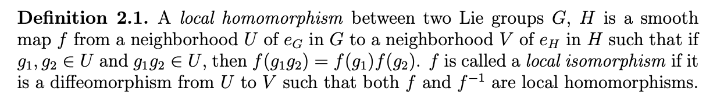
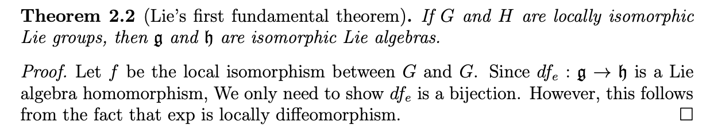
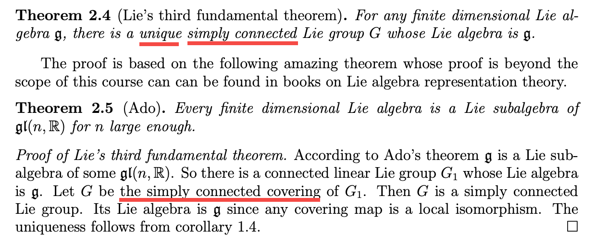

# Lies\_Fundamental\_Theorems

[toc]

## 第一和第二 Lie 定理
第一和第二 Lie 定理都只与李群在单位元附近的局部性质相关。

为方便描述，先看几个概念的定义：

李群的局部同态(local homomorphism)、局部同构(local isomorphism)：

类似地可以定义李群的局部自同构（上图中取 $H=G$）。

李群$G$的李代数$\mathfrak g$可以仅由单位元 $e$ 的邻域确定，所以李群间的局部同态 (local homomorphism) 就可以确定他们李代数间的同态 (homomorphism)，李群间的局部同构 (local isomorphism) 也可以确定李代数间的同构 (isomorphism)。

第一和第二 Lie 定理就是在说李群间的 local isomorphism 与李代数间的 isomorphism 之间的这种双向对应关系.

设$G,H$是两个李群，$Lie(G)=\mathfrak g,Lie(H)=\mathfrak h$，那么第一和第二 Lie 定理分别可描述如下：

> 以上截图来自 [http://staff.ustc.edu.cn/\~wangzuoq/Courses/13F-Lie/Notes/Lec%2012.pdf](http://staff.ustc.edu.cn/~wangzuoq/Courses/13F-Lie/Notes/Lec%2012.pdf)

## 第三 Lie 定理
第三 Lie 定理是说，对于每个有限维实李代数$\mathfrak g$，都存在一个李群 $G$ 使得 $\mathfrak g$ 是其李代数， $Lie(G)=\mathfrak g$。第三 Lie 定理的证明一般需要用到另一个并不平凡的定理：Ado’s theorem。

Ado’s theorem 是说，对于每个有限维实李代数$\mathfrak g$，都存在一个足够大的 $n$，使得 $\mathfrak g$ 同构于 $\mathfrak {gl}(n)$ 的某个 李子代数。

有了这个定理的帮助，我们就可以从 $GL(n)$ 中构建一个李子群$G$（由$\exp(\mathfrak g)$生成的群），使得 $G$ 的李代数为 $\mathfrak g$。

但李代数到李群间的这种对应并不是一对一的 —— 有相同（同构意义上）李代数的李群并不唯一。但如果加上限制条件，要求李群是单连通的，那么李代数与李群间就可以建立一一对应的关系。

所以第三 Lie 定理也可以完整描述为：

> 以上截图来自 [http://staff.ustc.edu.cn/\~wangzuoq/Courses/13F-Lie/Notes/Lec%2012.pdf](http://staff.ustc.edu.cn/~wangzuoq/Courses/13F-Lie/Notes/Lec%2012.pdf)

下面是一些关键技术细节的证明。

### 连通李群：一个李代数同态最多对应一个李群同态
如果$G$是连通的（不要求单连通）， $\psi,\varphi: G\to H$ 是两个李群同态，且它们对应的李代数同态(单位元处的切映射) 相等 $\varphi'=\psi':\mathfrak g\to \mathfrak h$，那么 $\varphi=\psi$。即连通李群 $G$ 到任意李群 $H$ 的群同态，可以由其对应的李代数同态完全确定。

下图中，4.20 解释了李群/李代数同态与 $\exp$ 的交换性，这种交换性、以及$\varphi'=\psi'$的假设，  使得 $\varphi$ 和 $\psi$在由 $\exp(\mathfrak g)$生成的李子群上是相等的；而 4.19 则解释了，对于$\mathfrak g$上的任意含0点的开集 $U\subset \mathfrak g$，如果 $G$ 连通，那么 $\exp(U)$ 生成的李子群就等于整个$G$; 

所以，当 $G$ 连通时，$\varphi'=\psi'\quad \Rightarrow \quad \varphi=\psi$；

需要注意的是，这里只是说对于每个李代数同态 $\mathfrak g\to \mathfrak h$，**如果存在**与之对应的李群同态$G\to H$，那么这个群同态是唯一的；但并未保证一定会存在这样一个李群同态，这也是我们下一节要关注的。

### 单连通李群：李群同态与李代数同态一一对应
上节已经说明，对于连通李群 $G$和给定的一个李代数同态 $\mathfrak g\to \mathfrak h$，如果存在与之对应的里群同态，那么这个群同态是唯一的；

本节说明，当$G$是单连通时，这样的群同态一定存在。

存在性的证明思路大致如下：

* 首先，李代数的同态 $f:\mathfrak g\to \mathfrak h$ 对应李群单位元附近邻域 $U(\subset G)\to H$的一个局部同态，记该局部同态为$\phi$；我们需要做的是把 $\phi$ 扩充为整个群 $G$ 上的同态 $\psi$；
* 沿着$G$上的曲线扩充 $\phi$的定义： $G$ 上一条从 $e$ 出发的曲线 $\alpha$，通过把曲线细分成多个小区间 $\Delta_1\alpha, \Delta_2\alpha...\Delta_n\alpha$（保证每个区间内的点 "间隔" $xy^{-1}$都不超出 $U$的范围，从而 $\phi(xy^{-1})$有定义），然后用级联乘积 $\phi(\Delta_1\alpha)\phi(\Delta_2\alpha)...\phi(\Delta_n\alpha)$ 定义$\alpha$终点的值 $\psi(\alpha(1))$；
* 扩充的唯一性（上述扩充是否是良定义的）：上面扩充的方法暂时忽略了一个问题，就是从 $e$到某个点 $g$之间，存在很多条路径，不同的路径 $\alpha$ 所定义的 $\psi(g)$是否相同呢？
   * 首先，利用局部同态 $\phi$ 的性质，容易证明间距足够近的两条同端点曲线在终点 $g$ 处能定义相同的  $\psi(g)$;
   * 所以进一步，对于同伦曲线族，它们在终点处都定义相同的  $\psi(g)$;
   * 最后，由于$G$单连通，所有从 $e$ 到 $g$ 的曲线都同伦，所以 $\psi(g)$ 的定义是路径无关的；
* 然后验证这样扩充得到的 $\psi$，确实是个群同态，且在邻域 $U$ 内它与 $\phi$ 相等；

### 每个连通李群存在 Universal Cover
前面提到过，借助 Ado’s theorem 我们一定可以找到一个李群 $G_1\subset GL(n)$ 使得其李代数是给定的 $\mathfrak g$；但我们现在需要找到一个满足条件的单连通李群，而$G_1$不一定满足，那能否从 $G_1$构造出一个单连通李群 $G$ 呢？

可以的，通过构造 $G_1$ 的 covering space $G$（the Universal Cover）；

这里主要是代数拓扑中一些基本群和复叠空间相关的处理。

* 下图 8.11 中，给出了$M(=G_1)$中以 $a$ 为基点的基本群 $\pi_1(M,a)$ 和 covering space $\tilde M$ 上的基本群 在$M$中的投影（群）$p_*\pi_1(\tilde M,\tilde a)$  之间的关系：它们之商与 $a$ 在复叠空间上的反投影点集 $p^{-1}(a)$ 对应 ；
* 对于连通空间 $M$（路径连通且局部单连通），选定基本群 $\pi_1(M,a)$ 的一个子群 $H$，8.12 给出了一种构造方法，可以构造一个 covering space $\tilde M$  使得其基本群在$M$上的投影  $p_*\pi_1(\tilde M,\tilde a)=H$  ：以所有 $a$ 出发的路径组成的空间为基础空间，在该空间上划分等价类（具体见下图），得到的等价类空间就是我们像要的 covering space $\tilde M$；
* 如果 $H$ 是单点群 $\{e\}$，那么得到的 $\tilde M$ 就是单连通的，它成为 $M$ 的 Universal Cover；

* 8.13 则说明了如何在这个构造出的单连通空间 $\tilde M$ 上建立李群结构，从而得到我们需要的单连通李群 $G$；作为 covering space，$G$ 与$G_1$是局部微分同胚的，所以它与 $G_1$ 有相同的李代数。

###  Ado’s theorem
对于每个有限维实李代数$\mathfrak g$，都存在一个足够大的 $n$，使得 $\mathfrak g$ 同构于 $\mathfrak {gl}(n)$ 的某个 李子代数。

陶哲轩给出的 Ado’s theorem 证明： [https://terrytao.wordpress.com/2011/05/10/ados-theorem/](https://terrytao.wordpress.com/2011/05/10/ados-theorem/)

## 其他相关内容
* Lie group–Lie algebra correspondence: [https://en.wikipedia.org/wiki/Lie\_group%E2%80%93Lie\_algebra\_correspondence](https://en.wikipedia.org/wiki/Lie_group%E2%80%93Lie_algebra_correspondence)

* Lie 定理的其他描述方式（用了范畴语言）： [https://ncatlab.org/nlab/show/Lie%27s+three+theorems](https://ncatlab.org/nlab/show/Lie%27s+three+theorems)

---
## 参考文献
1. **Introduction to Lie groups and Lie algebras**, Edited by Arthur A. Sagle, Ralph E. Walde Volume 51, 1973,  [pdf](https://download.tuxfamily.org/openmathdep/algebra_abstract/Introduction_Lie_Groups_Lie_Algebras-Walde.pdf)
2. **Natrual Operations in Differential Geomety**, Ivan Kolář , Peter W. Michor, Jan Slovák , 1993
3. [http://staff.ustc.edu.cn/\~wangzuoq/Courses/13F-Lie/Notes/Lec%2012.pdf](http://staff.ustc.edu.cn/~wangzuoq/Courses/13F-Lie/Notes/Lec%2012.pdf)