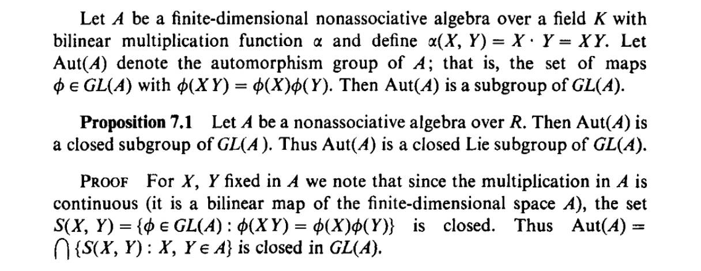
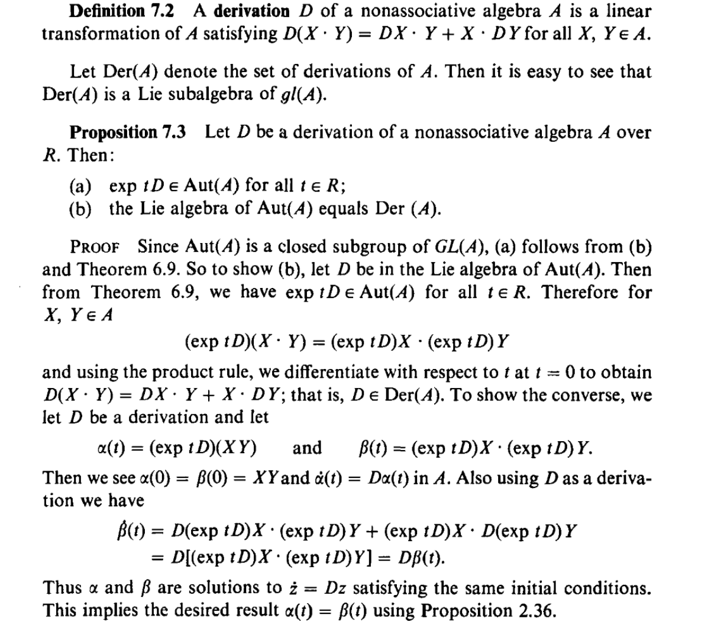
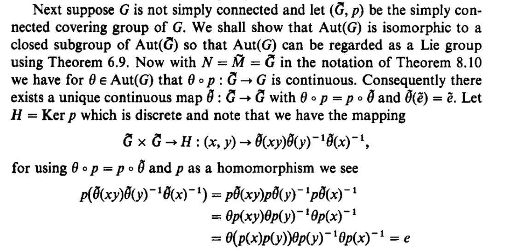
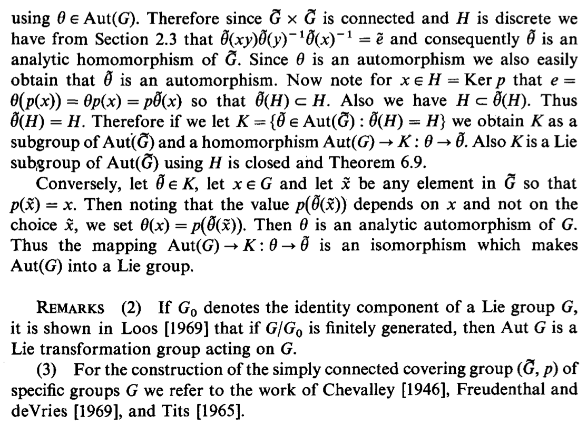

# 李群和李代数的自同构群

[toc]

# 李群和李代数的自同构群

## 李代数的自同态与自同构$\mathfrak {end}(\mathfrak g)$ , $Aut(\mathfrak g)$

$\mathfrak {end}(\mathfrak g)$ 是 $\mathfrak g$上所有自同态 **endomorphism **组成的空间， $\mathfrak {end}(\mathfrak g)\subset L(\mathfrak g)$；

> 对于普通的、无李代数结构的线性空间 $V$，$V$的自同态 **endomorphism** 是$V$上的线性变换，$Env(V)=L(V)$。

> 对于李代数 $\mathfrak g$，$\mathfrak {end}(\mathfrak g)\subset L(\mathfrak g)$，因为$\mathfrak {end}(\mathfrak g)$中的自同态除了是线性变换，还需要保持李括号。

> 对于线性空间 $V$，$Env(V)=L(V)=\mathfrak {gl}(V)$上有自然的李代数结构，李括号定义为 commutator； $\mathfrak g\to Env(V)$的李代数同态称为 $\mathfrak g$在$V$的表示。

> **Endomorphism Lie algebra**
> [https://ncatlab.org/nlab/show/endomorphism+Lie+algebra](https://ncatlab.org/nlab/show/endomorphism+Lie+algebra)
> Given a [vector space](https://ncatlab.org/nlab/show/vector+space) $V$, then its *endomorphism Lie algebra* $\mathfrak{end}(V)$ is the [Lie algebra](https://ncatlab.org/nlab/show/Lie+algebra) whose elements are the [linear maps](https://ncatlab.org/nlab/show/linear+maps) $\phi:V\rightarrow V$and whose Lie bracket is their [commutator](https://ncatlab.org/nlab/show/commutator): $[\phi_1,\phi_2] = \phi_1\circ \phi_2 - \phi_2\circ \phi_1$. A Lie algebra homomorphisms $\mathfrak g\rightarrow \mathfrak{end}(V)$ is a Lie action or *Lie algebra representation* of $\mathfrak g$ on $V$.

$Aut(\mathfrak g)$ 是 $\mathfrak g$上所有自同构 **automorphism **组成的空间， $Aut(\mathfrak g)\subset GL(\mathfrak g)$；

> **Automorphism of a Lie algebra**
> [https://en.wikipedia.org/wiki/Automorphism\_of\_a\_Lie\_algebra](https://en.wikipedia.org/wiki/Automorphism_of_a_Lie_algebra#Derivations)
> In [abstract algebra](https://en.wikipedia.org/wiki/Abstract_algebra%20%22Abstract%20algebra%22), an **automorphism**** of a ****Lie algebra** $\mathfrak g$ is an [isomorphism](https://en.wikipedia.org/wiki/Isomorphism%20%22Isomorphism%22) from $\mathfrak g$ to itself, that is, a linear map **preserving the Lie bracket**. The set of automorphisms of $\mathfrak g$ are denoted $Aut(\mathfrak g)$, the [automorphism group](https://en.wikipedia.org/wiki/Automorphism_group%20%22Automorphism%20group%22) of $\mathfrak g$.

### $\mathfrak {end}(\mathfrak g)$是$L(\mathfrak g)=\mathfrak {gl}(\mathfrak g)$的子李代数
$L(\mathfrak g)=\mathfrak {gl}(\mathfrak g)$是个李代数，李括号定义为线性算子的 commutator。

前面提到$\mathfrak {end}(\mathfrak g)\subset L(\mathfrak g)$，那 $\mathfrak {end}(\mathfrak g)$是否是 $L(\mathfrak g)$ 的李子代数呢？答案是肯定的，只需要验证 $\mathfrak {end}(\mathfrak g)$对 commutator 的封闭性。

设 $\alpha,\beta\in \mathfrak {end}(\mathfrak g)$，$X,Y\in \mathfrak g$；

 $\alpha,\beta$作为自同态，他们可以保持 $\mathfrak g$ 上的李括号，即$\alpha[X,Y]=[\alpha X,\alpha Y]$和$\beta[X,Y]=[\beta X,\beta Y]$；

容易验证 $\alpha\beta$ 和 $\beta\alpha$也都能保持李括号，进而它们的commutator $\alpha\beta-\beta\alpha$ 也能保持 $\mathfrak g$ 上的李括号。

$(\alpha\beta-\beta\alpha)[X,Y]=[(\alpha\beta-\beta\alpha) X,(\alpha\beta-\beta\alpha) Y]$

### $\mathfrak g$ 上的导子李代数$Der(\mathfrak g)\subset L(\mathfrak g)$
$\mathfrak g$上的线性变换 $\delta$ 称为一个 Derivation，如果它满足莱布尼兹法则：$\delta[X,Y]=[\delta X, Y] + [X,\delta Y]$.

$\mathfrak g$上所有的 Derivation 组成线性空间 $Der(\mathfrak g)$，它也是$L(\mathfrak g)$的李子代数。

下面对 commuator 在 $Der(\mathfrak g)$上的封闭性进行验证，即验证两个 导子的commuator也满足莱布尼兹法则。

$\begin{aligned} \delta_1\delta_2[X,Y]&=\delta_1([\delta_2 X, Y] + [X,\delta_2 Y])\\
&=\delta_1[\delta_2 X, Y] + \delta_1[X,\delta_2 Y]\\
&=([\delta_1\delta_2 X, Y] + [\delta_2 X, \delta_1Y]) + ([\delta_1X,\delta_2 Y]+[X,\delta_1\delta_2 Y])\\
&=([\delta_1\delta_2 X, Y]+[X,\delta_1\delta_2 Y]) + \underbrace{([\delta_2 X, \delta_1Y] + [\delta_1X,\delta_2 Y])}_{A}\\
\end{aligned}$

类似地 

$\begin{aligned}  \delta_2\delta_1[X,Y]&=([\delta_2\delta_1 X, Y]+[X,\delta_2\delta_1 Y]) +  A
\end{aligned}$

因此

$\begin{aligned} (\delta_1\delta_2-\delta_2\delta_1)[X,Y]&=[(\delta_1\delta_2-\delta_2\delta_1)X,Y]+[X,(\delta_1\delta_2-\delta_2\delta_1)Y]
\end{aligned}$

其中两个$A$被抵消了。

> **Derivation** on Lie algebra
> [https://en.wikipedia.org/wiki/Automorphism\_of\_a\_Lie\_algebra#Derivations](https://en.wikipedia.org/wiki/Automorphism_of_a_Lie_algebra#Derivations)
> A **derivation** on a Lie algebra is a linear map $\delta: \mathfrak g\to \mathfrak g$ satisfying the [Leibniz rule](https://en.wikipedia.org/wiki/Product_rule%20%22Product%20rule%22) : $\delta [X,Y]=[\delta X,Y] + [X,\delta Y]$.
> The set of derivations on a Lie algebra $\mathfrak g$ is denoted $der (\mathfrak g)$and is a subalgebra of the [endomorphisms](https://en.wikipedia.org/wiki/Endomorphism%20%22Endomorphism%22) on $\mathfrak g$, that is $der(\mathfrak g)\lt End(\mathfrak g)$. They inherit a Lie algebra structure from the Lie algebra structure on the endomorphism algebra, and closure of the bracket follows from the Leibniz rule. 

### $Aut(\mathfrak g)$是$GL(\mathfrak g)$的李子群
$Aut(\mathfrak g)$是$GL(\mathfrak g)$的闭子群，从而是李群：

（[下图所在文献的 Preview 链接](https://books.google.at/books?id=LA37coRrnaMC&pg=PA156&lpg=PA156&dq=why+is+the+automorphism+group+of+Lie+algebra+is+a+Lie+group&source=bl&ots=NcAvHkBuaS&sig=2Oo82lpnWrFWSd6Bj4sNiisujZo&hl=de&sa=X&ved=0CGQQ6AEwCGoVChMIvKrpofDhxgIVBfxyCh1-3gle#v=onepage&q&f=false)）

### $Aut(\mathfrak g)$ 的李代数是$Der(\mathfrak g)$

$Aut(\mathfrak g)$的李代数是 $Der(\mathfrak g)$ ：

> 一个简单的证明：
> [https://math.stackexchange.com/a/3823227](https://math.stackexchange.com/a/3823227)
> Let 𝐺={𝑔∈GL(𝐿)|𝑔[𝑥,𝑦\]=[𝑔𝑥,𝑔𝑦\],𝑥,𝑦∈𝐿}. Then, in order to get the tangent space of 𝐺 at 1, i.e. the Lie algebra of 𝐺, we just have to differentiate the equation 𝑔[𝑥,𝑦\]=[𝑔𝑥,𝑔𝑦\] and plug in 𝑔=1. If we differentiate at 𝑔 in the direction of 𝛿, we get 𝛿([𝑥,𝑦\])=[𝑔𝑥,𝛿(𝑦)\]+[𝛿(𝑥),𝑔𝑦\], and so plugging in 𝑔=1 gives us 𝛿([𝑥,𝑦\])=[𝑥,𝛿(𝑦)\]+[𝛿(𝑥),𝑦\]. Thus, 𝛿 is in the tangent space of 1 if and only if 𝛿 is a derivation on 𝐿. (And the Lie products are the same, because they are both given by the commutator [𝛿1,𝛿2\]=𝛿1𝛿2−𝛿2𝛿1).

> 其他参考：
> **derivation Lie algebra (or automorphism Lie algebra) of a Lie algebra **$\mathfrak g$**: **[https://ncatlab.org/nlab/show/derivation+Lie+algebra](https://ncatlab.org/nlab/show/derivation+Lie+algebra)
> For $\mathfrak g$ a [Lie algebra](https://ncatlab.org/nlab/show/Lie+algebra), then the Lie algebra of its [automorphism Lie group](https://ncatlab.org/nlab/show/automorphism+Lie+group)  $\mathfrak{aut}(\mathfrak g)_{even}$ called the the *automorphism Lie algebra* of $\mathfrak g$ (or *derivation Lie algebra *$\mathfrak {der}(\mathfrak g)$), is the Lie algebra whose underlying vector space is that of those linear maps $\Delta: \mathfrak g\rightarrow \mathfrak g$ which satisfy the [derivation](https://ncatlab.org/nlab/show/derivation) property:
> $\Delta([x,y])=[\Delta(x),y] + [x, \Delta(y)]$
> for all $x,y\in\mathfrak g$. The Lie bracket on $\mathfrak{aut}(\mathfrak g)_{even}$ (or * *$\mathfrak {der}(\mathfrak g)$)) is the [commutator](https://ncatlab.org/nlab/show/commutator) operation:
> $[\Delta_1,\Delta_2] := \Delta_1\circ \Delta_2 - \Delta_2\circ \Delta_1$

## 李群$G$的自同构群 $Aut(G)$
###  $Aut(G)\subset Aut(\mathfrak g)$?
考虑李群 $G$的自同构群  $Aut(G)$。

注意，它与$G$的李代数 $\mathfrak g$ 的自同构群 $Aug(\mathfrak g)$之间可以自然地建立起联系：

若 $\phi\in Aut(G)$是$G$上的自同构，则 $\phi$在单位元$e_G$处的切映射$\dot\phi:=T_{e_G}\phi$给出 $\mathfrak g$上的一个自同构，即$\dot \phi\in Aut(\mathfrak g)$.

如果 $\phi\mapsto \dot\phi$ 是 injective （单射）的，$Aut(G)$ 就可看做 $Aut(\mathfrak g)$ 的子群 (暂不讨论是不是 李子群)。下面分析 $\phi\mapsto \dot\phi$ 是否 injective 。

#### $G$不连通时
对于不连通的李群$G$， $\phi\mapsto \dot\phi$ 不是 injective 的：因为有些非恒等的连续自同构$\phi\ne Id_G$可以保持$G_0$不变，比如$G_0$之外的其他分支之间的 permutation 等（若 $f$为有限群$F$上的自同构，$H$为一个连通李群，那么$G=H\times F$就是非连通李群，此时$G_0=H$  ，$G$ 的自同构 $Id_H\times f$就是一个满足条件的 $\phi$）。 由于在这种自同构下 $G_0$被保持不变，于是单位元处的切映射$\dot \phi=\dot {Id_G}$ 但$\phi\ne Ad_G$；

当$G$有无穷多个连通分支时，其自同构群 $Aut(G)$ 可能很复杂。见这里的讨论：[https://math.stackexchange.com/a/1589323](https://math.stackexchange.com/a/1589323)

所以后面主要考虑$G$是连通李群的情况。对于不连通的李群，可以取单位元所在的连通分支 $G_0$来分析，$G_0$是原李群的正规李子群（参考 [这个问题](https://math.stackexchange.com/questions/3921615/showing-different-properties-of-a-connected-component-g-0-of-an-identity-in-a) ）。

#### $G$连通时
如果$G$是连通的，给定 $\dot\phi$ 就能确定唯一得 $\phi$，即  $\phi\mapsto \dot\phi$ 是 injective （单射）的，$Aut(G)$ 可看做 $Aut(\mathfrak g)$ 的子群。

> 下图证明了$G$到其他李群的同态可由其诱导的李代数同态唯一确定； 自同构$\phi$也是个同态，所以可由 $\dot\phi$ 唯一确定。

### $Aut(G)$ 是否也是李群？它的李代数是什么？
我们已经知道当$G$连通时 $Aut(G)\subset Aut(\mathfrak g)$ ; 现在来考察关于 $Aut(G)$的另一个重要问题：

* $Aut(G)$是否也构成一个李群？如果它是李群，那它的李代数是什么？

#### 一些结论
先放些结论，后面再对关键问题做些解释：

1. 如果 $G$ 是连通的，那么$Aut(G)$ 是 $Aut(\mathfrak g)$ 的闭子群，从而也是 $Aut(\mathfrak g)$ 的李子群；进一步，如果群$G$是单连通的，那么$Aut(G)\cong Aug(\mathfrak g)$;
2. 如果$Aut(G)$ 同构于 $Aut(\mathfrak g)$，则$Aut(G)$ 的李代数也是 $Der(\mathfrak g)$; 而如果$Aut(G)$ 只是 $Aut(\mathfrak g)$的一个李子群，其李代数也就是 $Der(\mathfrak g)$的一个李子代数。
3. 关于$Aut(G)$  上的拓扑和微分结构： $Aut(G)$是 $Aut(\mathfrak g)$ 的闭子群，所以其上的拓扑和微分结构都诱导自 $Aut(\mathfrak g)$ ： [https://math.stackexchange.com/questions/1903929/how-is-the-automorphism-group-of-a-lie-group-given-a-differential-structure](https://math.stackexchange.com/questions/1903929/how-is-the-automorphism-group-of-a-lie-group-given-a-differential-structure)

> 其他相关链接：
> **automorphism Lie group and derivation Lie algebra** :  [https://ncatlab.org/nlab/show/automorphism+Lie+group](https://ncatlab.org/nlab/show/automorphism+Lie+group)
> The [automorphism group](https://ncatlab.org/nlab/show/automorphism+group) $Aut(G)$ of a [Lie group](https://ncatlab.org/nlab/show/Lie+group)  $G$  itself canonically inherits the structure of a Lie group. Its [Lie algebra](https://ncatlab.org/nlab/show/Lie+algebra) is the [derivation Lie algebra](https://ncatlab.org/nlab/show/derivation+Lie+algebra) of the Lie algebra $\mathfrak g$ of $G$: $Lie(Aut(G)) \cong  \mathfrak {der}(\mathfrak g)$.

### 李群$G$单连通的情况
本节将说明当$G$单连通时有$Aut(G)\cong Aug(\mathfrak g)$;

前面已经提到  $\phi\mapsto \dot\phi$ 是 injective 的，那么只需再证明对于任意给定的李代数自同构 $f:\mathfrak g\to \mathfrak g$ ，都存在一个对应的李群自同构。

大致思路是，每个李代数自同构都对应李群单位元附近邻域 $U$ 上的一个局部自同构$\phi$，而这个局部自同构可以扩张为一个完整的的自同构$\psi$:

* 首先，沿着一条 $e\to g$ 的曲线（通过细分该曲线）可以把 $\psi$ 的定义扩张到 $U$ 外部的点 $g$上，且沿着同伦的曲线可以在 $g$ 处给出相等的 $\psi(g)$；
* 而由于 $G$ 的单连通性质，所有从 $e\to g$ 的曲线同伦，所以 $\psi(g)$的取值不依赖路径的选择，我们得到了一个良定义的  $\psi$ ；

详见 ^1：

> 单连通是 $Aut(G)\cong Aug(\mathfrak g)$ 的充分条件。
> 有些非单连通的李群，比如$SO(3)$上， $Aut(G)\cong Aug(\mathfrak g)$ 也成立：如果 $e\to g$ 的不同伦的曲线在每点 $g$ 处也都恰好给出相同的 $\psi(g)$，也可以使得  $Aut(G)\cong Aug(\mathfrak g)$ 成立。

### 李群$G$多连通的情况
而如果$G$是多连通的，情况会复杂一些，此时$Aut(G)$ 一般是 $Aut(\mathfrak g)$的真子群，我们需要证明$Aut(G)$ 在 $Aut(\mathfrak g)$ 中是闭的。

首先，取多连通李群 $G$的 universal cover $\tilde G$，那么二者有相同的李代数 $\mathfrak g$，且由于covering space $\tilde G$ 的单连通性，$Aut(\tilde G)\cong Aut(\mathfrak g)$；

然后需要证明 $Aut(G)$ 是 $Aut(\tilde G)$ 的闭子群，大致思路是构造一个关于 $Aut(\tilde G)$ 的连续函数，使其能将$Aut(G)$ 对应的子集映射为一个闭集，从而得出$Aut(G)$ 在 $Aut(\tilde G)$ 中是闭的，具体如下：

* 用 $p$ 表示 covering space $\tilde G$ 到底空间 $G$的投影函数，  $H$ 表示  $p$ 的 kernel，即 $\tilde G$ 上所有在 $G$中投影为 $e$的点组成的集合，注意这是个离散点集；
*  $G$ 上的每个自同构 $\theta$，都能唯一地提升为其 covering space $\tilde G$ 上的一个自映射 $\tilde \theta$ (satisfying $\theta\circ p=p\circ \tilde\theta$ and $\tilde\theta(\tilde e)=\tilde e$ where $p$ is the projecting map from covering space)；
* 然后证明 $\tilde\theta$ 是 $\tilde G$ 上的自同构：
   * 构造另一个映射 $C(\tilde \theta): \tilde G\times \tilde G\to H,  (x,y)\mapsto \tilde\theta(xy)\tilde\theta(y)^{-1}\tilde\theta(x)^{-1}$ ，简单计算可以发现$C(\tilde\theta)(*,*)$把 $\tilde G\times \tilde G$上的二元组 $(x,y)$ 都送到 $H$中的某个点上，即用 $p$ 把 $C(\tilde \theta)(x,y)$投影到$G$上后都是 $e$；
   * 从$C(\tilde\theta)(*,*)$的构造上可以看出它关于 $(x,y)$ 是连续的，所以 $C(\tilde\theta)(*,*)$ 必然把所有的   $(x,y)$  点对映射为 $H$ 中的同一点，这点是 $\tilde e=C(\tilde\theta)(\tilde e,\tilde e)$; 所以 $C(\tilde\theta)(*,*)$ 是个单值函数，进而是解析的，因此 $\tilde \theta$也是解析的；由 $C(\tilde\theta)(x,y)=\tilde e$可得 $\tilde\theta(xy)=\tilde\theta(x)\tilde\theta(y)$，$\tilde\theta$是自同态; $\theta$是自同构，易得 $\tilde\theta$也是自同构。

*  $H=Ker\ p$所以 $\theta(p(H))=e=p\tilde\theta(H)$，所以$\tilde \theta(H)\subset H$；同时由于 $\tilde\theta$ 是自同构（双射），所以$\tilde \theta(H)= H$；
* $\tilde G$ 上所有满足 $\tilde\theta(H)=H$的自同构组成子群 $K$，那么 $K$ 是闭的：考虑$\mathcal H_i: Aut(\tilde G)\rightarrow \tilde G,\quad \tilde\theta\mapsto \tilde\theta(h_i\in H)$，离散点集 $H$ 在是闭的，所以其在 $\mathcal H_i$ 下的原象也是闭的；每个 $h_i\in H$ 对应一个这样的 $\mathcal H_i$，所有的闭原象取交集就是 $K$，所以 $K$ 是闭的；
* $K$ 与 $Aut(G)$一一对应，所以 $Aut(G)$也是 $Aut(\tilde G)$ 的闭子群，从而是李群

#### 多连通的例子
令$G=S^1$是阿贝尔群 ($S^1$可看做 $\mathbb C$ 的子群，群乘法定义为复数乘法；$\mathbb C$又可看做实数域 $\mathbb R$上的交换+结合代数，$S^1$的 universal cover 是 $\mathbb R$)。
另外，$S^1$是连通的，但不是单连通的； 

$G$有平凡的李代数 $\mathfrak g = \mathbb R$，李括号恒为 0，所以

* $\mathfrak g$上所有的线性算子（乘一个实数）都是 $\mathfrak g$ 的自同态（李括号被自动保持），也都是一个导子，所以$\mathfrak{end}(\mathfrak g) = \mathbb R$，$Der(\mathfrak g)=\mathbb R$;
* 非 0 线性算子都是自同构， $Aut(\mathfrak g)\equiv \mathbb R-\{0\}$ ，这是非0实数的乘法群，有正、负两个连通分支；
但 $G=S^1$ 的自同构群[只包含恒等映射和取共轭](https://math.stackexchange.com/questions/902620/what-are-the-continuous-automorphisms-of-bbb-t)两个元素，$Aut(G)=\mathbb Z/2$ ，可以看做 0 维的李群，有两个0维的连通分支，它是 $Aut(\mathfrak g)$的真子群，$Aut(G)\subsetneqq Aut(\mathfrak g)$;
> 阿贝尔李群的 [inner automorphism](https://en.wikipedia.org/wiki/Inner_automorphism) 都是恒等映射：$conj_g(h)=ghg^{-1}=gg^{-1}h=h$，$S^1$的 [outer automorphism](https://en.wikipedia.org/wiki/Outer_automorphism_group)  则只包含取共轭）。
所以，显然 $Aut(G)$的李代数 $Lie(Aut(G))$ 是0维的，而 $Lie(Aut(\mathfrak g))$ 是1维的，前者只是后者的子李代数。

### 内自同构 inner automorphism, $Inn(G), Ad(G), ad(\mathfrak g)$

对于每个 $g\in G$,  $conj_g(h)=ghg^{-1}$ 定义了 $G$ 上的一个自同构，这样的自同构称为 内自同构 [inner automorphism](https://en.wikipedia.org/wiki/Inner_automorphism)；

$g\mapsto conj_g$ 是 $G\mapsto Aut(G)$ 的李群同态。用 $Inn(G)$ 代表所有内自同构组成的内自同构群， $Inn(G) \subset Aut(G)$，不难验证 $Inn(G)$ 是 $Aut(G)$ 的正规子群；
此外我们定义 "外自同构"群 为商群 $Out(G) = Aut(G)/Inn(G)$；
> Inn(G) is a normal subgroup of the full automorphism group Aut(G) of G. The outer automorphism group, Out(G) is the quotient group $Out(G) = Aut(G) / Inn(G)$.

对于每个$conj_g$，他在单位元处的切映射 $Ad_g\in Aut(\mathfrak g)$ 定义了李代数上的一个自同构， $conj_g\mapsto Ad_g$  定义了一个 $Inn(G) \to Aut(\mathfrak g)$ 的群同态；用 $Ad(G) \subset Aut(\mathfrak g)$ 表示所有的 $Ad_g$ 组成的子群，那 $conj_g\mapsto Ad_g$ 是 $Inn(G) \to Ad(G)$ 的满射，对于连通李群， $conj_g\mapsto Ad_g$ 也是单射，所以对于连通李群 $Inn(G) \cong Ad(G)$;

思考（对于连通李群）：
- 证明 $Inn(G)$ 在 $Aut(G)$ 中、或者 $Ad(G)$ 在 $Aut(\mathfrak g)$ 中是闭的，从而是李群；
- 从 $Inn(G)$ 的定义，可知 $g\mapsto conj_g$ 是 $G\to Inn(G)$ 的满射；那是否也是单射呢？（连通李群有$Inn(G) \cong Ad(G)$，所以相当于问李群同态 $g\mapsto Ad_g, G\to Aut(\mathfrak g)$ 是否是单射）；如果是单射， $g\mapsto Ad_g$ 就是李群同构。
> 伴随表示的忠实性：
李代数的伴随表示是忠实的，仅当李代数的 center (consists of all those elements x in L such that $[x,a] = 0$ for all a in L.) 只包含0点：
https://math.stackexchange.com/a/539595/685690
[李群伴随表示的忠实性](https://en.wikipedia.org/wiki/Adjoint_representation#Properties) 同理：the adjoint representation of a connected Lie group G is faithful if and only if G is [centerless](https://en.wikipedia.org/wiki/Center_(group_theory)): The center of a group G consists of all those elements g in G such that $ghg^{-1}=h$ for all h in G.)

$Ad(G)$ 的李代数是 $ad(\mathfrak g)$： 
考虑对 $g\mapsto Ad_g$ 的微扰， $Ad(\exp(Xt) g) = Ad(\exp(Xt)) Ad(g) = e^{ad(Xt)} Ad(g)$，可见 $Ad_g$ 的微扰方向只能是 $ad(Xt)$ 这种形式，所以  $Ad(G)$  的李代数是 $ad(\mathfrak g)$ 的子集；但同时每个在0点附近  $ad(Xt)$ 也能生成一个 $Ad(\exp(Xt))$，所以 $Ad(G)$ 和$ad(\mathfrak g)$ 局部微分同胚, $ad(\mathfrak g)$ 是 $Ad(G)$ 的李代数；

当$G$ 连通时，$Ad(G)$ 也是 Inn(G) 的李代数；$ad(\mathfrak g)$ 也称为内导子李代数，记为 $inn(\mathfrak g)$。

> [https://math.stackexchange.com/a/1589323](https://math.stackexchange.com/a/1589323)
> Aut(𝐺) always has a subgroup Inn(𝐺) of inner automorphisms, and correspondingly its Lie algebra always contains the subalgebra Inn(𝔤)
 of inner derivations of 𝔤.

## 参考书目

1. **Introduction to Lie groups and Lie algebras**, Edited by Arthur A. Sagle, Ralph E. Walde Volume 51, 1973,  [pdf](https://download.tuxfamily.org/openmathdep/algebra_abstract/Introduction_Lie_Groups_Lie_Algebras-Walde.pdf)
2. **Natrual Operations in Differential Geomety**, Ivan Kolář , Peter W. Michor, Jan Slovák , 1993