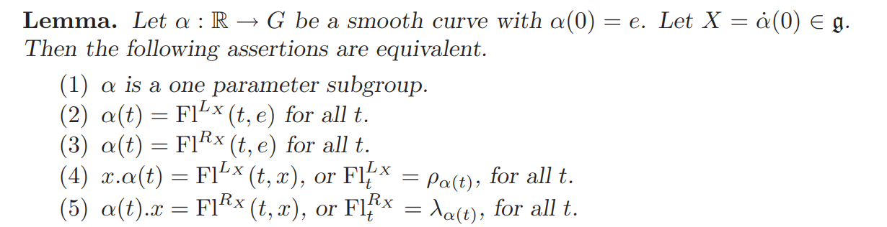

# 李群基础理论速览

[TOC]

## Preparation

### Some symbol convention

#### Tangent space and tangent map

Let $M$ be a $m$-dimension manifold, and $TM$ be its tangent bundle.
Then for $p\in M$, we denote the tangent space of $M$ at $p$ by $T_pM$;
The projection function $\pi_M: TM\rightarrow M$ is defined as $\pi_M[T_pM]=\{p\}$;
If $f: M\rightarrow N$ is a smooth map, then we denote its tangent map by $Tf: TM\rightarrow TN$ and the pointwise tangent map by $T_pf: T_pM\rightarrow T_{f(p)}N$ (for $p\in M$).
> Note $Tf[T_pM] = Range(T_pf)\subset T_{f(p)}N$

##### The chain rule
Let $f: K\rightarrow M$, $g: M\rightarrow N$ be smooth maps between manifolds and $h=g\circ f : K \rightarrow N$.
Then
$Th = Tg\circ Tf : TK \rightarrow TN$,
and the pointwise version is 
$T_ph=T_{f(p)}g\circ T_pf: T_pK\rightarrow T_{h(p)}N=T_{g(f(p))}N$ (for $p\in K$).
To be more specific, let $p\in K, X_p\in T_pK$, then
$(Th)X_p=(Tg)(Tf)X_p = (Tg)(T_pf)X_p = (T_{f(p)}g)(T_pf)X = (T_ph)X$

##### The inverse rule

If $f$ is invertible, then $T(f^{-1})=(Tf)^{-1}$

#### Lie group operations

Define:
multiply two elements: $\mu: G\times G\rightarrow G, (g,h)\mapsto gh$;
multiply $g$ from left: $\lambda_g: G\rightarrow G, h\mapsto gh$; 
> $\lambda_g$ is a self-diffeomorphism (hence invertible) and $\lambda_g^{-1}=\lambda_{g^{-1}}$

multiply $g$ from right: $\rho_g: G\rightarrow G, h\mapsto hg$
> $\rho_g$ is a self-diffeomorphism (hence invertible) and $\rho_g^{-1}=\rho_{g^{-1}}$

$\mu^*=T\mu, \lambda_g^*=T\lambda_g, \rho_g^*=T\rho_g$ represent the corresponding tangent maps.

$\mu(g,h)=gh=\rho_h(g)=\lambda_g(h)$
$T_{(g,h)}\mu (X_g, Y_h) = (T_g\rho_h)X_g+(T_h\lambda_g)Y_h$

### Invariant vector fields and the Lie bracket on $\mathfrak g=T_eG$

We use $\mathfrak g=T_eG$ to denote the tangent space at $e$;

#### Left-invariant

A tangent vector field $L$ is said to be *left-invariant* iif $L(g)= (T_e\lambda_g) L(e)$.
Every vector in $\mathfrak g$ can generate a left-invariant vector field, and every left-invariant vector field on $G$ can be generated by its value at $e$ (a vector in $\mathfrak g$);
> $\lambda_g$ is smooth map that maps $e$ to $g$, then the tangent map of $\lambda_g$ sends vectors in $T_eG$ to $T_gG$; If a vector in $T_eG$ is given, then we can "translate" this vector to every $g$ on $G$ by $\lambda_g$ and gain a (left-invariant) vector field on $G$.

Let's say $X\in \mathfrak g$, and $L_X$ is the left-invariant vector field generated by $X$, then $L_X(g) = (T_e\lambda_g) X$; 
Conversely, if $L$ is a left invariant vector field and $L(g)=Y_g\in T_gG$, then the generator $X(\in \mathfrak g)$ of $L$ is:
$X=(T_e\lambda_g)^{-1} Y_g = (T_g\lambda_{g^{-1}})Y_g$.
The Lie bracket on  left-invariant vector fields induces a Lie bracket $[]_L$on $\mathfrak g$, defined by: $[X,Y]_L=Z$ iff $[L_X,L_Y]=L_Z$.

#### Right-invariant

Similarly, a tangent vector field $R$ is *right-invariant* iif $R(g)= (T_e\mu_g) R(e)$. 
For $X\in \mathfrak g$, we denote $R_X$ the right-invariant vector field generated by $X$, and $R_X(g)= (T_e\mu_g) X$;
Conversely, if $R$ is a rightinvariant vector field and $R(g)=Y_g\in T_gG$, then the generator $X(\in \mathfrak g)$ of $R$ is:
$X=(T_e\rho_g)^{-1} Y_g = (T_g\rho_{g^{-1}})Y_g$
The Lie bracket on right-invariant vector fields also induces a Lie bracket $[]_R$on $\mathfrak g$, defined by: $[X,Y]_R=Z$ iff $[R_X,R_Y]=R_Z$.

> Then, what's the relationship between the two Lie brackets $[]_L$ and $[]_R$ on $\mathfrak g$?
> $[X,Y]_L=-[X,Y]_R$?

#### A Lemma:  $[L_X, R_Y]=0$
The Lie bracket of a left invariant vector field $L_X$ and a right invariant vector field $R_Y$ always vanish: $[L_X, R_Y]=0$
>  Proof ??

#### Lie group homomorphism induces Lie algebra homomorphism

Lie group homomorphism induces Lie algebra homomorphism:

So we have 
$$\phi'[X, Y] = [\phi'(X), \phi'(Y)]$$
for the two involved Lie algebras.
> For adjoint representations (introduced below), let $\phi=Ad, \phi'=ad$, then $ad[X,Y]=[ad X, ad Y]$

### Automorphisms and adjoint representation

Let $G$ be a Lie group. Every $g\in G$ can generate an automorphism 
$conj_g: G\rightarrow G$ defined as 
$conj_g=\lambda_g\circ \rho_{g^-1}=\rho_{g^-1}\circ \lambda_g$
or exciplicitly, $conj_g(h)=ghg^{-1}=(\lambda_g\circ \rho_{g^-1})$.
> $conj_g(e)=e$
$conj_g(h_1h_2)=gh_1h_2g^{-1}=gh_1g^{-1}gh_2g^{-1}=conj_g(h_1)conj_g(h_2)$

The tangent map of $conj_g$ (by the chain rule) : $Tconj_g=T\lambda_g\circ T\rho_{g^{-1}}=T\rho_{g^{-1}}\circ T\lambda_g$,
at $e\in G$:
$T_e conj_g=T_{g^{-1}}\lambda_g\circ T_e\rho_{g^{-1}}=T_g\rho_{g^{-1}}\circ T_e\lambda_g: T_eG\rightarrow T_eG$
$T_e conj_g: \mathfrak g\rightarrow \mathfrak g$ defines an automorphism of $\mathfrak g$.
The space of all the automorphisms of $\mathfrak g$ is $GL(\mathfrak g)$;
Define the adjoint representation of $G$:
$Ad: G\rightarrow GL(\mathfrak g),  g\mapsto T_e conj_g = T_{g^{-1}}\lambda_g\circ T_e\rho_{g^{-1}}=T_g\rho_{g^{-1}}\circ T_e\lambda_g$

$Ad$ itself, as a smooth map form manifold $G$ into $GL(\mathfrak g)$, has its tangent map $T(Ad)$, too.
Consider this tangent map at $e\in G$, $T_e(Ad)$.
Then the adjoint representation $ad$ of Lie algebra $\mathfrak{g}$ is the tangent map of $Ad$ at $e\in G$, $T_e(Ad)$, i.e.
$ad=T_e(Ad): \mathfrak g\rightarrow  \mathfrak {gl} (\mathfrak g)$ 

#### An important result : $(ad X)Y=[X,Y]$
An important result is : $(ad X)Y=[X,Y]$:
> 

#### Left and right perturbation
Let's give a perturbation to $g\in G$.
We can make the perturbation either from the left or from the right, i.e. $\exp(\Delta_l)g$ or $g\exp(\Delta_r)$. 
If the two perturbation are equivalent, i.e. $\exp(\Delta_l)g = g\exp(\Delta_r)$, then what can we say about $\Delta_r$ and $\Delta_l$?
Actually we have $\exp(\Delta_l) = conj_g(\exp(\Delta_r))$, and for infinitesimal perturbation (tangent at $e$), it just writes $\Delta_l=Ad(g)(\Delta_r)$, or $\Delta_r=Ad(g^{-1})(\Delta_l)$.

## The exponential map $\exp$
exponential map $\exp: \mathfrak g \rightarrow G, X\mapsto exp(X)$ 一般借助单参子群或左/右不变向量场的 local flow 来定义。
其中单参子群更容易理解一些。
若 $c: R\rightarrow G, t\mapsto c(t)$ 是一个李群同态，也是$G$上的一条曲线；曲线$c$ 在 $c(0)=e\in G$ 处的切向量$c'(0).1$ (其中$.1$代表作用于R上的单位切向量) 是李代数 $\mathfrak g$ 中的元素；
反过来，对任意 $X\in \mathfrak g$，也存在一个唯一的曲线$c_X$ 使得$c_X: R\rightarrow G$是一个李群同构，或单参子群，且$c_X'(0).1=X$;
指数映射定义为：$\exp(X)=c_X(1)$。
考虑曲线 $c_{\alpha X}(t):=c_X(\alpha t)$，根据链式法则，$c_{\alpha X}'= \alpha c_X'$；所以$c_{\alpha X}(t)$ 也给出一个李群同态，且它在G的单位元 $e$ 处的切向量是 $c_{\alpha X}'(0)= \alpha c_X'(0) = \alpha X$；因此: $\exp(\alpha X)=c_{\alpha X}(1)=c_X(\alpha)$
于是，$\frac {d\exp(tX)}{dt}=\frac {dc_X(t)}{dt}$。
> 指数映射也可通过 左/右 不变向量场过单位元 $e$ 处的积分曲线、或其 local flow 来等价地定义。左/右 不变向量场过单位元 $e$ 处的积分曲线是一个单参子群。

### 同态与$\exp$ 的交换性

前面提到过李群同态诱导李代数同态。同态与 exp 是可交换的。
Let $f: G\rightarrow H$ be a homomorphism between Lie groups $G$ and $H$, then:
$f\circ \exp^G = exp^H\circ T_ef : \mathfrak {g} \rightarrow H$

群的伴随表示 $Ad: G\rightarrow GL(\mathfrak g)$ 也是一个李群同态，所以$Ad/ad$ 与 $\exp$ 可交换：$Ad\circ \exp^G = exp^{GL(\mathfrak g)}\circ ad : \mathfrak {g} \rightarrow GL(\mathfrak {g})$

通过上图中的式子，我们第一次把一般李群的指数映射与矩阵的幂级数联系起来（上图中的 $(ad X)$ 是 $\mathfrak g$ 上的一个线性变换，可看做一个矩阵），使得抽象的一般李群在某种意义上也变得可计算了。

### Differential of the  exponential map

todo：证明 $d\exp : \mathfrak g\rightarrow \mathfrak g$ 非退化，所以根据反函数定理，在足够小的邻域中 $\exp$ 可逆，是个局部微分同胚，用$\exp^{-1}$ 或 $\log$ 来表示$\exp$的逆。

#### 切向量的右平移，右对数导数  $\delta$  (The right logarithmic derivative)

首先，定义 $\rho_g: G\rightarrow G$为右乘 $g$ 、或右平移$g$ 运算，即$\rho_gh=hg$；其逆为 $\rho_{g^{-1}}$，即右平移$g^{-1}$; 二者的切映射分别为 $T\rho_g, T\rho_{g^{-1}}: TG\rightarrow TG$;

注意， $\rho_{g^{-1}}$可以把 $g$ "右平移" 回 $e$，$T\rho_{g^{-1}}$把  $g$ 的切空间 $T_gG$ 右平移回 $T_eG\equiv \mathfrak g$;  具体地，$T_g\rho_{g^{-1}}: T_gG \rightarrow \mathfrak g$;

为了方便，我们再定义一个函数 $\xi : TG\rightarrow \mathfrak g$，它可以把$G$每点处的切向量都右平移回 $\mathfrak g$ 上： 对于每个切向量 $s\in T_gG$，它都对应一个右不变向量场 $\zeta$使得$\zeta (g)=s$，那么 $\xi(s)=\zeta(e)$;

现在可以定义右对数导数 (The right logarithmic derivative) $\delta$了。

对于映射 $f: M\rightarrow G$，其右对数导数   $\delta f:TM\rightarrow \mathfrak g$ 定义为$\delta f = \xi\circ Tf$.

简而言之，就是把切映射 $Tf$ 和右平移 $\xi$ 组合起来，把 $M$上的切向量都映射并右平移到 $\mathfrak g$ 上；

关于 右对数导数 $\delta$ 有如下引理：(其中$\mu: G\times G\rightarrow G$ 为群乘法 $\mu(a,b)=ab$)

> 类似地也可以定义左对数导数：
>

#### exp 的右对数导数 $\delta(\exp)$，left jacobian $J_l$ 及其逆

先回顾下几个函数的 domain：
$\exp: \mathfrak g\rightarrow G$
$T(\exp): T\mathfrak g\rightarrow TG$  （注意 $T\mathfrak g$，可以理解为 $\mathfrak g$ 的每点处又都长出一个 $\mathfrak g$）
$T_X(\exp): \mathfrak g \equiv T_X\mathfrak g\rightarrow T_{\exp(X)}G, \quad for\ X\in \mathfrak g$
对于 $Y\in T_X \mathfrak g\equiv \mathfrak g, T(\exp)Y\in T_{\exp(X)}G$，我们通过右平移把$\exp(X)$处的切向量  $T(\exp)Y$ 平移回单位元 $e$处，得到 $Y'\in \mathfrak g$；
反过来，单位元 $e$ 处的切向量$Y'$，通过右平移（右乘 $\exp(X)$），变成了  $\exp(X)$处的切向量 $T(\exp)Y$ 。沿此方向的无穷小微扰 $\epsilon$ 作用为 $\exp(X+Y\epsilon)=\exp(Y'\epsilon) \exp(X)$
于是可以定义$X$处的 left jacobian $J_l(X)\equiv \delta(\exp)|_{T_X\mathfrak g}: Y\mapsto Y'=J_l(X)Y$，从而
 $\exp(X+Y\epsilon)=\exp(J_l(X)Y\epsilon) \exp(X)$。
$J_l(X)$ 的逆 记为 $J_l^{-1}(X): Y'\mapsto Y=J_l^{-1}(X)Y'$.

> 类似地可定义 right jacobian，假设 $\exp(X+Y\epsilon)=\exp(X)\exp(J_r(X)Y\epsilon)$,
> 考虑到
> $$
\begin{aligned}
\exp(X+Y\epsilon) & = [\exp(X+Y\epsilon)^{-1}]^{-1}  \\
& = [\exp(-X-Y\epsilon)]^{-1} \\
& = [\exp(-J_l(-X)Y\epsilon) \exp(-X)]^{-1} \\
& = \exp(X)\exp(J_l(-X)Y\epsilon)
\end{aligned}
$$
> 所以我们有  $J_r(X)=J_l(-X)$.

关于 $J_l$ 和 $\delta(\exp)$ ， 我们有（后面会贴证明）： 
$$J_l(X) = \delta(\exp)(X) := \delta(\exp)|_{T_X\mathfrak g} = \sum_{p=0}^{\infty} \frac{1}{(p+1)!}(ad\ X)^p=g(ad\ X)$$
其中 $g$ 是一个幂级数简写符号，$g(z):=\frac{e^z-1}{z}$，注意这里 $\frac{e^z-1}{z}$ 不代表要 "除以$z$" 或乘以 $z^{-1}$，而只是用来简记它所对应的幂级数。
至此，我们已经可以用幂级数来表示 $J_l(X)$ 了，那它的逆 $J_l^{-1}(X)$ 是否也能用幂级数表示？可以的：
$$J_l^{-1}(X) =\sum_{n=0}^{\infty} \frac{(-1)^n}{n+1}(e^{ad X}-I)^n=f(e^{ad X})$$
其中 $f$ 为 $\frac{log(y)}{y-1}$ 对应的幂级数简写：$f(y)=\frac{log(y)}{y-1}$。定义这些简写可以方便我们做幂级数的计算，比如从简写符号上可以直接看出 $g(\log y)\cdot f(y) = 1$，即 $f(y) = g(\log y)^{-1}$；令 $y=e^{ad X}$，则有 $f(e^{ad X})=g(ad X)^{-1}=J_l^{-1}(X)$。

> $J_l(X) = \delta(\exp)(X)=\sum_{p=0}^{\infty} \frac{1}{(p+1)!}(ad\ X)^p=g(ad\ X)$ 的证明如下：
> 

## The BCH formula

### BCH formula for Lie Group
利用前面提到的右对数导数（left jacobian）及其逆 ，通过对 $J_l^{-1}$ 积分即可求得 BCH 公式。
考虑 $G$ 上的轨迹 $z(t) = \exp(tX)\exp(Y)$，随着时间 $t$ 从 0 到 1，$z$ 从 $\exp(Y)$ 处移动到 $\exp(X)\exp(Y)$，且在每个时刻 $t$，$z$ 的运动方向 $\dot z$ 右平移到 $\mathfrak g$ 上后都始终沿 $X$ 方向；
再来看在 $\mathfrak g$ 上 $Z(t):=\log z(t)$ 的轨迹。首先，在 $t=0$ 时， $Z=\log z$ 在 $Y$ 点处；在每个时刻$t$，$Z$ 的运动方向为 $\dot Z=J_l^{-1}(Z)X$ （因为 $\dot z$ 右平移到 $\mathfrak g$ 上是沿 $X$ 方向），因此在 $t=1$ 时，我们有
$$
\begin{aligned}
Z(1) = log(\exp(X)\exp(Y)) &= Z(0) + \int_{t=0}^1 \dot Z(t)dt \\
& = Y + \int_{t=0}^1 J_l^{-1}(Z(t))Xdt \\
& = Y + \int_{t=0}^1 f(e^{ad.Z(t)})Xdt \\
& = Y + \int_{t=0}^1 f(Ad.exp(Z(t)))Xdt  \quad \quad (by\ 4.25) \\
& = Y + \int_{t=0}^1 f(Ad(\exp(tX)\exp(Y)))Xdt  \\
& = Y + \int_{t=0}^1 f(Ad(\exp(tX))\cdot Ad(\exp(Y))))Xdt  \\
& = Y + \int_{t=0}^1 f(e^{t\cdot ad.X}e^{ad.Y})Xdt \\
\end{aligned}
$$
拆开此积分即得 BCH 公式。

### BCH formula for Banach Algebra
Let $R$ be a ring or an associative algebra, we define a function $R$:
$\exp_n(x)=\sum_{k=0}^n \frac{x^k}{k!}=I+\sum_{k=1}^n \frac{x^k}{k!}$
define the Lie bracke $[x,y]=xy-yx$.
If $R$ is also a metric space, and the series $(\exp_n(x))$ converges to some point, then we can write
$exp(x)=\lim_{n\rightarrow \infty} \exp_n(x)$.
So we define the function $\exp$ on $R$:
$exp(x)=\lim_{n\rightarrow \infty} \exp_n(x)$ if the limit exists.
Also, we can define $\log(x)$ by series. Then, $log(exp(x)exp(y))$ can be rewriten in terms of $[]$ by applying $[x,y]=xy-yx$, and this leads to the BCH formula.
The linear oprators $L(V)$ on a finite dimensional vector space $V$ forms a Banach Algebra, e.g. $L(\mathbb R^n)$ and $L(\mathfrak g)$ for some Lie algebra $\mathfrak g$.

#### $\exp$ of tangent vector fields on manifold
Let $\mathfrak X(M)$ be the space of tangent vector fields on a manifold $M$. Since every tangent vector filed $X(M)\in \mathfrak X(M)$ can be seen as a map that convert a smooth function into another ($C^{\infty}(M)\rightarrow C^{\infty}(M)$), and the pointwise-addtion and the composition operator between these maps (the vector fields) make $\mathfrak X(M)$ an associative algebra.
Now consider an **analytic** function $f$ and a vector field $X$ on $M$. What does $exp(tX)f$ stands for (let's suppose $\exp(tX)$ exists as a vector field)?
Consider an integral curve $c$ of $X$, define $f_c:=f\circ c$，i.e. $f_c(t)=f(c(t))$. 
If $f_c$ is locally **analytic** and $t$ is small, then we can write
$f_c(t) = f_c(0) + \sum_{n\ge 1} f_c^{(n)}(0)t^n/n!$
but note that $f_c^{(n)}(0)$ is exactly $X^nf(c(0))$, so $f(c(t))=(exp(tX)f)(c(0))$. That is to say, $exp(tX)$ acts on an analytic function $f$ by making $f$ "flow" a period of time $t$ along $X$.
Furthermore, if the underlying manifold is a Lie group $G$, $X$ is a left/right invariant field and the integral curve $c$ is chosen as $c(0)=e,c'(0)=X_e$, then $f(c(t))=(exp(tX)f)(e)$. With this property we can associate the vector field $tX$, or just its value at $e$, $tX_e$, with the element $c(t)$ of the Lie group, writen as something like $exp(tX_e)=c(t)$. However, this coincides with the standard definition of $\exp$ for a Lie groups, which can provide a new perspective to understand the exponential map: every group element $g\in G$ can be seen as a transformation of analytic functions on $G$. To be more specific, $g$ can left-translate (or right-translate, depending on the invariant type we choose) the function, $f\mapsto f\circ \lambda_g$, acting like an invariant field, so we associate the invariant field with $g$ by the map $\exp$.

